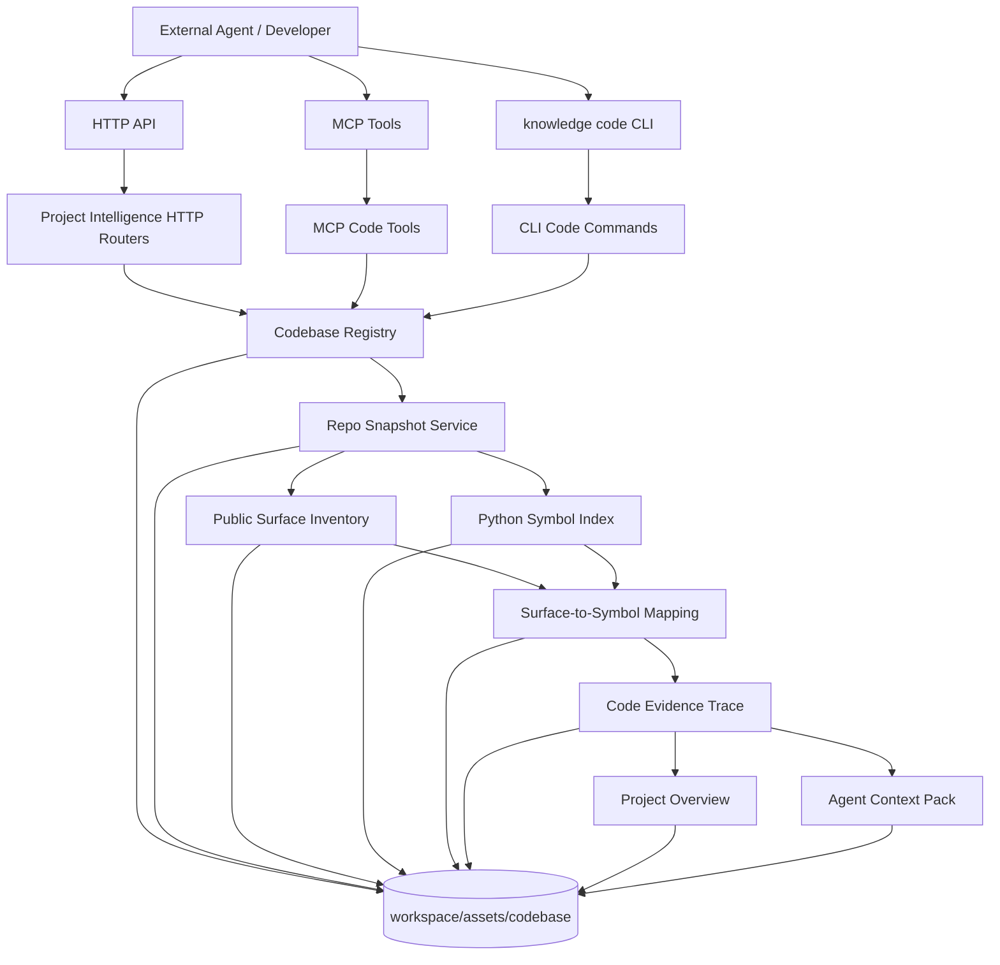

# V2.0 Target Architecture: Agent-callable Project Intelligence

> Status: target architecture for V2.0 Agent-callable MVP.
> Scope: Phase 1-7 only. DevWiki, Code Graph, Code Quality Governance Extension, and minimum frontend read-only pages are V2.1 Expansion.

## 1. Architecture Goal

V2.0 turns a local software project into a deterministic, evidence-backed, agent-callable code asset. The core path is:

```text
codebase registry
  -> repo snapshot
  -> public surface inventory
  -> Python symbol index
  -> surface/symbol/evidence mapping
  -> HTTP/MCP/CLI read convergence
  -> project overview + agent context pack
```

The system must not treat a codebase as ordinary document chunks in the existing source registry. V2.0 code artifacts are independent assets bridged into query/trace/context at read time.

## 2. Component Architecture



## 3. Artifact Layout

All V2.0 artifacts live under:

```text
workspace/assets/codebase/{codebase_id}/
```

Required layout:

```text
codebase.json
snapshots/
  {snapshot_id}/
    snapshot.json
    files.jsonl
    stats.json
    warnings.jsonl
    surfaces.jsonl
    capabilities.jsonl
    alignment_matrix.json
    symbols.jsonl
    imports.jsonl
    mappings.jsonl
    evidence.jsonl
overview.json
agent_context/
  {pack_id}.json
```

Every persisted JSON artifact must include:

- `schema_version`
- `workspace_id`
- `codebase_id`
- `created_at` or equivalent generation timestamp
- `snapshot_id` when snapshot-scoped

Public responses must return repo-relative paths by default. Absolute paths are internal-only and must not be exposed through HTTP/MCP/CLI.

## 4. Public Interfaces

### HTTP

V2.0 uses target workspace-scoped HTTP APIs:

```text
POST /api/workspaces/{workspace_id}/codebases/{codebase_id}/snapshots
GET  /api/workspaces/{workspace_id}/codebases/{codebase_id}/snapshots
GET  /api/workspaces/{workspace_id}/codebases/{codebase_id}/snapshots/{snapshot_id}
GET  /api/workspaces/{workspace_id}/codebases/{codebase_id}/inventory
GET  /api/workspaces/{workspace_id}/codebases/{codebase_id}/surfaces
GET  /api/workspaces/{workspace_id}/codebases/{codebase_id}/symbols
GET  /api/workspaces/{workspace_id}/codebases/{codebase_id}/trace/surface/{surface_id}
GET  /api/workspaces/{workspace_id}/codebases/{codebase_id}/trace/symbol/{symbol_id}
GET  /api/workspaces/{workspace_id}/codebases/{codebase_id}/trace/capability/{capability}
GET  /api/workspaces/{workspace_id}/codebases/{codebase_id}/overview
POST /api/workspaces/{workspace_id}/codebases/{codebase_id}/agent/context-pack
GET  /api/workspaces/{workspace_id}/codebases/{codebase_id}/agent/context-packs/{pack_id}
```

### MCP

V2.0 MCP tools:

```text
knowledge_codebase_snapshot
knowledge_project_inventory
knowledge_code_symbol_search
knowledge_public_surface_trace
knowledge_project_overview
knowledge_agent_context_pack
```

Existing Phase 1 tools remain:

```text
knowledge_codebase_import
knowledge_codebase_list
knowledge_codebase_describe
knowledge_codebase_archive
```

### CLI

V2.0 CLI commands:

```text
knowledge code snapshot
knowledge code inventory
knowledge code symbols
knowledge code trace
knowledge code overview
knowledge code context-pack
```

Existing Phase 1 commands remain:

```text
knowledge code import
knowledge code list
knowledge code describe
knowledge code archive
```

## 5. Shared Read Envelope

All V2.0 read APIs should use a stable envelope:

```json
{
  "ok": true,
  "schema_version": "v2.0",
  "workspace_id": "string",
  "codebase_id": "string",
  "snapshot_id": "string",
  "data": {},
  "artifact_refs": [],
  "warnings": [],
  "unresolved": [],
  "next_actions": []
}
```

Failure responses must use the same envelope shape with `ok=false` and a structured error:

```json
{
  "ok": false,
  "schema_version": "v2.0",
  "workspace_id": "string",
  "codebase_id": "string",
  "snapshot_id": null,
  "data": {},
  "artifact_refs": [],
  "warnings": [],
  "unresolved": [],
  "next_actions": [],
  "error": {
    "code": "SNAPSHOT_NOT_FOUND",
    "message": "Snapshot not found",
    "retryable": false
  }
}
```

HTTP, MCP, and CLI must agree on stable identifiers, counts, warnings, unresolved items, and artifact refs for the same operation.

## 6. Deterministic ID And Taxonomy Rules

V2.0 IDs must be deterministic enough to support mapping and evidence reuse:

- `snapshot_id`: derived from repository content fingerprint, git state if available, and scan policy hash; it must not include `generated_at`.
- `surface_id`: `http:{METHOD}:{PATH}`, `mcp:{tool_name}`, `cli:{command path}`, or `frontend:{page_or_api}`.
- `capability_id`: normalized lower snake case with stable aliases, for example `source_import`, `query`, `build`, `quality`, `graph`, `codebase_import`.
- `symbol_id`: `py:{kind}:{module_qualified_name}:{symbol_qualified_name}` with a path hash only when needed to disambiguate collisions.
- `evidence_id`: hash of repo-relative path, line range, extractor, and evidence kind.

Capability taxonomy must merge equivalent HTTP/MCP/CLI surfaces into one capability when evidence supports the merge. Unresolved capability grouping must be explicit.

## 7. Snapshot Self-exclusion Rule

Snapshot scanning must exclude V2 artifact output directories when they are inside the scanned repository. At minimum, ignore:

```text
workspace/assets/codebase/**
assets/codebase/**
.data_service/**
```

This prevents snapshot artifacts from being scanned into the next snapshot and causing `snapshot_id` churn.

## 8. Architecture Gates

V2.0 implementation must obey these gates:

- Do not add V2 core routes to `backend/app/api/v1/data_service.py`.
- Do not add V2 core logic to `backend/data_service/service.py`.
- Do not add substantial CLI logic to `backend/data_service/__main__.py`; use `cli_code.py` and focused helpers.
- Do not create, mutate, or depend on `lifecycle/sources.json` for codebase artifacts.
- Do not claim full call graph, data flow, control flow, runtime dispatch recognition, or type inference.
- Do not emit important summary/guidance claims without evidence or `needs_review`.
- Do not implement Phase 7 as a single giant context pack service; split selection, ranking, rendering, token budget, and persistence.
