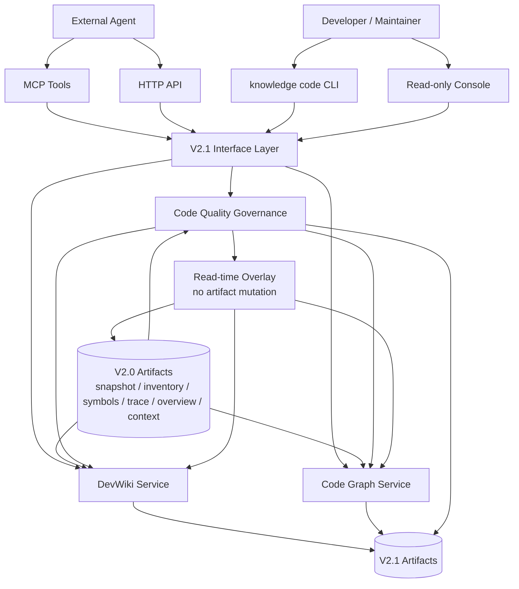
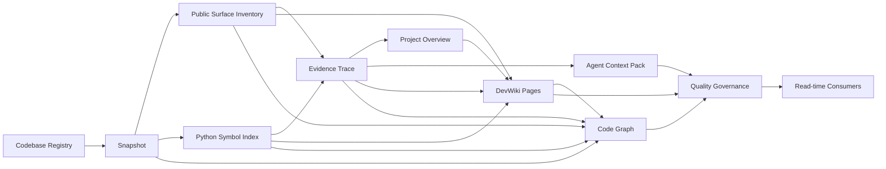

# V2.1 Target Architecture: Project Intelligence Expansion

> Status: target architecture for V2.1.
> Baseline: V2.0 artifacts are the source of truth for snapshot, inventory, symbols, evidence, overview, and context packs.
> Closure status: Phase 8-12 are accepted for the current worktree.

## 1. Architecture Goal

V2.1 adds durable reading, graph, governance, and frontend layers on top of accepted V2.0 artifacts:

```text
V2.0 artifacts
  -> DevWiki Baseline
  -> Code Graph Baseline
  -> Code Knowledge Quality Governance
  -> HTTP/MCP/CLI + read-only frontend
  -> V2.1 closure acceptance
```

Current target-state progress:

```text
V2.0 artifacts              accepted
  -> DevWiki Baseline       accepted
  -> Code Graph Baseline    accepted
  -> Code Quality           accepted
  -> Read-only Frontend     accepted
  -> V2.1 Closure           accepted
```

V2.1 must not rebuild codebase facts from scratch when V2.0 artifacts already provide them. DevWiki, Code Graph, and Quality Governance consume V2.0 artifacts and write their own V2.1 artifacts under the same codebase asset root.

Before Phase 8 implementation, the V2.0 closure gate must verify `docs/V2.x/V2_0_CLOSURE_AUDIT_REPORT.md`, accepted V2.0 artifacts, real repository E2E evidence, and absence of open fatal/major findings.

## 2. Component Architecture



## 3. Artifact Layout

All V2.1 artifacts live under:

```text
workspace/assets/codebase/{codebase_id}/
```

Required layout:

```text
devwiki/
  index.json
  pages/
    {page_slug}.json
    {page_slug}.md
graph/
  graph.json
  nodes.jsonl
  edges.jsonl
  summary.json
  mermaid/
    project.mmd
quality/
  feedback.jsonl
  rules.jsonl
  rule_reviews.jsonl
  plan.json
  summary.json
```

Every artifact must include:

- `schema_version`
- `workspace_id`
- `codebase_id`
- `snapshot_id` when artifact is snapshot-scoped
- `created_at` or `updated_at`
- `source_artifact_refs`
- `artifact_hash` or content fingerprint for phase gates when applicable.

Public responses must use repo-relative paths. Absolute paths remain internal-only.

V2.1 phases must record hashes for V2.0 fact artifacts before and after phase execution. Unless a phase explicitly plans and audits a V2.0 rebuild, these hashes must remain unchanged.

## 4. DevWiki Architecture

DevWiki modules:

```text
backend/data_service/code_assets/devwiki/model.py
backend/data_service/code_assets/devwiki/planner.py
backend/data_service/code_assets/devwiki/builder.py
backend/data_service/code_assets/devwiki/renderer_markdown.py
backend/data_service/code_assets/devwiki/persistence.py
backend/data_service/code_assets/devwiki/service.py
```

Responsibilities:

- Planner decides required pages and sections.
- Builder converts V2.0 overview, inventory, symbols, trace, and context facts into page models.
- Renderer writes Markdown from the same page model used for JSON.
- Persistence writes `index.json`, page JSON, and page Markdown.
- Service exposes build/list/read operations.

DevWiki is not V1 LLMWiki. It is project-intelligence documentation generated from V2 code artifacts.

Every DevWiki section must include `generated_from`, `source_artifact_refs`, evidence, `needs_review`, and confidence. JSON and Markdown are rendered from the same page model; Markdown must not introduce important facts that are absent from JSON.

## 5. Code Graph Architecture

Code Graph modules:

```text
backend/data_service/code_assets/graph/model.py
backend/data_service/code_assets/graph/builder.py
backend/data_service/code_assets/graph/neighbors.py
backend/data_service/code_assets/graph/renderer_mermaid.py
backend/data_service/code_assets/graph/persistence.py
backend/data_service/code_assets/graph/service.py
```

Responsibilities:

- Builder creates deterministic nodes and edges from V2.0 artifacts plus DevWiki artifacts.
- Neighbor service reads persisted graph and returns local graph slices.
- Mermaid renderer exports project-level and focused graph views.
- Persistence writes graph JSON, node JSONL, edge JSONL, summary JSON, and Mermaid files.

The graph must not include unsupported semantic edges such as full calls, data flow, control flow, runtime trace, or inferred type relationships.

Graph build must produce edge coverage metrics and assert `unsupported_edge_count == 0`. Mermaid exports must reference real node IDs and must not expose absolute paths.

## 6. Quality Governance Architecture

Quality modules:

```text
backend/data_service/code_assets/quality/model.py
backend/data_service/code_assets/quality/feedback.py
backend/data_service/code_assets/quality/rules.py
backend/data_service/code_assets/quality/review.py
backend/data_service/code_assets/quality/plan.py
backend/data_service/code_assets/quality/persistence.py
backend/data_service/code_assets/quality/service.py
```

Responsibilities:

- Feedback records human/Agent feedback against V2.1 target types.
- Rules builder proposes correction rules from feedback and low-confidence artifacts.
- Review records approve/reject/revoke decisions.
- Plan builder creates a read-time consumption plan.
- Consumers can apply approved rules to DevWiki, graph, and context-pack read outputs.

Approved rules are read-time overlays only. Applying, approving, rejecting, or revoking rules must not mutate original V2.0 fact artifacts or V2.1 DevWiki, Graph, or Context Pack source artifacts. Read outputs may include `governed_by`, `applied_rules`, and `plan_refs`.

## 7. Interface Layer

HTTP routes should keep a thin code assets entrypoint:

```text
backend/app/api/v1/code_assets.py
```

Recommended split for V2.1 route modules:

```text
backend/app/api/v1/code_assets_devwiki.py
backend/app/api/v1/code_assets_graph.py
backend/app/api/v1/code_assets_quality.py
```

MCP tools should keep a thin code tool entrypoint:

```text
backend/data_service/mcp_code_tools.py
```

Recommended split for V2.1 MCP modules:

```text
backend/data_service/mcp_code_devwiki_tools.py
backend/data_service/mcp_code_graph_tools.py
backend/data_service/mcp_code_quality_tools.py
```

CLI should keep a thin code CLI entrypoint:

```text
backend/data_service/cli_code.py
```

Recommended split for V2.1 CLI modules:

```text
backend/data_service/cli_code_devwiki.py
backend/data_service/cli_code_graph.py
backend/data_service/cli_code_quality.py
```

Large implementation logic must stay in focused `code_assets/*` modules, not in interface files.

## 8. Closure Architecture

Phase 12 is an acceptance architecture, not a product feature architecture.

It must verify:

- V2.0 artifacts remain the source of truth for codebase facts.
- V2.1 DevWiki, Graph, Quality, and frontend consume persisted artifacts and backend payloads.
- Quality Governance applies approved rules as read-time overlays only.
- Frontend displays backend-provided risk states and does not calculate authoritative facts locally.
- Final public surfaces remain stable across HTTP, MCP, and CLI.
- Final reports do not claim unsupported static-analysis capabilities.

## 8. Frontend Architecture

Frontend adds a read-only Project Intelligence surface to the existing Knowledge Console.

Minimum views:

- DevWiki page list and page detail.
- Code Graph summary and Mermaid preview.
- Quality summary, feedback/rule counts, and plan impact.
- Agent Context Pack summary/readback.

Frontend must call backend APIs and must not become a separate source of truth.

Frontend must display backend-provided `evidence`, `stale`, `needs_review`, `unresolved`, and quality status. It must not locally compute graph status, quality status, page confidence, or evidence counts as authoritative facts.

## 9. Architecture Gates

V2.1 implementation must obey these gates:

- Do not add V2.1 core routes to `backend/app/api/v1/data_service.py`.
- Do not add V2.1 core logic to `backend/data_service/service.py`.
- Do not mutate or depend on `lifecycle/sources.json` for V2 codebase artifacts.
- Do not implement DevWiki, Code Graph, or Quality as monolithic files.
- Do not claim full call graph, data flow, control flow, runtime dispatch recognition, or type inference.
- Do not emit important DevWiki, graph, or quality conclusions without evidence or `needs_review`.
- Do not expose absolute repo or workspace paths in public HTTP/MCP/CLI/frontend payloads.
- Do not start Phase 8 unless V2.0 closure, artifact presence, and V2.0 artifact hash baselines are verified.
- Do not silently regenerate V2.0 fact artifacts from V2.1 services when required artifacts are missing.
- Do not allow Quality Governance to mutate original artifacts during rule application.

## 10. Validation Architecture

V2.1 requires validation helpers for:

- V2.0 artifact hash gates.
- DevWiki page schema and Markdown/JSON consistency.
- Graph node/edge schema, unsupported edge count, edge coverage, and Mermaid node integrity.
- Quality feedback/rule/review/plan schema and read-time overlay immutability.
- Cross-link integrity from DevWiki, Graph, Quality, and Context Pack references back to real artifacts.
- Structured HTTP/MCP/CLI error envelopes for missing V2.0 closure, missing artifacts, unknown pages, unknown graph nodes, unknown quality rules, and unsupported target types.

## 11. Target Data Flow


