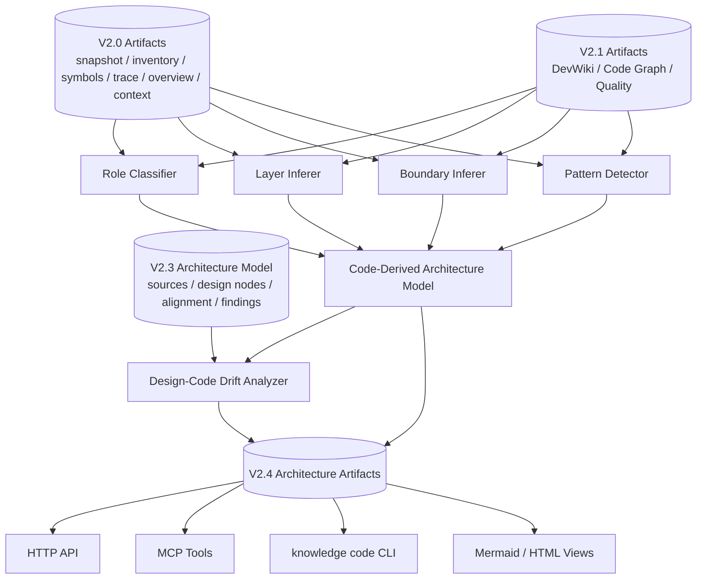

# V2.4 Target Architecture: Code-Derived Architecture Inference

> Status: target architecture for V2.4.
> Baseline: V2.0/V2.1 artifacts and V2.3 architecture model are source inputs.
> Rule: V2.4 may infer architecture from code facts, but must not overclaim unsupported static-analysis semantics.

Date: 2026-06-02

## 1. Architecture Goal

V2.4 adds a code-derived architecture inference layer:

```text
V2.0 facts + V2.1 graph/wiki/quality + V2.3 design model
  -> code role classification
  -> layer and boundary inference
  -> pattern candidate detection
  -> code-derived architecture model
  -> design-code drift findings
  -> HTTP/MCP/CLI + Mermaid/HTML views
```

V2.4 has two separate model sources:

- Design-side model: architecture documents, Drawio diagrams, Markdown diagrams, and their alignment to code facts.
- Code-derived model: roles, layers, boundaries, and pattern candidates inferred from code artifacts.

The design-side model and code-derived model are compared, but neither silently overwrites the other.

## 2. Component Architecture



## 3. Module Plan

V2.4 should extend the existing architecture package:

```text
backend/data_service/code_assets/architecture/
  role_classifier.py
  layer_inferer.py
  boundary_inferer.py
  pattern_detector.py
  code_model_builder.py
  drift.py
```

Existing modules should remain focused:

- `model.py`: add V2.4 data models only if the file remains readable; otherwise split `code_model.py`.
- `service.py`: orchestrates build/read operations but does not contain classification logic.
- `renderer.py`: renders code-derived model and drift views from persisted models.
- `persistence.py`: persists and reads V2.4 artifacts.

HTTP, MCP, and CLI should reuse the current architecture interface split:

```text
backend/app/api/v1/code_assets_architecture.py
backend/data_service/mcp_code_architecture_tools.py
backend/data_service/cli_code_architecture.py
```

If any file starts accumulating large business logic, split into dedicated helpers before implementation acceptance.

## 4. Data Model Summary

### CodeArchitectureRole

```text
role_id
role_type
target_type
target_id
name
path
signals
evidence
confidence
needs_review
source_artifact_refs
```

Allowed role types:

```text
api_router
mcp_tooling
cli_tooling
frontend
service
domain
runtime
provider
storage
policy
governance
build_pipeline
artifact_store
test
script
docs
unknown
```

### CodeLayer

```text
layer_id
layer_type
members
signals
evidence
confidence
needs_review
```

Allowed layer types:

```text
interface
application
domain
infrastructure
governance
runtime
artifact
test
docs
unknown
```

### CodeBoundary

```text
boundary_id
boundary_type
name
members
cross_boundary_edges
signals
evidence
confidence
needs_review
```

Allowed boundary types:

```text
package
bounded_context_candidate
adapter_boundary
governance_boundary
storage_boundary
public_surface_boundary
```

### ArchitecturePatternCandidate

```text
pattern_id
pattern_type
targets
signals
evidence
confidence
needs_review
```

Allowed pattern types:

```text
fastapi_router
mcp_registry
cli_command_group
provider_adapter
artifact_store
pipeline
quality_gate
context_pack
devwiki
code_graph
architecture_alignment
```

### DesignCodeDriftFinding

```text
finding_id
finding_type
severity
design_ref
code_ref
evidence
confidence
needs_review
recommendation
```

Allowed finding types:

```text
DESIGN_LAYER_MISSING_CODE
CODE_LAYER_NOT_IN_DESIGN
ROLE_MISMATCH
BOUNDARY_LEAK
UNMAPPED_PUBLIC_SURFACE
PATTERN_WITHOUT_DESIGN
DESIGN_ONLY_PATTERN
LOW_CONFIDENCE_ROLE
EVIDENCE_MISSING
```

## 5. Inference Rules

Inference must be deterministic-first:

- Public surfaces imply interface roles only when linked through inventory or graph artifacts.
- MCP role classification uses MCP tool specs, MCP registry, and MCP module evidence.
- CLI role classification uses parser/command group evidence.
- FastAPI role classification uses route artifacts and route handler evidence.
- Storage/artifact roles use persisted artifact layouts and code asset persistence modules.
- Governance roles use quality feedback/rule/plan models and services.
- Pattern candidates require multiple signals or a single strong public-surface signal.

Inference must report uncertainty:

- Missing evidence produces `needs_review`.
- Low-confidence roles cannot be promoted to architecture summary facts.
- Dynamic or unsupported relationships must stay unresolved.

## 6. Artifact Layout

```text
workspace/assets/codebase/{codebase_id}/architecture/
  code_roles.jsonl
  code_layers.jsonl
  code_boundaries.jsonl
  pattern_candidates.jsonl
  code_derived_model.json
  design_code_drift.jsonl
  views/
    code_derived_architecture.mmd
    code_derived_architecture.html
```

Artifact mutation rule:

- V2.4 writes only V2.4 architecture artifacts.
- V2.4 may read V2.0/V2.1/V2.3 artifacts.
- V2.4 must not silently rebuild or mutate prior artifacts.

## 7. Public Interface Architecture

HTTP:

```text
POST /api/workspaces/{workspace_id}/codebases/{codebase_id}/architecture/code/build
GET  /api/workspaces/{workspace_id}/codebases/{codebase_id}/architecture/code/model
GET  /api/workspaces/{workspace_id}/codebases/{codebase_id}/architecture/code/roles
GET  /api/workspaces/{workspace_id}/codebases/{codebase_id}/architecture/code/patterns
GET  /api/workspaces/{workspace_id}/codebases/{codebase_id}/architecture/code/drift
GET  /api/workspaces/{workspace_id}/codebases/{codebase_id}/architecture/code/views/{view_id}
```

MCP:

```text
knowledge_code_architecture_build
knowledge_code_architecture_model
knowledge_code_architecture_roles
knowledge_code_architecture_patterns
knowledge_code_architecture_drift
knowledge_code_architecture_view
```

CLI:

```text
knowledge code architecture code-build
knowledge code architecture code-model
knowledge code architecture roles
knowledge code architecture patterns
knowledge code architecture drift
knowledge code architecture code-view
```

## 8. Architecture Gates

Implementation must stop for review if:

- It needs to add V2.4 core logic to `backend/data_service/service.py`.
- It needs to add V2.4 routes to `backend/app/api/v1/data_service.py`.
- It cannot produce evidence for high-confidence architecture roles.
- It claims full call graph, data flow, control flow, runtime dispatch, or type inference.
- It can only pass on mock repos, not on `data_service` and HarnessOS.
- It mutates V2.0/V2.1/V2.3 artifacts without an explicit rebuild plan.
- It emits absolute paths in public payloads or generated views.

## 9. Target-State Diagram

See `docs/V2.x/V2_4_TARGET_STATE.drawio`.
