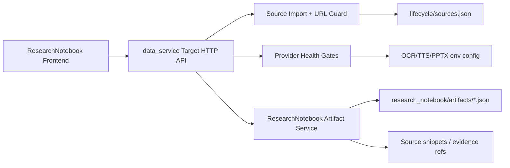
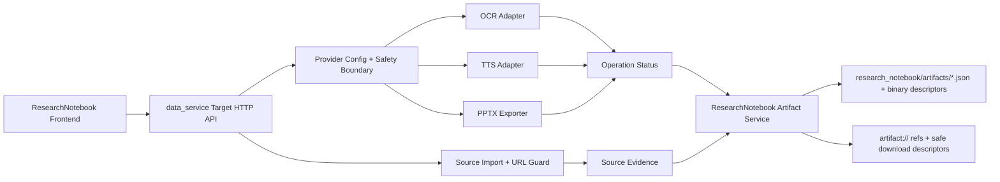
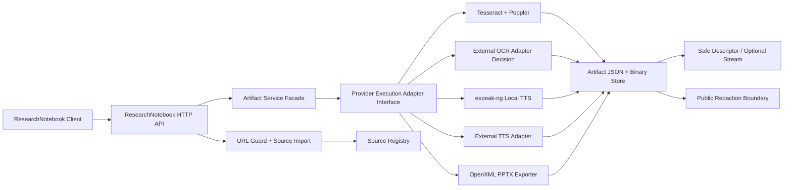

# V2.5 ResearchNotebook Backend Target Architecture

## 1. Component Model

Current accepted baseline:



Provider-specific target:



## 2. Module Boundaries

- URL SSRF guard remains in `data_service.url_source_contract`.
- Existing source import route receives only compatibility edits needed to return blocked URL payloads.
- ResearchNotebook artifact/provider logic lives in `data_service.research_notebook_artifacts`.
- ResearchNotebook HTTP routes live in `app.api.v1.research_notebook`.
- V2.0-V2.4 code asset artifacts are not modified by V2.5.
- Provider-specific adapters should live behind focused ResearchNotebook provider modules, not inside `backend/app/api/v1/data_service.py`.
- HTTP route handlers remain thin: validate request, call provider/artifact service, return sanitized envelope.

## 3. Storage

ResearchNotebook artifacts are stored under each workspace:

```text
research_notebook/
  artifacts/
    {artifact_id}.json
    binaries/
      {artifact_id}.{ext}
```

Public payloads expose only service-owned refs:

```text
artifact://{workspace_id}/{artifact_id}
source://{source_id}
```

Binary artifact descriptors must expose safe service refs or controlled download descriptors. They must not expose absolute filesystem paths.

Binary descriptor minimum fields:

```text
artifact_id
artifact_type
status
binary.ref
binary.mime_type
binary.size_bytes
binary.sha256
download.descriptor_id
evidence_refs
```

## 4. Security Rules

URL guard blocks:

- localhost and loopback;
- private IP ranges;
- link-local and metadata IP;
- multicast/reserved/unspecified addresses;
- redirect targets that resolve to blocked addresses;
- unsupported content type;
- timeout and permission errors.

No public response may include local filesystem paths or debug path keys.

## 5. Provider Rules

OCR/TTS/PPTX providers are optional. Absence is not a backend failure; it is represented as stable false capability or explicit unsupported artifact response.

Provider-specific execution rules:

- A configured provider must be health-checked before work is reported as supported.
- Provider auth failures, timeouts, unsupported provider names, and quota failures must map to structured public error codes.
- Raw provider exceptions, API keys, internal endpoints, and local paths must be redacted.
- Provider-backed artifacts must retain source evidence refs and generation metadata.
- Provider-disabled fallback behavior must continue to pass after provider-backed paths are added.
- Public errors must use the Provider Error Contract from the V2.5 PRD.
- Health payloads must use the Provider Health Contract from the V2.5 PRD.
- OCR image fixture is mandatory; scanned PDF requires rasterizer support or `PDF_RASTERIZER_UNAVAILABLE`.

Provider errors must be normalized into:

```text
PROVIDER_NOT_CONFIGURED
PROVIDER_UNSUPPORTED
PROVIDER_MISSING_CREDENTIAL
PROVIDER_AUTH_FAILED
PROVIDER_TIMEOUT
PROVIDER_QUOTA_EXCEEDED
PROVIDER_UNAVAILABLE
PROVIDER_BAD_RESPONSE
PROVIDER_EXECUTION_FAILED
PROVIDER_OUTPUT_INVALID
EXPORTER_NOT_CONFIGURED
EXPORTER_UNSUPPORTED
PDF_RASTERIZER_UNAVAILABLE
```

## 6. Target Data Flow

```text
Source Evidence
  -> Provider Request Builder
  -> Provider Adapter / Local Exporter
  -> Operation Status
  -> Artifact Writer
  -> Public Artifact Read/List/Download Descriptor
```

OCR output must include source locator information such as page number, block index, optional bbox, confidence, and extracted text.

Audio output must include script segments, voice metadata, duration, artifact descriptor, and evidence refs.

PPTX output must include source slides artifact id, generated PPTX artifact id, slide count, file size, and evidence lineage.

TTS data flow must remain two-stage:

```text
source evidence -> script_segments -> TTS provider -> audio binary -> audio descriptor
```

If TTS is unavailable after script generation, output may expose `script_available=true`, but it must keep `audio_available=false` and must not mark the artifact as audio-ready.

PPTX output must be a valid OpenXML zip package, not a renamed JSON artifact.

## 7. Phase-to-Architecture Mapping

| Phase | Architecture Change |
| --- | --- |
| Phase 32 | Adds Provider Config + Safety Boundary and structured provider error mapping. |
| Phase 33 | Adds OCR Adapter and OCR artifact path for scanned source fixtures. |
| Phase 34 | Adds TTS Adapter and audio artifact descriptor path. |
| Phase 35 | Adds PPTX Exporter and binary artifact descriptor path. |
| Phase 36 | Adds closure-level validation across provider-enabled and provider-disabled paths. |
| Phase 37 | Adds scanned PDF success path and fixture-backed rasterization acceptance. |
| Phase 38 | Adds executable provider adapter contracts and separates health declaration from execution support. |
| Phase 39 | Adds one accepted external TTS provider real run where a usable key exists. |
| Phase 40 | Adds external OCR provider decision and optional real provider run. |
| Phase 41 | Closes artifact download semantics: descriptor-only or direct binary stream. |
| Phase 42 | Freezes full PRD coverage and acceptance matrix. |

## 7.1 V2.5B Full PRD Closure Target Architecture

V2.5A accepted the local provider path. V2.5B extends the architecture toward the full original ResearchNotebook backend PRD:



Architecture rules for V2.5B:

- provider health can advertise known provider names, but execution support must be resolved by adapter availability;
- a known provider with no execution adapter must be testable and must return `PROVIDER_UNSUPPORTED`;
- provider execution adapters must return the Provider Error Contract, not raw SDK exceptions;
- Phase 37 must use the same `ProviderExecutionResult` and `ArtifactWriteResult` contract that Phase 38 hardens;
- scanned PDF OCR success must flow through a real rasterizer and OCR provider;
- Minimax can be a TTS candidate only if it satisfies the audio artifact contract with real binary output;
- direct binary streaming, if added, must sit behind the artifact download boundary and never expose local paths;
- V2.5B must preserve V2.5A disabled fallback and local provider acceptance.

## 8. Recommended Module Split

Provider-specific implementation should split logic before adding adapters:

```text
backend/data_service/research_notebook/
  providers/
    config.py
    errors.py
    redaction.py
    health.py
    ocr_tesseract.py
    tts_*.py
    pptx_exporter.py
  artifacts/
    binary_store.py
    descriptors.py
    ocr_artifacts.py
    audio_artifacts.py
    pptx_artifacts.py
```

`backend/data_service/research_notebook_artifacts.py` may remain as a compatibility facade, but it must not grow into a new large provider implementation module.

Phase 38-40 adapter implementations should use focused modules:

```text
backend/data_service/research_notebook/
  providers/
    adapter_contract.py
    adapter_registry.py
    tts_external_*.py
    ocr_external_*.py
  artifacts/
    audio_artifacts.py
    download_contract.py
```

Route handlers in `backend/app/api/v1/research_notebook.py` should stay thin. Provider SDK calls, rasterizer calls, binary integrity checks, and provider decision records must not be implemented in route handlers.

## 8.1 Binary Integrity and Redaction Boundary

Every provider-backed artifact must pass the same integrity checks:

```text
artifact JSON exists
binary exists when applicable
sha256 matches
size_bytes matches
mime_type matches
status matches
descriptor ref is safe
no absolute path
```

The redaction boundary must cover:

- API responses;
- provider raw exception bodies;
- request metadata;
- artifact metadata;
- generated scripts/text;
- binary descriptors;
- download descriptors.

## 9. Architecture Gates

- Do not add V2.5 core artifact logic to `backend/app/api/v1/data_service.py`.
- Do not generate fake audio or PPTX files.
- Do not accept LLM-only artifacts without evidence.
- Do not mutate project-intelligence artifacts under `assets/codebase`.
- Do not claim real provider acceptance unless provider-enabled real fixture tests pass.
- Do not silently downgrade provider failures to ready artifacts.
- Do not return binary local paths or provider secrets in public API output.
- Do not accept provider-enabled tests that skip all real provider execution.
- Do not accept OCR success from embedded-text PDF when the claim is scanned PDF OCR.
- Do not count provider health support as provider execution support.
- Do not mark Azure, Google, ElevenLabs, or Minimax accepted without a provider-enabled real fixture.
- Do not mark full PRD closure accepted without a PRD coverage matrix.
- Do not add direct binary download streaming unless the download descriptor contract and security model are updated first.
- Do not allow `research_notebook_artifacts.py` to absorb new external provider SDK implementation details.
- Do not pass Phase 38 without a negative health-known/execution-unsupported provider test.
