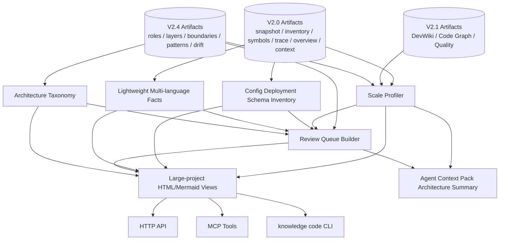

# V2.6 Target Architecture: Large-Scale Architecture Abstraction Hardening

> Status: target architecture for V2.6.
> Baseline: V2.0/V2.1/V2.4 Project Intelligence artifacts.
> Rule: V2.6 hardens architecture abstraction for large projects without claiming full static analysis.

Date: 2026-06-03

## 1. Architecture Goal

V2.6 adds a large-project hardening layer on top of V2.4 code-derived architecture inference:

```text
V2.0 facts + V2.1 graph/wiki/quality + V2.4 architecture inference
  -> scale profile
  -> lightweight multi-language/config facts
  -> taxonomy and confidence calibration
  -> review queue
  -> large-project views
  -> Agent Context Pack architecture summary
```

V2.6 has two strict boundaries:

- It may summarize and classify deterministic facts.
- It must not invent runtime or semantic relationships that are not present in persisted artifacts.

## 2. Component Architecture



## 3. Module Plan

V2.6 should extend the existing architecture package:

```text
backend/data_service/code_assets/architecture/
  scale_profile.py
  config_inventory.py
  deployment_inventory.py
  taxonomy.py
  review_queue.py
  large_project_views.py
```

Existing architecture modules remain source inputs:

- `role_classifier.py`
- `layer_inferer.py`
- `boundary_inferer.py`
- `pattern_detector.py`
- `code_model_builder.py`
- `drift.py`
- `service.py`
- `renderer.py`
- `persistence.py`

Interface modules remain:

```text
backend/app/api/v1/code_assets_architecture.py
backend/data_service/mcp_code_architecture_tools.py
backend/data_service/cli_code_architecture.py
```

Business logic must not move into route handlers. `service.py` may orchestrate, but scale/config/taxonomy/review logic should live in focused modules.

## 4. Data Model Summary

### ArchitectureScaleProfile

```text
schema_version
workspace_id
codebase_id
snapshot_id
file_count
loc_total
language_distribution
artifact_sizes
build_durations
warning_counts
skipped_paths
confidence_distribution
needs_review_count
summary_mode_required
source_artifact_refs
created_at
```

### ConfigInventoryItem

```text
item_id
item_type
path
key
value_summary
signals
evidence
confidence
needs_review
redaction
```

Allowed item types:

```text
package_manifest
python_project_config
container_config
compose_config
kubernetes_manifest
ci_workflow
env_example
openapi_like_schema
database_schema_hint
unknown_config
```

### DeploymentInventoryItem

```text
deployment_id
deployment_type
path
name
runtime_hint
service_hint
ports
dependencies
evidence
confidence
needs_review
```

Allowed deployment types:

```text
dockerfile
docker_compose
kubernetes
github_actions
process_script
package_script
unknown_deployment
```

### ArchitectureTaxonomy

```text
schema_version
taxonomy_id
role_types
layer_types
boundary_types
pattern_types
confidence_thresholds
override_source
created_at
```

### ArchitectureReviewQueueItem

```text
review_id
target_type
target_id
reason
severity
confidence
signals
evidence
recommended_action
```

## 5. Public Contract

All V2.6 read outputs must:

- use V2 success/error envelopes;
- expose stable counts and IDs;
- return summary-first payloads;
- include artifact refs;
- include unresolved/needs_review counts;
- avoid absolute paths and secrets;
- never imply unsupported static analysis semantics.

## 6. Storage and Artifact Rules

V2.6 writes only under:

```text
workspace/assets/codebase/{codebase_id}/architecture/
```

V2.6 must not mutate:

- source registry;
- V2.0 snapshot/inventory/symbol/trace artifacts;
- V2.1 DevWiki/Graph/Quality artifacts;
- V2.4 code-derived model artifacts unless explicitly rebuilding V2.4.

Before and after V2.6 builds, acceptance must hash-gate prior artifacts.

## 7. Rendering Rules

HTML and Mermaid outputs must be generated from persisted artifacts only:

- `architecture_large_project_overview.html`
- `architecture_key_boundaries.mmd`

The renderer may omit low-value nodes for readability, but every displayed node must map back to a persisted role, config item, deployment item, boundary, pattern, or review queue item.

## 8. False-Claim Guardrails

Reject implementation or closure if:

- large-project view contains facts not present in artifacts;
- unsupported dynamic/runtime relationship is marked accepted;
- low-confidence inference is included as high-confidence architecture fact;
- non-Python lightweight facts are described as full semantic analysis;
- config files with secrets leak raw values;
- artifact hash gate shows silent mutation of previous V2 artifacts;
- HarnessOS E2E is replaced with mock data.
