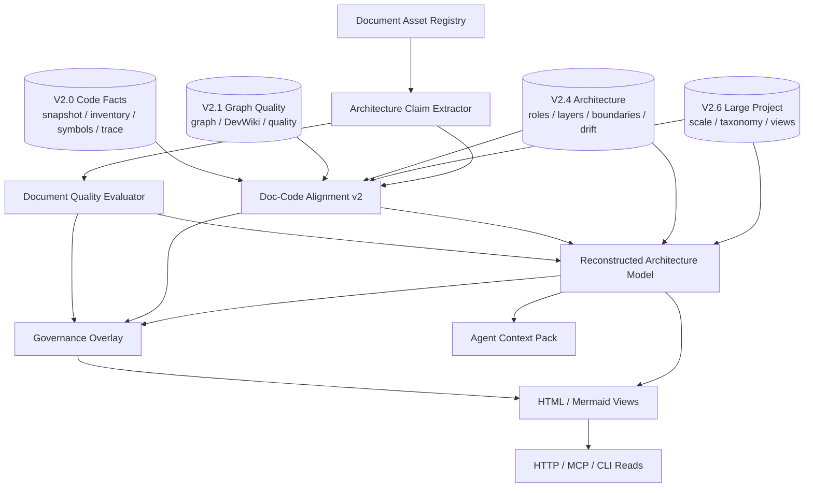

# V2.7 Target Architecture: Documentation-Code Architecture Governance

> Status: target architecture for V2.7 document development.
> Rule: V2.7 reconstructs architecture from document claims plus code evidence, not from code alone.
> Phase 49-55 are accepted; V2.7 closure is accepted for the current worktree.

Date: 2026-06-04

## 0. Current Architecture Status

Phase 49, Phase 50, Phase 51, Phase 52, Phase 53, Phase 54, and Phase 55 are implemented and accepted. The Document Asset Registry, Architecture Claim Extractor, Document Quality Evaluator, Doc-Code Alignment v2, Architecture Reconstruction Report, Governance Integration, and Closure Acceptance are part of the current V2.7 baseline.

Current V2.7 baseline:

- `architecture_docs.jsonl`
- `architecture_doc_sources.jsonl`
- `architecture_doc_claims.jsonl`
- `architecture_doc_relations.jsonl`
- `architecture_doc_quality_findings.jsonl`
- `architecture_doc_quality_summary.json`
- `architecture_doc_code_alignment.jsonl`
- `architecture_doc_code_drift_v2.jsonl`
- `architecture_reconstructed_model.json`
- `views/document_code_architecture_report.html`
- `views/document_code_architecture_diff.mmd`
- HTTP/MCP/CLI document registry build/read contracts
- HTTP/MCP/CLI document claim build/read contracts
- HTTP/MCP/CLI document quality build/read contracts
- HTTP/MCP/CLI document-code alignment build/read contracts
- HTTP/MCP/CLI reconstructed architecture build/read/view contracts
- quality feedback/rules/review/plan support for V2.7 document-code targets
- read-time governance overlay on V2.7 document-code reads
- real `data_service` and HarnessOS document registry E2E

Remaining target architecture:

- none for accepted V2.7 scope.

## 1. Architecture Goal

V2.7 adds a documentation governance layer on top of V2.6 large-project architecture abstraction. After Phase 49, the first stage of the pipeline is implemented:

```text
V2.0 facts + V2.1 graph/quality + V2.4 architecture inference + V2.6 large-project hardening
  -> document asset registry [accepted Phase 49]
  -> architecture claim extraction [accepted Phase 50]
  -> document quality evaluation [accepted Phase 51]
  -> doc-code alignment v2 [accepted Phase 52]
  -> reconstructed target/current/diff architecture [accepted Phase 53]
  -> governance overlay [accepted Phase 54]
  -> HTML/Mermaid/API/MCP/CLI/Agent outputs
```

V2.7 has three strict boundaries:

- documented architecture claims and code facts must remain separately traceable;
- inferred architecture must be confidence-scored and marked `needs_review` unless supported by evidence;
- original documents and prior code artifacts are immutable unless explicitly rebuilt by their owning phase.

Phase 49 starts with a V2.6 closure pre-gate. V2.7 must verify V2.6 closure documentation and artifact availability before consuming V2.6 scale, taxonomy, review queue, and view artifacts. Missing V2.6 artifacts are represented as structured missing-artifact state and must not be replaced with mock data.

## 2. Current vs Target Difference

| Area | Current V2.6 capability | V2.7 target capability |
| --- | --- | --- |
| Document discovery | Heuristic architecture source discovery by path and extension | First-class document asset registry with doc type, phase, scope, and stale hints |
| Drawio parsing | Label and edge extraction | Architecture claim extraction with relation semantics, status, governance and acceptance hints |
| Markdown parsing | Mostly heading-level architecture nodes | Claim-level extraction for PRD, target architecture, gap, plan and audit documents |
| Document quality | Not first-class | Completeness, consistency, evidence, freshness and acceptance closure findings |
| Design-code match | Token overlap and low-confidence review | Claim-to-code alignment with status taxonomy, evidence rules and coverage metrics |
| Architecture view | Code-derived large-project summary | Target/current/diff architecture reconstruction from document and code artifacts |
| Governance | Quality targets include architecture roles/findings | Governance targets include docs, claims, doc quality findings, alignments and reconstructed nodes |

## 3. Component Architecture



## 4. Module Plan

V2.7 should extend the existing architecture package without moving business logic into interface modules:

```text
backend/data_service/code_assets/architecture/
  doc_registry.py
  doc_claim_extractor.py
  doc_quality.py
  doc_code_alignment.py
  doc_reconstruction.py
  doc_views.py
  doc_contracts.py
```

Existing source inputs:

- V2.0 artifacts: snapshot, files, public surfaces, symbols, evidence trace.
- V2.1 artifacts: code graph, quality governance.
- V2.4 artifacts: code architecture roles, layers, boundaries, patterns, drift.
- V2.6 artifacts: scale profile, lightweight inventory, taxonomy, review queue and large-project views.

Interface modules should remain thin:

```text
backend/app/api/v1/code_assets_architecture.py
backend/data_service/mcp_code_architecture_tools.py
backend/data_service/cli_code_architecture.py
```

If these files become too large, implementation should split V2.7 interface registration into focused doc-architecture modules while preserving existing public paths.

## 5. Data Model Summary

### ArchitectureDocument

```text
schema_version
workspace_id
codebase_id
snapshot_id
doc_id
doc_type
path
title
phase_hint
version_hint
scope_hint
stale_hint
authority_role
authority_level
supersedes
superseded_by
evidence
confidence
needs_review
created_at
```

Allowed `doc_type` values:

```text
prd
target_architecture
gap_analysis
drawio
development_plan
acceptance_plan
audit_report
api_matrix
handoff_summary
readme
unknown_architecture_doc
```

Allowed `authority_role` values:

```text
target
implementation_plan
acceptance_result
audit_status
historical_reference
unknown
```

Allowed `authority_level` values:

```text
primary
supporting
historical
weak
```

### ArchitectureDocumentClaim

```text
claim_id
doc_id
claim_type
label
normalized_label
status_hint
scope_hint
source_path
line_range
source_block_type
drawio_cell_id
drawio_diagram_id
evidence
confidence
needs_review
```

Allowed `claim_type` values:

```text
system
plane
layer
bounded_context
component
adapter
provider
runtime
storage
artifact
public_interface
governance_boundary
policy
milestone
acceptance_gate
forbidden_claim
non_goal
quality_gate
```

Claim confidence ceilings:

```text
explicit heading/table/API matrix claim: <= 0.90
explicit acceptance gate/non-goal/forbidden claim: <= 0.90
Markdown bullet/list claim: <= 0.80
drawio node only: <= 0.70
drawio edge without explicit relation label: <= 0.65
inferred claim: <= 0.60 and needs_review
```

### ArchitectureDocumentRelation

```text
relation_id
from_claim_id
to_claim_id
relation_type
source_doc_id
evidence
confidence
needs_review
```

Allowed relation types:

```text
contains
depends_on
governs
produces
consumes
implements
documents
validates
blocks
supersedes
conflicts_with
```

### ArchitectureDocumentQualityFinding

```text
finding_id
target_type
target_id
finding_type
severity
title
evidence
recommendation
confidence
needs_review
```

Accepted alignment policy:

```text
accepted_match_confidence_min = 0.80
weak_match_confidence_range = 0.40 - 0.79
token_overlap_only -> weak_match only
```

Allowed `match_strategy` values:

```text
exact_surface_id
exact_symbol_id
artifact_ref_match
capability_id_match
path_and_line_evidence_match
graph_node_id_match
v24_role_boundary_match
v26_taxonomy_match
manual_reviewed
token_overlap_only
```

Allowed finding types:

```text
missing_acceptance_gate
missing_evidence
stale_document
scope_conflict
status_conflict
unsupported_claim
ambiguous_ownership
missing_current_target_split
doc_code_mismatch
overbroad_architecture_claim
```

### ArchitectureDocCodeAlignment

```text
alignment_id
claim_id
code_ref
status
match_strategy
document_evidence
code_evidence
confidence
needs_review
```

Allowed statuses:

```text
matched
weak_match
designed_not_found_in_code
code_not_documented
doc_claim_without_evidence
stale_doc_claim
needs_review
```

### ReconstructedArchitectureModel

```text
model_id
target_nodes
current_nodes
diff_nodes
edges
coverage_summary
quality_summary
source_artifact_refs
confidence_distribution
needs_review_count
```

## 6. Public Contract

All V2.7 read outputs must:

- use V2 success/error envelopes;
- expose stable IDs and counts;
- include artifact refs;
- include document and code evidence;
- separate documented target architecture from current code architecture;
- mark inferred nodes explicitly;
- avoid absolute paths and secrets;
- never claim pure code recovery of human design intent.

## 7. Storage Rules

V2.7 writes only under:

```text
workspace/assets/codebase/{codebase_id}/architecture/docs/
```

V2.7 must not silently mutate:

- source registry;
- V2.0 snapshot/inventory/symbol/trace artifacts;
- V2.1 DevWiki/Graph/Quality artifacts;
- V2.4 architecture artifacts;
- V2.6 scale/profile/view artifacts;
- original project documents.

Approved governance rules may affect read-time overlay only.

Every phase must perform a source artifact hash gate:

- record source registry hash;
- record original document hashes;
- record V2.0/V2.1/V2.4/V2.6 artifact hashes;
- run the phase;
- assert those hashes remain unchanged unless the owning phase explicitly rebuilds them.

## 8. Rendering Rules

Generated views:

```text
views/document_code_architecture_report.html
views/document_code_architecture_diff.mmd
```

Rendering must follow these rules:

- target architecture nodes come from document claims;
- current architecture nodes come from code facts or V2.4/V2.6 artifacts;
- diff nodes come from alignment or quality findings;
- every visible important node has a source artifact reference;
- copied drawio nodes must be labeled as document claims, not code-inferred facts.
- HTML must escape document text, sanitize links, and disable raw script injection.
- Mermaid node IDs must come from artifact IDs, not raw labels.
- Mermaid labels must be escaped, and Mermaid outputs must not contain absolute paths.

## 9. Cross-Link Integrity

V2.7 artifacts must be internally resolvable:

- every `doc_id` in claims, relations, findings and alignments must exist in `architecture_docs.jsonl`;
- every `claim_id` in relations, findings and alignments must exist in `architecture_doc_claims.jsonl`;
- every relation endpoint must resolve to an existing claim;
- every accepted `code_ref` must resolve to a persisted surface, symbol, graph node, role, layer, boundary, pattern or V2.6 lightweight fact;
- every reconstructed node must reference a document claim, code fact, or explicitly marked inference;
- every node rendered in HTML/Mermaid must exist in the reconstructed model.

## 10. False-Claim Guardrails

Reject implementation or closure if:

- a copied original architecture diagram is presented as code-reconstructed architecture;
- token overlap is the only evidence for an accepted match;
- low-confidence claims are counted as accepted facts;
- generated views introduce architecture claims not present in artifacts;
- document quality findings have no evidence;
- `data_service` or HarnessOS E2E is replaced with mock data;
- prior V2 artifacts are silently rewritten.
- source artifact hash gates fail.
