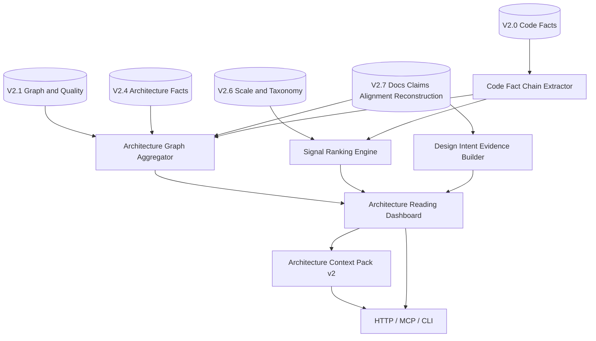

# V2.8 Target Architecture: Readable Architecture Intelligence

> V2.8 target architecture for documentation development.
> V2.8 consumes V2.0-V2.7 artifacts and improves graph readability, code fact depth, ranking, and architecture context output.
> It does not claim full static analysis or pure code recovery of human design intent.

Date: 2026-06-04

## 1. Architecture Goal

V2.8 adds a presentation and intelligence layer on top of V2.7:

```text
V2.0-V2.7 artifacts
  -> graph aggregation and view models
  -> deeper code fact chains
  -> signal ranking and review queue v2
  -> design-intent evidence model
  -> readable HTML/SVG/Mermaid views
  -> Architecture Context Pack v2
```

The architecture separates:

- persisted facts from rendered views;
- deterministic code facts from inferred runtime hints;
- documented target intent from code-observed implementation;
- accepted findings from reviewable signals.

## 2. Current vs Target Difference

| Area | V2.7 baseline | V2.8 target |
| --- | --- | --- |
| HTML report | Summary cards, target/current/diff sections, Mermaid diff | First-screen readable dashboard with multiple charts, hotspot tables, graph navigation, and evidence links |
| Graph | persisted model with capped node lists | clustered graph views by layer, capability, folder/module, authority, confidence, and severity |
| Code facts | public surfaces, symbols, alignment, drift | entrypoint chains, service/module paths, dependency clusters, config/runtime/deployment hints |
| Large project UX | many claims/drift rows, limited ranking | signal ranking, top-N review queues, summary levels, noise reduction |
| Design intent | mostly document-derived claims | explicit documented intent / code-observed implementation / audit-accepted state / mismatch model |
| Agent output | context pack from prior artifacts | architecture context pack v2 with ranked evidence, diagrams, and task-aware guidance |

## 3. Component Architecture



## 4. Module Plan

V2.8 should extend the existing architecture package with focused modules:

```text
backend/data_service/code_assets/architecture/
  reading_dashboard.py
  graph_aggregation.py
  code_fact_chains.py
  signal_ranking.py
  intent_evidence.py
  context_pack_v2.py
  view_rendering_v2.py
```

Interface modules remain thin:

```text
backend/app/api/v1/code_assets_architecture.py
backend/data_service/mcp_code_architecture_tools.py
backend/data_service/cli_code_architecture.py
```

If interface files grow too large, split registration into focused architecture read modules while preserving public paths.

## 5. Data Flow

```text
Input artifacts:
  V2.0 surfaces/symbols/evidence
  V2.1 graph/quality
  V2.4 roles/layers/boundaries/drift
  V2.6 scale/taxonomy/review queue
  V2.7 docs/claims/quality/alignment/reconstruction

Processing:
  code fact chain extraction
  graph clustering and view generation
  signal ranking
  design-intent evidence linking
  dashboard assembly
  context pack rendering

Outputs:
  JSON artifacts
  HTML/SVG/Mermaid views
  HTTP/MCP/CLI read payloads
  Agent context pack v2
```

## 6. Boundary Rules

- No full call graph, data flow, control flow, runtime trace, or type inference claim.
- Import dependencies are not runtime calls.
- Runtime boundary hints are `needs_review` unless backed by explicit code/config evidence.
- Drawio nodes remain document-derived unless independently supported by code evidence.
- Ranking cannot hide fatal or major findings.
- Rendered charts cannot invent facts that are absent from persisted artifacts.
- V2.0-V2.7 artifacts are read-only inputs unless explicitly rebuilt by their owning phase.

## 7. Storage Layout

```text
workspace/assets/codebase/{codebase_id}/architecture/v2_8/
  architecture_reading_dashboard.json
  architecture_graph_summary.json
  architecture_graph_clusters.json
  architecture_graph_views/
  architecture_code_fact_chains.jsonl
  architecture_runtime_boundaries.jsonl
  architecture_signal_ranking.json
  architecture_review_queue_v2.json
  architecture_intent_evidence.jsonl
  architecture_context_pack_v2/
  views/
```

## 8. Architecture Exit Gates

V2.8 architecture is accepted only if:

- both `data_service` and HarnessOS pass real E2E;
- report views are readable without relying on external design documents;
- every chart node and relationship resolves to a persisted artifact;
- accepted code chains include source evidence and line ranges;
- graph clusters expose expansion provenance;
- context packs do not contain unsupported guidance;
- public outputs pass redaction and contract parity checks.
