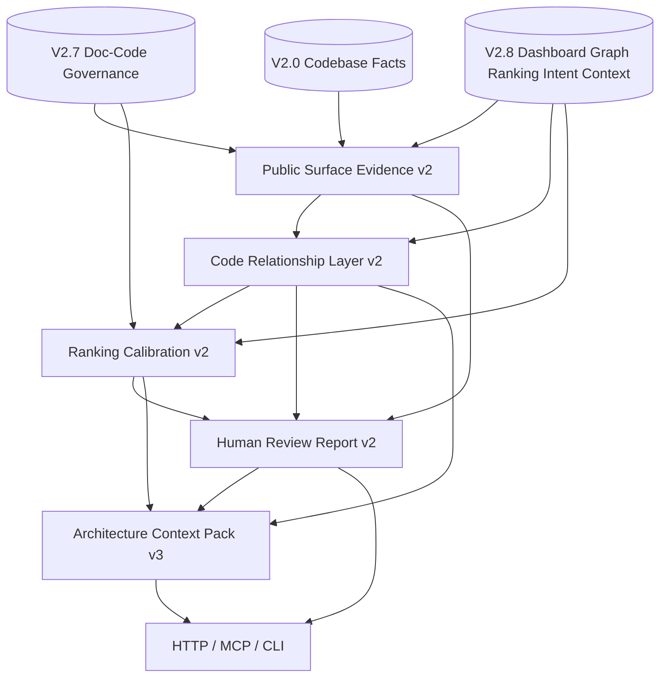

# V2.9 Target Architecture: Evidence-Hardened Architecture Review

> V2.9 target architecture for documentation development.
> V2.9 consumes accepted V2.0-V2.8 artifacts and hardens public-surface evidence, shallow implementation relationships, ranking calibration, and human review output.
> It does not claim full static analysis, full call graph, or pure code recovery of human design intent.

Date: 2026-06-05

## 1. Architecture Goal

V2.9 adds an evidence hardening and review presentation layer on top of V2.8:

```text
V2.0-V2.8 artifacts
  -> Public Surface Evidence v2
  -> Code Relationship Layer v2
  -> Ranking Calibration v2
  -> Human Review Report v2
  -> Architecture Context Pack v3
  -> HTTP / MCP / CLI
```

The architecture separates:

- deterministic line-level evidence from inferred hints;
- accepted implementation relationships from heuristic review items;
- ranking priority from acceptance status;
- human-readable report content from source facts;
- V2.9 artifacts from V2.0-V2.8 source artifacts.

## 2. Current vs Target Difference

| Area | V2.8 baseline | V2.9 target |
| --- | --- | --- |
| HarnessOS code evidence | chains generated, accepted chains = 0 due missing line evidence | public surface evidence v2 improves line-level extraction or records structured blockers |
| Code relationships | entrypoint chains and runtime hints | shallow capability -> surface -> handler/module/test relationship paths |
| Ranking | many major/pinned items exposed conservatively | duplicate grouping, severity normalization, calibrated priority lanes |
| Human report | dashboard with charts and hotspots | richer audit report with heatmaps, lanes, module clusters, evidence expanders |
| Context pack | V2.8 dashboard/graph/ranking/chains/intent | V3 pack with calibrated risks, implementation paths, human review notes |

## 3. Component Architecture



## 4. Module Plan

Focused modules:

```text
backend/data_service/code_assets/architecture/
  surface_evidence_v2.py
  code_relationships_v2.py
  ranking_calibration_v2.py
  human_review_report_v2.py
  context_pack_v3.py
```

Thin interface modules:

```text
backend/app/api/v1/code_assets_architecture.py
backend/data_service/mcp_code_architecture_tools.py
backend/data_service/cli_code_architecture.py
```

If interface modules grow too large, registration may be split into focused architecture modules while preserving public paths and tool names.

## 5. Data Flow

```text
Inputs:
  V2.0 surfaces/symbols/evidence
  V2.4 roles/layers/boundaries/patterns
  V2.7 docs/claims/quality/alignment/reconstruction
  V2.8 dashboard/graph/chains/ranking/intent/context

Processing:
  public surface evidence extraction v2
  shallow code relationship construction
  ranking calibration and review queue grouping
  human report rendering
  context pack v3 creation

Outputs:
  JSON/JSONL artifacts
  HTML/Mermaid views
  HTTP/MCP/CLI payloads
  Agent context packs
```

## 6. Boundary Rules

- No full call graph, data flow, control flow, runtime trace, or type inference claim.
- Import dependencies are dependency evidence, not runtime calls.
- Heuristic relationships remain `needs_review`.
- Drawio/document claims remain document-derived unless independently supported by code evidence.
- Ranking cannot hide fatal or major findings.
- Human report views cannot introduce facts absent from persisted artifacts.
- V2.0-V2.8 artifacts are read-only inputs unless explicitly rebuilt by their owning phase.

## 7. Storage Layout

```text
workspace/assets/codebase/{codebase_id}/architecture/v2_9/
  architecture_public_surface_evidence_v2.jsonl
  architecture_code_relationships_v2.jsonl
  architecture_module_clusters_v2.json
  architecture_signal_ranking_v2.json
  architecture_review_queue_v3.json
  architecture_human_review_report_v2.json
  architecture_context_pack_v3/
  views/
```

## 8. Architecture Exit Gates

V2.9 architecture is accepted only if:

- both `data_service` and HarnessOS pass real E2E;
- HarnessOS evidence improves over V2.8 or a structured blocker is recorded;
- every accepted relationship has evidence and line-level source refs where applicable;
- ranking calibration exposes reason codes and grouping metrics;
- human report is readable without raw JSON inspection;
- context packs preserve evidence under token pressure;
- public outputs pass redaction and HTTP/MCP/CLI parity checks.
