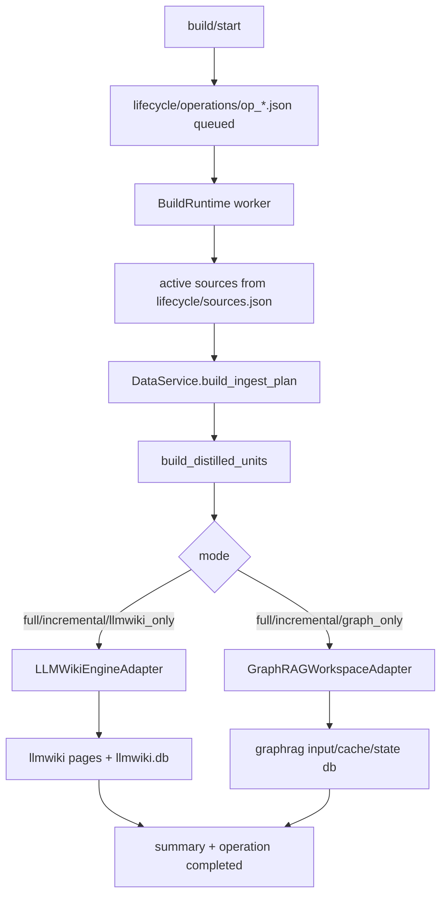
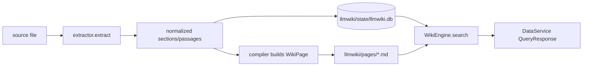
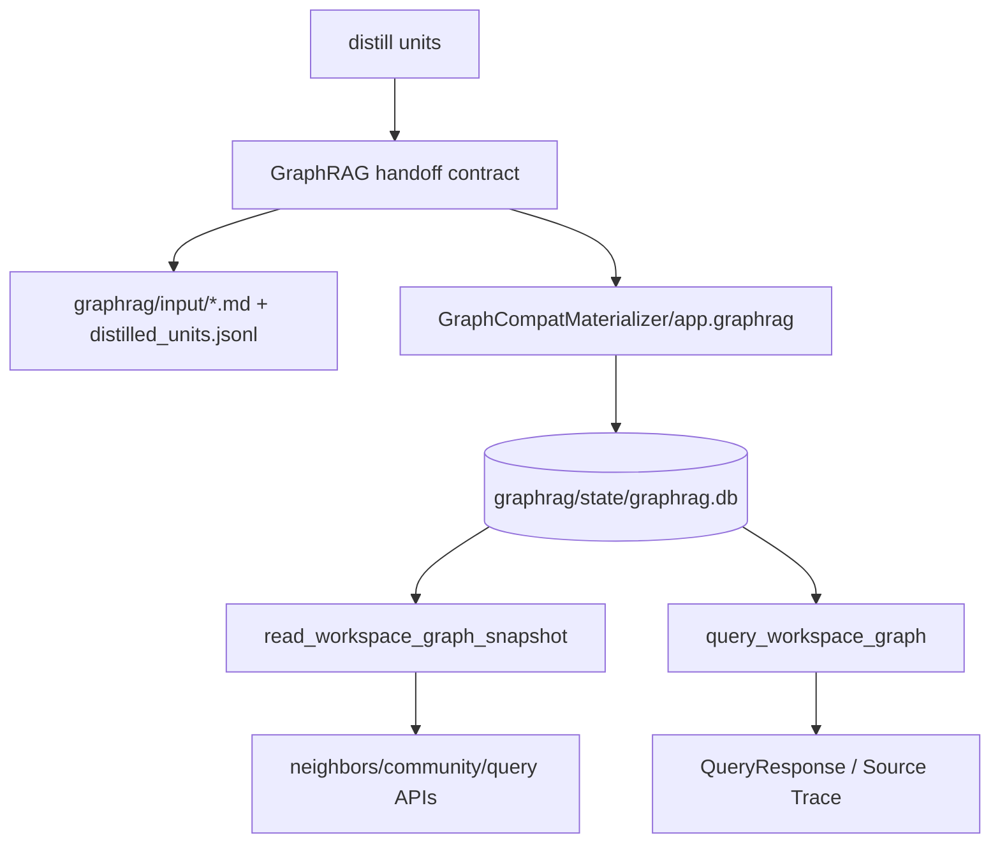
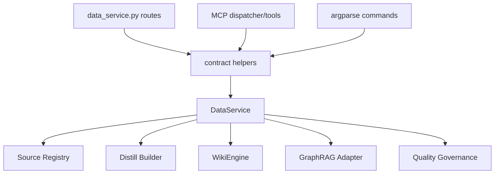
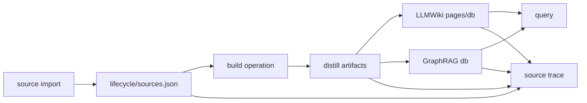
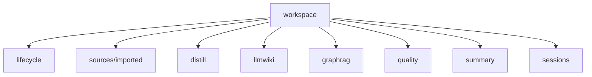
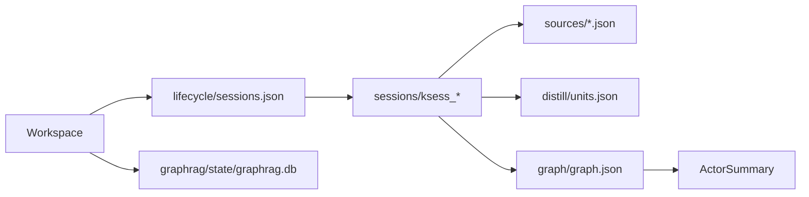

> Generated from repository analysis.
> Business code was not modified.
> Important claims include source evidence where possible.

# V2 Project Baseline: Local Knowledge Governance Service

## 1. 项目一句话定位

**已确认事实**：本项目是一个 MCP-first 的本地知识治理底座，把本地/外部来源转成 source registry、distill units、LLMWiki 页面、GraphRAG 图谱、查询结果、证据链和质量治理产物，并通过 HTTP、MCP stdio、CLI、前端控制台暴露。证据：`README.md:1-15`, `backend/data_service/service.py:34-49`, `backend/app/main.py:24-68`。

它不是什么：

- 不是普通 CRUD data service：核心实体不是业务表，而是 workspace/source/unit/page/graph/session/quality artifact。证据：`backend/data_service/models.py:54-204`。
- 不是单一 RAG service：它同时维护 LLMWiki、GraphRAG、Source Trace、Quality Governance，并在 query 层聚合。证据：`backend/data_service/service.py:2751-2865`。
- 不是单纯 document parser：解析只是 ingest pipeline 的一段，后面还有 distill、wiki、graph、summary、quality。证据：`backend/data_service/service.py:51-59`, `backend/data_service/service.py:2681-2749`。
- 不是会议/学习/IDE 等上层应用：README 明确排除录音、ASR、实时字幕、学习平台 UI、IDE 插件等。证据：`README.md:29-35`。
- 不是大型代码分析器本体：README 提到代码理解场景应传入 README、file tree、symbols、imports、call graph 等外部分析产物；当前代码只出现少量 typed unit 预留。证据：`README.md:35-35`, `backend/data_service/service.py:168-173`。

区别点：它的边界是“受控本地知识空间 + 多入口治理接口”，而不是“数据库 API / 向量检索 API / 文件解析 API”。`DataService` 注释明确自身拥有 artifact layout、ingest planning、distill policy、retrieval/query aggregation、quality artifacts、summary，但不重写 LLMWiki 或 GraphRAG 内部。证据：`backend/data_service/service.py:34-49`。

## 2. 仓库结构总览

**目录树（过滤 `.git`、`.venv`、`node_modules`、`dist`、`build`、`__pycache__`、缓存目录；最多 4 层）**：

```text
.
├── README.md                         # 根说明、边界、入口
├── backend/
│   ├── README.md                     # 后端说明、环境变量
│   ├── pyproject.toml                # Python 包、依赖、console scripts
│   ├── app/
│   │   ├── main.py                   # FastAPI app 与 /knowledge 静态入口
│   │   ├── api/v1/                   # HTTP boundary，核心大文件 data_service.py
│   │   ├── llmwiki/                  # LLMWiki engine、extractors、compiler、SQLite storage
│   │   ├── graphrag/service/         # Graph materializer/query/session graph
│   │   └── static/knowledge_console/ # 前端构建产物
│   ├── data_service/                 # 当前核心 orchestration / MCP / CLI / contracts
│   └── tests/                        # pytest 覆盖 HTTP/MCP/CLI/graph/session/source/quality
├── frontend/
│   ├── package.json                  # Vue/Vite 前端依赖
│   ├── vite.config.ts                # build 到 backend/app/static/knowledge_console
│   └── src/                          # Knowledge Console 源码
├── docs/
│   ├── V1.5/ V1.6/ V1.7/ V1.8/      # 历史阶段文档与 public surface baseline
│   └── data_service/                 # 架构、验收、质量报告
├── harnessos-*/                      # 验收工作区样例/产物
├── llmwiki*/ graphrag/ distill/      # 根级运行产物样例
└── summary/ quality/                 # 根级运行产物样例
```

**主要语言与 LOC（核心源码/文档口径，排除虚拟环境和构建产物）**：

| 类型 | 文件数 | 大致 LOC |
|---|---:|---:|
| Python | 135 | 42,245 |
| Markdown | 144 | 15,591 |
| Vue | 3 | 5,809 |
| TypeScript | 3 | 718 |
| JSON | 37 | 868 |
| CSS | 1 | 37 |
| TOML | 1 | 29 |

统计命令只读遍历了 `backend/app`、`backend/data_service`、`backend/tests`、`frontend/src`、`docs` 和根/后端配置文件。关键目录职责由 `README.md:9-15`、`backend/pyproject.toml:5-29`、`frontend/vite.config.ts:13-24` 佐证。

## 3. 运行入口与进程模型

| 入口 | 启动命令 | 源码 | 主要依赖 | 对外能力 |
|---|---|---|---|---|
| HTTP / FastAPI | `cd backend && uvicorn app.main:app --reload` | `backend/app/main.py:24-68` | `app.api.api_router`、FastAPI、StaticFiles | `/api/*`、`/docs`、`/knowledge` |
| MCP stdio | `cd backend && python -m data_service.mcp_stdio` | `backend/data_service/mcp_stdio.py:66-76` | `MCPToolDispatcher`、`all_tool_specs()` | 40 个 knowledge MCP tools |
| CLI compat | `cd backend && python -m data_service --help` | `backend/data_service/__main__.py:238-291`, `backend/data_service/__main__.py:707-714` | `DataService`、contract helpers | ingest/query/summary/distill/quality/boundary/graphrag |
| CLI target | `knowledge ...` | `backend/pyproject.toml:23-25`, `backend/data_service/__main__.py:285-291` | workspace/source/build/graph/trace/quality parsers | 管理式 workspace/source/build/graph/trace |
| Console scripts | `data-service`, `knowledge` | `backend/pyproject.toml:23-25` | setuptools entry points | 包装上述 CLI |
| 前端控制台 | `cd frontend && npm run build` 后访问 `/knowledge` | `frontend/vite.config.ts:13-24`, `backend/app/main.py:50-68` | Vue/Vite，静态文件由 FastAPI 服务 | Knowledge Ops Console |
| Build operation | HTTP/MCP/CLI start build | `backend/data_service/mcp_build_runtime.py:62-173` | `threading.Thread`、`DataService` | 非阻塞 queued/running/completed build |
| 测试入口 | `python3 -m pytest ...` | `README.md:93-98`, `backend/tests/conftest.py:15-28` | pytest、TestClient | HTTP/MCP/CLI/graph/session/quality 回归 |

进程模型：FastAPI 是常驻 HTTP 进程；MCP stdio 是 MCP server 进程；CLI 是短进程；workspace build 在服务进程内用 daemon thread 串行消费当前 workspace 的 queued operation。证据：`backend/data_service/mcp_build_runtime.py:62-114`。

## 4. 当前公开能力清单

| 能力域 | 说明 | HTTP | MCP | CLI | 关键实现/模型/产物 | 分类 | 证据 |
|---|---|---|---|---|---|---|---|
| Workspace | 创建、列出、描述、归档受控知识空间 | `/api/workspaces`, `/api/v1/knowledge/workspaces/*` | `knowledge_workspace_*` | `knowledge workspace *` | `.data_service_workspace.json`, `WorkspaceRuntime` | 核心底座 | `backend/data_service/mcp_workspace_tools.py:21-72`, `backend/data_service/mcp_workspace_runtime.py:14-87` |
| Source 导入与管理 | 文件/文本/URL/上传文件进入 source registry，可去重、软删除 | `/sources`, `/sources/import`, `/sources/remove` | `knowledge_source_*` | `knowledge source *` | `lifecycle/sources.json`, `src_{sha256[:16]}` | 核心底座 | `backend/data_service/mcp_source_tools.py:12-74`, `backend/app/api/v1/data_service.py:3200-3223` |
| 目录扫描 | 对绑定目录做变更检测 | `/api/v1/knowledge/directories/scan`, `/api/workspaces/{id}/folder-collections/scan` | 无直接 MCP | 无直接 CLI | directory scan snapshot | 辅助/导入支撑 | `backend/app/api/v1/data_service.py:2619-2623`, `backend/app/api/v1/data_service.py:4054-4077` |
| Build / Operation | 异步构建 distill/wiki/graph/summary | `/build/start`, `/build/operations/{id}` | `knowledge_build_*` | `knowledge build *` | `lifecycle/operations/*.json` | 核心底座 | `backend/data_service/mcp_build_tools.py:21-60`, `backend/data_service/mcp_build_runtime.py:116-173` |
| Distill | 生成/读取 typed distill units | `/distill`, `/sources/{id}/units` | `knowledge_distill_preview` | `data_service distill` | `distill/manifest.json`, `distill/units/distilled_units.jsonl` | 核心底座 | `backend/data_service/models.py:149-168`, `backend/data_service/service.py:2486-2679` |
| LLMWiki | 生成可读 wiki pages、SQLite FTS、page/source/link | `/page`, `/knowledge` UI 预览 | 独立 `app.llmwiki.mcp_stdio` 存在；data_service MCP 无 page tool | `app.llmwiki` CLI 存在；data_service 仅 summary/page HTTP | `llmwiki/pages/*.md`, `llmwiki/state/llmwiki.db` | 核心底座 | `backend/app/llmwiki/engine.py:242-343`, `backend/app/llmwiki/storage.py:45-94` |
| Query | llmwiki/graphrag/hybrid 查询 | `/query`, `/api/workspaces/{id}/query` | `knowledge_query`, `knowledge_query_v2` | `query` | `QueryMode`, `QueryResponse` | 核心底座 | `backend/data_service/models.py:46-51`, `backend/data_service/query_contract.py:51-63` |
| GraphRAG / 图谱 | workspace graph snapshot/neighbors/community/query/session | `/graph/*`, `/api/v1/knowledge/graph` | `knowledge_graph_snapshot`, session graph tools | `knowledge graph *` | `graphrag/state/graphrag.db` | 核心底座 | `backend/app/graphrag/service/data_service_query_model.py:14-109`, `backend/app/api/v1/data_service.py:3558-3655` |
| Session 级知识 | session lifecycle、structured ingest、session graph/query/actor | `/sessions/*` | `knowledge_session_*`, `knowledge_actor_summary` | 部分 graph session CLI；无完整 session CLI group | `lifecycle/sessions.json`, `sessions/{id}` | 核心/会话底座 | `backend/data_service/session_service.py:54-122`, `backend/data_service/mcp_session_tools.py:33-237` |
| Source Trace | source 到 distill/wiki/graph 的证据链 | `/sources/{source_id}/trace`, `/source/trace` | `knowledge_source_trace` | `knowledge trace source` | trace payload | 核心底座 | `backend/data_service/source_trace_contract.py:152-263` |
| Quality Governance | feedback/rules/review/plan/low-signal/read-time policy | `/quality/*` | `knowledge_quality_*`, `knowledge_correction_*` | `quality *` | `quality/feedback.jsonl`, `correction_rules.json`, `correction_plan.json` | 核心治理 | `backend/data_service/mcp_quality_tools.py:22-93`, `backend/data_service/service.py:408-621` |
| Folder/Research/Agent/Studio/Provider | folder summary、research report、agent draft、studio artifacts、provider health | `/folder-collections/scan`, `/workflows/folder-summary/runs`, `/research`, `/agent-workflows/draft`, `/-/ai-provider/health` | 无 data_service MCP | 无 CLI | contract modules | 上层产品辅助 | `backend/app/api/v1/data_service.py:3226-3360` |
| CLI 能力 | compat + target 双 CLI | 无 | 无 | `data_service`, `knowledge` | argparse parsers | 运维/集成接口 | `backend/data_service/__main__.py:39-291` |
| MCP 工具 | 40 个工具，含 v2 envelope wrappers | 无 | 40 tools | 无 | `all_tool_specs()` | Agent 接口 | `backend/data_service/mcp_tool_registry.py:27-132` |
| 前端控制台 | 操作 workspace/source/build/query/wiki/graph/quality | `/knowledge` | 无 | 无 | Vue page + API client | 运维 UI | `frontend/src/pages/KnowledgePage.vue:1-220`, `frontend/src/api/dataService.ts:1-260` |

## 5. HTTP API 路由基线

**路由分层**：`app.include_router(api_router, prefix="/api")`；`api_router` 同时挂载 target router `/workspaces` 和 legacy v1 router `/v1`。证据：`backend/app/main.py:48-48`, `backend/app/api/__init__.py:8-10`, `backend/app/api/v1/data_service.py:88-89`。

| method | path | handler | request schema | response schema | 稳定性/域 | 证据 |
|---|---|---|---|---|---|---|
| POST | `/api/workspaces` | `create_target_workspace` | `TargetWorkspaceCreateRequest` | `_target_envelope` | target / Workspace | `backend/app/api/v1/data_service.py:2348-2354`, `backend/app/api/v1/data_service.py:3086-3105` |
| GET | `/api/workspaces` | `list_target_workspaces` | query params | `_target_envelope` | target / Workspace | `backend/app/api/v1/data_service.py:3108-3128` |
| GET | `/api/workspaces/{workspace_id}` | `describe_target_workspace` | path | `_target_envelope` | target / Workspace | `backend/app/api/v1/data_service.py:3131-3164` |
| GET | `/api/workspaces/{workspace_id}/capabilities` | `read_target_workspace_capabilities` | path | `_target_envelope` | target / Capability | `backend/app/api/v1/data_service.py:3167-3174` |
| POST | `/api/workspaces/{workspace_id}/archive` | `archive_target_workspace` | `TargetWorkspaceArchiveRequest` | `_target_envelope` | target / Workspace | `backend/app/api/v1/data_service.py:2356-2359`, `backend/app/api/v1/data_service.py:3177-3197` |
| POST | `/api/workspaces/{workspace_id}/sources` | `import_target_sources` | `TargetSourceImportRequest` | `_target_envelope` | target / Source | `backend/app/api/v1/data_service.py:2389-2396`, `backend/app/api/v1/data_service.py:3200-3223` |
| GET | `/api/workspaces/{workspace_id}/sources` | `list_target_sources` | query params | `_target_envelope` | target / Source | `backend/app/api/v1/data_service.py:3363-3372` |
| GET | `/api/workspaces/{workspace_id}/sources/{source_id}` | `describe_target_source` | path | `_target_envelope` | target / Source | `backend/app/api/v1/data_service.py:3375-3384` |
| GET | `/api/workspaces/{workspace_id}/sources/{source_id}/preview` | `preview_target_source` | path | `_target_envelope` | target / Source Preview | `backend/app/api/v1/data_service.py:3387-3397` |
| GET | `/api/workspaces/{workspace_id}/sources/{source_id}/units` | `list_target_source_units` | query params | `_target_envelope` | target / Document Units | `backend/app/api/v1/data_service.py:3400-3417` |
| GET | `/api/workspaces/{workspace_id}/sources/{source_id}/units/{unit_id}` | `describe_target_source_unit` | path | `_target_envelope` | target / Document Units | `backend/app/api/v1/data_service.py:3420-3429` |
| GET | `/api/workspaces/{workspace_id}/sources/{source_id}/units/{unit_id}/evidence/{evidence_id}` | `describe_target_evidence_span` | path | `_target_envelope` | target / Evidence | `backend/app/api/v1/data_service.py:3432-3447` |
| POST | `/api/workspaces/{workspace_id}/sources/{source_id}/remove` | `remove_target_source` | `TargetSourceRemoveRequest` | `_target_envelope` | target / Source | `backend/app/api/v1/data_service.py:2434-2437`, `backend/app/api/v1/data_service.py:3450-3467` |
| POST | `/api/workspaces/{workspace_id}/build/start` | `start_target_build` | `TargetBuildStartRequest` | operation envelope | target / Build | `backend/app/api/v1/data_service.py:2440-2444`, `backend/app/api/v1/data_service.py:3470-3510` |
| GET | `/api/workspaces/{workspace_id}/build/operations/{operation_id}` | `read_target_build_operation` | path | operation envelope | target / Build | `backend/app/api/v1/data_service.py:3513-3526` |
| POST | `/api/workspaces/{workspace_id}/build/operations/{operation_id}/cancel` | `cancel_target_build_operation` | `TargetBuildCancelRequest` | operation envelope | target / Build | `backend/app/api/v1/data_service.py:2447-2450`, `backend/app/api/v1/data_service.py:3529-3555` |
| GET | `/api/workspaces/{workspace_id}/graph/neighbors` | `read_target_graph_neighbors` | query params | `_target_envelope` | target / Graph | `backend/app/api/v1/data_service.py:3558-3579` |
| GET | `/api/workspaces/{workspace_id}/graph/community` | `read_target_graph_community` | query params | `_target_envelope` | target / Graph | `backend/app/api/v1/data_service.py:3582-3601` |
| GET | `/api/workspaces/{workspace_id}/graph/query` | `read_target_graph_query` | query params | `_target_envelope` | target / Graph | `backend/app/api/v1/data_service.py:3604-3627` |
| GET | `/api/workspaces/{workspace_id}/graph/session` | `read_target_graph_session` | query params | `_target_envelope` | target / Graph | `backend/app/api/v1/data_service.py:3630-3655` |
| POST/GET | `/api/workspaces/{workspace_id}/sessions...` | `*_target_session*` | target session schemas | `_target_envelope` | target / Session | `backend/app/api/v1/data_service.py:2466-2508`, `backend/app/api/v1/data_service.py:3658-3833` |
| POST/GET | `/api/workspaces/{workspace_id}/quality...` | quality handlers | quality schemas | `_target_envelope` | target / Quality | `backend/app/api/v1/data_service.py:2651-2689`, `backend/app/api/v1/data_service.py:3836-3985` |
| POST | `/api/workspaces/{workspace_id}/query` | `query_workspace` | `WorkspaceScopedQueryRequest` | query payload enhanced | target / Query | `backend/app/api/v1/data_service.py:2565-2568`, `backend/app/api/v1/data_service.py:3988-3998` |
| POST | `/api/workspaces/{workspace_id}/distill` | `read_workspace_distill` | `WorkspaceScopedDistillRequest` | distill payload | target / Distill | `backend/app/api/v1/data_service.py:2596-2605`, `backend/app/api/v1/data_service.py:4001-4018` |
| GET | `/api/workspaces/{workspace_id}/sources/{source_id}/trace` | `read_workspace_source_trace` | path/query | `_target_envelope` | target / Source Trace | `backend/app/api/v1/data_service.py:4021-4039` |
| GET/HEAD | `/knowledge...` | `knowledge_console` | path | static index | public UI | `backend/app/main.py:57-68` |

兼容旧接口 `/api/v1/knowledge/*` 覆盖 workspaces/source/build/ingest/query/summary/graph/distill/source trace/quality/page/reset，全部在同一文件内。证据：`backend/app/api/v1/data_service.py:2721-4166`。

观察：

- 分层有 target 与 compat 两套，但都堆在 `backend/app/api/v1/data_service.py`，该文件同时定义 schema、helper、route、target envelope、业务 glue，职责过重。
- 重复路由明显：workspace/source/build/query/distill/source trace/quality 都有 `/api/workspaces/*` 与 `/api/v1/knowledge/*` 两套。
- V2 通用 asset API 可参考 target 风格：workspace-scoped REST path + `_target_envelope` + `artifact_refs` + `next_actions`。
- 不建议继续把 `/api/workspaces/{id}/code/...` 堆进该大文件，应新建 route module 并在 `app/api/__init__.py` 注册。

## 6. MCP 工具基线

注册机制：`all_tool_specs()` 拼接 core、quality、v2 wrapper、workspace、source、build、session specs；stdio `list_tools()` 把 dict 转为 MCP `Tool`；`call_tool()` 交给 `MCPToolDispatcher`。证据：`backend/data_service/mcp_tool_registry.py:128-132`, `backend/data_service/mcp_stdio.py:66-73`, `backend/data_service/mcp_dispatcher.py:35-118`。

| tool name | 输入 schema 摘要 | handler/source | 对应 HTTP/CLI | 核心性 |
|---|---|---|---|---|
| `knowledge_ingest` | `paths`, `workspace`, `workspace_id` | core | `/api/v1/knowledge/ingest`, `data_service ingest` | 核心 |
| `knowledge_query` | `query`, `mode`, `top_k` | core | `/query`, `query` | 核心 |
| `knowledge_distill_preview` | filters: `source_id/kind/typed_unit_type/...` | core | `/distill`, `distill` | 核心 |
| `knowledge_source_trace` | `source_id`, `limit` | core | `/source/trace`, `trace source` | 核心 |
| `knowledge_quality_summary` | workspace | quality | summary/quality HTTP, `quality summary` | 核心 |
| `knowledge_correction_plan` | `rebuild` | quality | correction-plan HTTP/CLI | 核心 |
| `knowledge_quality_feedback` | target/action fields | quality | feedback HTTP/CLI | 核心 |
| `knowledge_correction_rules` | `status`, `limit` | quality | rules HTTP/CLI | 核心 |
| `knowledge_review_correction_rule` | `rule_id`, `status` | quality | review HTTP/CLI | 核心 |
| `knowledge_*_v2` | v2 envelope wrappers over 7 legacy tools | registry/dispatcher | same as legacy | compatibility/external MCP |
| `knowledge_workspace_*` | create/list/describe/archive | workspace | `/api/workspaces*`, `knowledge workspace *` | 核心 |
| `knowledge_source_*` | import/list/remove | source | `/api/workspaces/{id}/sources*`, `knowledge source *` | 核心 |
| `knowledge_build_*` | start/status/cancel | build | `/build/*`, `knowledge build *` | 核心 |
| `knowledge_session_*` | create/get/list/close/delete/ingest/build/query | session | `/sessions/*` | 核心/会话 |
| `knowledge_graph_snapshot`, `knowledge_graph_neighbors`, `knowledge_community_summary` | graph read params | session tools | `/graph/*`, `knowledge graph *` | 核心 |
| `knowledge_actor_summary` | `session_id`, `actor_id` | session tools | no direct HTTP route found | 核心/会话 |

命名规律：`knowledge_{domain}_{verb}`，v2 wrapper 使用 `_v2` 后缀。schema 是手写 JSON Schema dict，不是从 Pydantic 自动生成。错误处理以 envelope/blocked payload 为主，部分 handler 抛 `ValueError` 后由 dispatcher 或 HTTP route 转换。证据：`backend/data_service/mcp_source_tools.py:23-74`, `backend/data_service/mcp_dispatcher.py:125-153`。

V2 新增 code intelligence / project intelligence 工具建议：

- 放 `backend/data_service/mcp_code_tools.py`，定义 `CODE_TOOL_SPECS` 和 `handle_code_tool`。
- 在 `mcp_tool_registry.all_tool_specs()` 拼接，并在 `mcp_dispatcher.py` 增加 `CODE_TOOL_NAMES` 分派。
- 初始工具建议：`knowledge_codebase_import`、`knowledge_code_inventory`、`knowledge_code_graph_snapshot`、`knowledge_agent_context_pack`。

## 7. CLI 命令基线

CLI 使用 argparse。`data_service` 是兼容 CLI；`knowledge` 是 target CLI，增加 workspace/source/build/graph/trace。证据：`backend/data_service/__main__.py:39-291`, `backend/data_service/__main__.py:707-714`。

| command group | 子命令 | 关键参数 | 内部服务 | 对应 HTTP/MCP |
|---|---|---|---|---|
| `data_service ingest` | - | `paths`, `--workspace`, `--graphrag-owner` | `DataService.build_ingest_plan/run_default_pipeline` | `knowledge_ingest` |
| `data_service summary` | - | `--workspace` | `write_summary_files` | `/summary` |
| `data_service distill` | - | filters | `run_distill_contract` | `knowledge_distill_preview` |
| `data_service query` | - | `query`, `--mode`, `--top-k` | `run_query_contract` | `knowledge_query` |
| `data_service quality` | summary/feedback/rules/review/correction-plan | target/action/status args | quality contract helpers | quality MCP/HTTP |
| `data_service boundary` | - | `--workspace` | `read_boundary_audit` | `/boundary` |
| `data_service graphrag-execute` | - | `--workspace` | `run_graphrag_execution_request` | `/graphrag/execute` |
| `knowledge workspace` | create/list/describe/archive | `--workspace-root`, `--workspace-id`, metadata | `handle_workspace_tool` | workspace MCP/HTTP |
| `knowledge source` | import/list/remove | `--workspace-id`, `--path`, `--text`, metadata | `handle_source_tool` | source MCP/HTTP |
| `knowledge build` | start/status/cancel | `--workspace-id`, `--operation-id`, `--mode` | `handle_build_tool` | build MCP/HTTP |
| `knowledge graph` | snapshot/neighbors/community/query/session | graph selectors | graph contracts/session tool | graph HTTP/MCP |
| `knowledge trace` | source | `--source-id` | `source_trace_payload` | source trace MCP/HTTP |
| `knowledge query/quality` | same as compat | same | same | query/quality MCP/HTTP |

能力对齐结论：

- Workspace/source/build/query/quality/source trace 基本三端对齐。
- Folder/research/agent/studio/provider health 目前主要只有 HTTP target。
- `knowledge_actor_summary` 只有 MCP，没有明确 HTTP/CLI 等价入口。
- `directories/scan` 兼容 HTTP 有，target folder scan 有，但 MCP/CLI 没有直接等价。

## 8. Source Registry 与导入链路

1. `source_id`：文件/文本 import 使用 `src_{sha256[:16]}`；session ingest 使用 normalized payload hash。证据：`backend/data_service/mcp_source_tools.py:126-140`, `backend/data_service/session_service.py:215-233`。
2. 去重：读取 `lifecycle/sources.json`，按 sha256 建 `existing_by_sha`，重复时返回副本并标 `status=duplicate`，不再写文件。证据：`backend/data_service/mcp_source_tools.py:120-134`。
3. 软删除：在 manifest item 上写 `status=removed`、`removed_at`、`remove_reason`。证据：`backend/data_service/mcp_source_tools.py:240-267`。
4. 恢复/重新导入：未找到显式 restore；同 sha 文件重新导入会被 sha 去重命中，返回 duplicate；人工改 manifest 或内容变更才会产生新 source。合理推断，证据：`backend/data_service/mcp_source_tools.py:120-153`。
5. 状态：MCP 声明 `active/removed/duplicate/blocked`；ingest_status 使用 `pending/built/failed` 等运行状态。证据：`backend/data_service/mcp_source_tools.py:12-15`, `backend/data_service/mcp_build_runtime.py:211-221`。
6. metadata：`source_id/sha256/title/status/path/original_path/metadata/imported_at/low_signal/ingest_status`。证据：`backend/data_service/mcp_source_tools.py:139-150`。
7. 文件 vs 文本：文件保留 suffix 和 original_path；文本编码 UTF-8、固定 `.md`、original_path 为 None，文本 metadata 与全局 metadata 合并。证据：`backend/data_service/mcp_source_tools.py:169-194`。
8. 目录扫描：legacy scan 使用 `DirectoryScanRequest(paths,persist,limit)`；target folder scan 使用授权 root、permission grant、recursive、extensions、globs、depth、size、symlink 策略。证据：`backend/app/api/v1/data_service.py:2399-2410`, `backend/app/api/v1/data_service.py:4054-4077`。
9. 格式支持：README 说已实现 json/txt/md/html/csv/pdf/ppt/pptx，docx/yaml 计划中；代码 `SUPPORTED_SOURCE_SUFFIXES` 和 LLMWiki `_detect_source_type` 已包含 docx/yaml/yml，且存在 extractors。代码领先 README。证据：`README.md:73-90`, `backend/data_service/service.py:60-65`, `backend/app/llmwiki/engine.py:880-899`。
10. 持久化：source registry 在 `workspace/lifecycle/sources.json`，导入副本在 `workspace/sources/imported`。证据：`backend/data_service/mcp_workspace_runtime.py:30-41`, `backend/data_service/mcp_source_tools.py:120-123`。
11. 后续流程：build 从 active sources 取 path，构建 ingest plan，distill，再调用 LLMWiki/GraphRAG adapters，刷新 summary。证据：`backend/data_service/mcp_build_runtime.py:120-160`。

## 9. Build Operation 与任务系统

- operation_id：workspace build 使用 `op_{uuid.uuid4().hex[:12]}`；session build 使用 `sop_{uuid...}`。证据：`backend/data_service/mcp_build_tools.py:97-109`, `backend/data_service/session_service.py:256-278`。
- build mode：workspace `full/incremental/graph_only/llmwiki_only`；session `distill/graph/communities/full`。证据：`backend/data_service/mcp_build_tools.py:9-15`, `backend/data_service/session_service.py:19-20`。
- mode 差异：workspace runtime 只用 mode 决定 `include_llmwiki` 与 `include_graphrag`；`full` 和 `incremental` 当前执行逻辑相同。证据：`backend/data_service/mcp_build_runtime.py:136-154`。
- 状态：queued/running/completed/failed/blocked/cancelled；terminal 集合为 completed/failed/blocked/cancelled。证据：`backend/data_service/mcp_build_tools.py:9-15`, `backend/data_service/mcp_build_runtime.py:120-173`。
- 并发：每个 workspace 仅一个 worker key，队列按 operation file created_at 串行消费；多 workspace 可并行。证据：`backend/data_service/mcp_build_runtime.py:21-25`, `backend/data_service/mcp_build_runtime.py:62-114`。
- 幂等：没有幂等 key；每次 start 新 operation_id，source 去重提供输入层幂等。合理推断，证据：`backend/data_service/mcp_build_tools.py:97-124`。
- 失败：写 `status=failed`、`stage=failed`、`error.message/type/traceback/retryable`。证据：`backend/data_service/mcp_build_runtime.py:176-190`。
- 产物刷新：写 distill artifacts、LLMWiki pages/db、GraphRAG staged input/db、summary、source ingest_status。证据：`backend/data_service/service.py:2486-2679`, `backend/data_service/default_adapters.py:15-51`, `backend/data_service/default_adapters.py:54-211`。



V2 codebase build profile 插入点：`build_ingest_plan` 增加 asset_type/codebase policy；`build_distilled_units` 增加 code unit builder；GraphRAG adapter 前增加 code graph contract；operation mode 增加 `code_only` 或单独 code build runtime。

## 10. Distill 知识单元基线

数据模型：`DistilledUnit(unit_id, source_id, kind, authority, text, normalized_text, importance, confidence, source_weight, source_density_score, title/LLM flags, tags, entities, relations, provenance)`。证据：`backend/data_service/models.py:149-168`。

当前 kind：`fact_candidate/question/conclusion/step/example/note/risk/entity_candidate/relation_candidate/topic_candidate`。typed unit 映射为 concept/question/claim/workflow/example/meeting_summary/risk/fact/entity_evidence/relation_evidence；额外预留 `architecture_note/code_symbol/code_dependency/code_call_edge`。证据：`backend/data_service/models.py:17-29`, `backend/data_service/service.py:156-173`。

关联方式：unit 以 `source_id` 关联 source；workspace 由 `IngestPlan.workspace/layout` 决定产物路径。证据：`backend/data_service/models.py:171-182`。

筛选：distill contract 支持 `source_id/kind/typed_unit_type/min_importance/llm_enriched_only/authority/min_source_weight/min_source_density`。证据：`backend/data_service/distill_contract.py:36-59`。

产物：每 source 写 `distill/sources/{source_id}.json`，全量写 `distill/units/distilled_units.jsonl`、`distill/manifest.json`、`distill/schema.json`。证据：`backend/data_service/service.py:2486-2679`。

使用：LLMWiki handoff 和 GraphRAG handoff 都由 `DataService` 构建；GraphRAG adapter 只取允许 unit 并写 `graphrag/input/distilled_units.jsonl`。证据：`backend/data_service/default_adapters.py:21-34`, `backend/data_service/default_adapters.py:151-211`。

新增 code asset units 需要修改：

- `DistilledUnitKind` 或 typed-unit schema：加入 `code.file/module/class/function/route/endpoint/mcp_tool/cli_command/public_service/capability`。
- `DataService.build_distilled_units` 拆分/扩展为 code distiller，避免继续堆在 `service.py`。
- GraphRAG handoff/materializer 识别 code node/edge。
- HTTP `/distill` 和 MCP `knowledge_distill_preview` 可复用现有 filters。

## 11. LLMWiki 基线

入口：`LLMWikiEngineAdapter` 调 `WikiEngine.ingest()`；`DataService._build_llmwiki_config()` 指向 workspace raw/pages/state/normalized/readable/summary。证据：`backend/data_service/default_adapters.py:15-51`, `backend/data_service/service.py:2867-2876`。

页面生成：`WikiEngine._ingest_single_file` 选择 extractor、生成 source_id、提取 sections、normalize passages、写 source/passages/normalized artifacts，然后 `_compile_source_page` 写 Markdown 和 SQLite page。证据：`backend/app/llmwiki/engine.py:242-343`, `backend/app/llmwiki/engine.py:522-542`。

页面 ID：`WikiPage.slug` 是页面主键；模型定义 slug/title/kind/body/source_ids/link_slugs。证据：`backend/app/llmwiki/models.py:116-134`。

source 关联：SQLite `page_sources(slug,source_id)`，`SourceRecord` 保存 original/stored path、sha、compile state。证据：`backend/app/llmwiki/storage.py:98-186`, `backend/app/llmwiki/models.py:63-87`。

引用/backlink/source page：storage 有 pages/links/page_sources，engine 从 wiki link 抽取 link_slugs 并插入 page。证据：`backend/app/llmwiki/engine.py:225-240`, `backend/app/llmwiki/engine.py:528-532`。

查询：`DataService.query_llmwiki` 调 `WikiEngine.search()`，把 pages/passages 转统一 `QueryHit`。证据：`backend/data_service/service.py:2792-2824`。

增量/过期：`_should_recompile_existing` 基于 sha、model、compile_status 判断是否重编；未见完整页面 DAG 增量调度。证据：`backend/app/llmwiki/engine.py:991-1003`。



DevWiki 复用点：extractor/normalize/storage/page compiler/search 可复用；需要新增 code source renderer、symbol evidence citation、code-aware page planner、API/MCP/CLI inventory pages。

## 12. GraphRAG / 知识图谱基线

workspace graph：GraphRAG adapter 从 distill contract staging 到 `graphrag/input` 与 `graphrag/cache/input_contract.json`，再由 `app.graphrag` 写 SQLite `graphrag/state/graphrag.db`。证据：`backend/data_service/default_adapters.py:54-149`, `backend/data_service/default_adapters.py:151-211`。

数据模型：query model 从 SQLite 表读取 entities/themes/relationships，输出 nodes/edges/communities/stats/db_path。node type 当前至少有 `entity`、`theme`；session graph 另有 actor/source/unit/topic/entity。证据：`backend/app/graphrag/service/data_service_query_model.py:14-109`, `backend/app/graphrag/service/session_graph_service.py:58-139`。

graph query：`query_graph_db` 对节点检索，返回 hits、nodes、edges、communities、stats；DataService 包装成 `QueryResponse`。证据：`backend/app/graphrag/service/data_service_query_model.py:109-197`, `backend/data_service/service.py:2826-2861`。

workspace vs session：workspace graph 持久化在 SQLite；session graph 是 `sessions/{session_id}/graph/graph.json`，由结构化 records 的 relation extractor 构建。证据：`backend/app/graphrag/service/data_service_bridge.py:35-42`, `backend/data_service/session_service.py:280-309`, `backend/data_service/session_service.py:537-541`。



V2 code graph：复用 graph snapshot/query/neighbors/community API shape；新增 code node/edge schema、code materializer、code relation types、source trace code evidence。

## 13. Query 服务基线

query mode：`llmwiki/graphrag/hybrid`。证据：`backend/data_service/models.py:46-51`。

request/response：HTTP request 为 `QueryRequest` 或 `WorkspaceScopedQueryRequest`；response 为 `mode/query/answer/hits/engine_payloads`。证据：`backend/app/api/v1/data_service.py:2558-2568`, `backend/data_service/query_contract.py:32-63`。

差异：

- `llmwiki`：查 wiki pages/passages，answer 是命中数量描述。证据：`backend/data_service/service.py:2792-2824`。
- `graphrag`：查 graph db，answer 描述节点/关系/supporting units。证据：`backend/data_service/service.py:2826-2861`。
- `hybrid`：分别查两者并拼接 hits 与 engine_payloads。证据：`backend/data_service/service.py:2763-2782`。

evidence/source citation：query hit 保留 `source` 和 `meta`，但严格证据链主要由 Source Trace 和 document units/evidence spans 提供；query response 本身不是完整 citation contract。

`knowledge_query_v2` 与 `knowledge_query`：v2 是 envelope-wrapped wrapper，dispatcher 映射到 legacy tool 后再包 envelope。证据：`backend/data_service/mcp_tool_registry.py:27-52`, `backend/data_service/mcp_dispatcher.py:125-153`。

V2 扩展 query mode：在 `QueryMode`、`normalize_query_mode`、`DataService.query()` 扩展；建议不要直接把 code_graph/devwiki/api_surface/impact/agent_context 全塞入 `service.py`，而是新建 query router/strategy。

## 14. Session 级知识服务基线

用途：为 scoped session 提供 lifecycle、structured ingest、session graph state。证据：`backend/data_service/session_service.py:54-64`。

创建：按 external_id sha256 生成 `ksess_{digest}`，写 `lifecycle/sessions.json` 并建 `sessions/{session_id}`。证据：`backend/data_service/session_service.py:66-122`。

ingest：支持 `text/markdown/turns/json`，写 `sessions/{id}/sources/{source_id}.json` 和 session `sources.json`。证据：`backend/data_service/session_service.py:194-254`。

close/delete：close 改 status；delete 删除 session dir 并标 disposed。证据：`backend/data_service/session_service.py:154-177`。

build/query/actor：build 写 session distill units、graph、summary；query/neighbor/community/actor 基于 `SessionGraphService`。证据：`backend/data_service/session_service.py:256-415`。

未来开发任务/PR review/Agent coding session 可复用 session lifecycle、structured records、actor summary、source_refs；需要新增 code-specific record schema 与 code graph relations。

## 15. Source Trace / 证据链基线

输入：`source_id` 和 `limit`，target HTTP strict 模式拒绝 path/URL/非法 registry id。证据：`backend/data_service/source_trace_contract.py:13-38`, `backend/app/api/v1/data_service.py:4021-4045`。

输出：source、provenance、distill.units、llmwiki.pages、graphrag.nodes/edges/communities、trace_summary，并做路径敏感字段 sanitization。证据：`backend/data_service/source_trace_contract.py:93-115`, `backend/data_service/source_trace_contract.py:227-263`。

追踪方式：source -> distill 用 `service.read_distill_bundle(source_id)`；source -> wiki 通过 source/title/path/unit terms 匹配 page stem/title/body；source -> graph 通过 terms 匹配 node id/name/label/type，再取关联 edge/community。证据：`backend/data_service/source_trace_contract.py:161-213`。

结论：当前 trace 足以支持“source 到当前知识产物”的粗粒度追踪；不足以天然支持“每个开发摘要结论精确到代码行/符号/route/MCP tool/CLI”的证据链。V2 需增加 code evidence span、symbol-to-surface mapping、DevWiki page citations、agent answer citation graph。

## 16. Quality Governance 基线

质量数据：`quality/feedback.jsonl`、`quality/correction_rules.json`、`quality/correction_plan.json`。证据：`backend/data_service/models.py:80-83`。

MCP/HTTP 能力：summary、feedback、rules list/build、review、correction plan、low-signal audit。证据：`backend/data_service/mcp_quality_tools.py:22-93`, `backend/app/api/v1/data_service.py:3836-3985`, `backend/app/api/v1/data_service.py:4048-4151`。

治理对象：schema 允许 target_type 为 page/source/entity/query 等，前端还列出 community/distill_unit；service 计划 action 会影响 `llmwiki` 与 `graphrag` 读时策略。证据：`backend/app/api/v1/data_service.py:2640-2648`, `frontend/src/api/dataService.ts:161-220`, `backend/data_service/service.py:1654-1660`。

生成链路：feedback -> draft correction rule -> review approved/rejected/etc -> correction plan -> read-time apply to graph/wiki/query/page。证据：`backend/data_service/service.py:1600-1662`, `backend/data_service/service.py:3112-3445`。

V2 需扩展 target_type/rule_type：`code_symbol`、`code_route`、`code_mcp_tool`、`code_cli_command`、`devwiki_page`、`api_surface_report`、`agent_context_pack`。

## 17. 前端控制台基线

入口：`frontend/src/App.vue` 只渲染 `KnowledgePage`；Vite build 输出到 `../backend/app/static/knowledge_console`，base 为 `/knowledge/`。证据：`frontend/src/App.vue:1-7`, `frontend/vite.config.ts:5-24`。

FastAPI 服务：挂载 `/knowledge/assets`，`/knowledge` fallback 到 index.html。证据：`backend/app/main.py:50-68`。

API client：默认 base `/api/v1/knowledge`，通过 `VITE_DATA_SERVICE_API_KEY` 发送 API key。证据：`frontend/src/api/dataService.ts:1-3`。

UI 能力：页面含全局 query、workspace/source 管理、目录扫描/build、Wiki Artifacts、GraphRAG、source trace、distill quality、quality feedback/rules/plan、MCP Contract。证据：`frontend/src/pages/KnowledgePage.vue:17-85`, `frontend/src/pages/KnowledgePage.vue:99-220`。

V2 页面建议：Project Intelligence Overview、Repo Snapshot、Code Inventory、Code Graph、DevWiki、API Surface、Agent Context Pack。

## 18. 存储与数据模型基线

```text
workspace/
├── .data_service_workspace.json
├── lifecycle/
│   ├── sources.json
│   ├── sessions.json
│   └── operations/op_*.json
├── sources/imported/src_*.{md,txt,...}
├── distill/
│   ├── manifest.json
│   ├── schema.json
│   ├── sources/{source_id}.json
│   └── units/distilled_units.jsonl
├── llmwiki/
│   ├── raw/
│   ├── readable/
│   ├── normalized/{source_id}.json
│   ├── pages/*.md
│   └── state/llmwiki.db
├── graphrag/
│   ├── input/*.md
│   ├── cache/input_contract.json
│   └── state/graphrag.db
├── sessions/{session_id}/
│   ├── sources/*.json
│   ├── distill/units.json
│   ├── graph/graph.json
│   └── operations/sop_*.json
├── quality/
└── summary/
```

主要使用本地文件 + SQLite。LLMWiki 使用 SQLite + FTS5；GraphRAG workspace 使用 SQLite；session graph 使用 JSON。证据：`backend/data_service/models.py:85-117`, `backend/app/llmwiki/storage.py:45-94`, `backend/app/graphrag/service/data_service_bridge.py:35-42`, `backend/data_service/session_service.py:528-541`。

schema evolution：LLMWiki storage 有 `SCHEMA_VERSION=2` 和迁移入口；distill/schema 有 schema_version；大部分 JSON artifacts 没有统一 migration framework。证据：`backend/app/llmwiki/storage.py:45-94`, `backend/data_service/service.py:2630-2678`。

V2 artifacts 建议：`workspace/code/` 或 `workspace/assets/codebase/` 下存 repo snapshot、code units、code graph、DevWiki artifacts，避免污染现有 `distill` 根 schema；但 query/trace 可读取并桥接到统一 response。

## 19. 配置、依赖与 AI Provider 基线

配置：后端加载 `backend/.env` 和 `backend/app/.env`；API/JWT 配置来自 env。证据：`backend/app/main.py:13-18`, `backend/app/config.py:16-35`。

环境变量：README 列出 `DATA_SERVICE_WORKSPACE_ROOT`、allowed roots、`DATA_SERVICE_REQUIRE_API_KEY`、`API_KEY`、JWT dev flags。证据：`backend/README.md:40-48`。

AI provider：OpenAI-compatible only，要求 `DATA_SERVICE_AI_PROVIDER`、`DATA_SERVICE_AI_PROVIDER_NAME`、`DATA_SERVICE_AI_BASE_URL`、`DATA_SERVICE_AI_MODEL`、`DATA_SERVICE_AI_API_KEY`，调用 `/chat/completions`。证据：`backend/data_service/ai_provider_contract.py:24-70`, `backend/data_service/ai_provider_contract.py:103-176`。

provider health：target route `GET /api/workspaces/-/ai-provider/health` 调真实 provider smoke。证据：`backend/app/api/v1/data_service.py:3226-3236`, `backend/data_service/ai_provider_contract.py:188-204`。

LLM 调用：AI provider contract 是 ResearchNotebook V1.5 HTTP helper；LLMWiki 另有 `llm_client`；embedding/rerank/generation 未见清晰分层。仍需人工确认 provider 抽象是否应统一。

## 20. 测试基线

测试目录：`backend/tests`，pytest。`conftest.py` 加 backend 到 `sys.path`，设置 mock/env，兼容 TestClient stream 参数。证据：`backend/tests/conftest.py:15-28`, `backend/tests/conftest.py:30-50`。

覆盖域（按文件名确认）：

- 核心 data service/API/MCP：`test_data_service.py`, `test_data_service_api.py`, `test_data_service_mcp.py`
- LLMWiki：`test_llmwiki.py`
- graph CLI/query/neighbors/community/session：`test_graph_cli_*.py`
- target HTTP：workspace/source/build/session/graph/quality/folder/research/provider/studio/url/multi-format/document units/evidence spans
- public surface guard：`test_public_surface_guard.py`

运行方式：README 给出 `python3 -m pytest backend/tests/test_data_service.py backend/tests/test_data_service_api.py backend/tests/test_data_service_mcp.py -q`；全量可用 `cd backend && pytest tests -q` 推断。证据：`README.md:93-98`。

V2 MVP 优先补测：codebase import、repo snapshot fixture、Python symbol extraction、FastAPI route inventory、MCP inventory、CLI inventory、code unit schema、code graph baseline、agent context pack traceability。

## 21. 当前架构图

```mermaid
flowchart LR
  Apps[Meeting/Learning/Agents/Code Assistants] --> HTTP[FastAPI /api]
  Apps --> MCP[MCP stdio]
  Ops[Operator] --> CLI[data-service/knowledge CLI]
  Ops --> UI[/knowledge Console]
  HTTP --> DS[DataService boundary]
  MCP --> DS
  CLI --> DS
  UI --> HTTP
  DS --> Wiki[LLMWiki]
  DS --> Graph[GraphRAG]
  DS --> Store[(Local workspace artifacts)]
```





```mermaid
flowchart LR
  HTTP[/api/workspaces + /api/v1/knowledge] --> Service
  MCP[knowledge_* tools] --> Dispatcher --> Service
  CLI[data_service/knowledge] --> Handlers --> Service
  UI[/knowledge] --> HTTP
```





证据：`backend/app/main.py:48-68`, `backend/data_service/mcp_dispatcher.py:35-118`, `backend/data_service/service.py:2681-2865`, `backend/data_service/models.py:85-117`, `backend/data_service/session_service.py:528-541`。

## 22. 当前项目的核心模块依赖关系

主要依赖摘要：

- `backend/app/main.py` -> `app.api.api_router`
- `app.api` -> target router + v1 router
- `data_service.mcp_stdio` -> `mcp_tool_registry` + `MCPToolDispatcher`
- `MCPToolDispatcher` -> core/workspace/source/build/session/quality handlers
- `DataService` -> `LLMWikiEngineAdapter`、`GraphRAGWorkspaceAdapter`、`WikiEngine`、GraphRAG bridge/query
- `default_adapters` -> `app.llmwiki` 与 `app.graphrag.service`
- `session_service` -> `SessionGraphService`、`SessionRelationExtractor`

高耦合中心：

- `backend/app/api/v1/data_service.py`：schema、auth dependency、target/compat route、folder/research/studio/provider、source preview/document unit/evidence span、quality 等全部集中，超过 4k 行。证据：`backend/app/api/v1/data_service.py:88-89`, `backend/app/api/v1/data_service.py:2328-2717`, `backend/app/api/v1/data_service.py:2721-4166`。
- `backend/data_service/service.py`：DataService 同时负责 ingest planning、distill heuristics、quality、query、summary、format profile、read-time policy，超过 4k 行。证据：`backend/data_service/service.py:34-49`, `backend/data_service/service.py:2124-2865`。

适合抽出的 service：source registry、build operations、distill builder、quality governance、target HTTP route modules、code asset module（V2）。

V2 不应继续堆叠：`backend/app/api/v1/data_service.py` 和 `backend/data_service/service.py`。

## 23. V2 扩展点分析

| 方向 | 推荐扩展点 | 需要新增模块 | 需要修改模块 | 风险 |
|---|---|---|---|---|
| `asset_type=codebase` | source import metadata + new code asset registry | `data_service/code_assets.py` | source schemas/tool schemas | 与普通 source 状态混淆 |
| repo snapshot | build 前或 source import 后 | `code_snapshot_contract.py` | build runtime | 大仓库性能/权限 |
| code distill units | Distill contract 复用 filters | `code_distill_builder.py` | `models.py`, distill schema | 当前 `service.py` 已过大 |
| code graph | GraphRAG query API shape 复用 | `code_graph_materializer.py` | graph query model / route | workspace graph SQLite schema 兼容 |
| DevWiki | LLMWiki storage/search/page writer 复用 | `devwiki_compiler.py` | LLMWiki config or adapter | 页面 slug/source evidence 规则 |
| `knowledge_agent_context_pack` | MCP 新 domain | `mcp_code_tools.py` | registry + dispatcher | output schema 需稳定 |
| `/api/workspaces/{id}/code/...` | 新 router module | `app/api/v1/code_assets.py` | `app/api/__init__.py` | 避免大文件继续膨胀 |
| 前端 code pages | workbench tab/nav | `frontend/src/pages/CodePage.vue` | API client/nav | 当前单页很大 |
| CLI code commands | `knowledge code ...` | parser helper + handlers | `__main__.py` | argparse 文件继续变大 |
| 最小 PR | inventory -> units -> graph -> context pack | 分阶段新增 | 小步注册 | public surface drift |

## 24. V2 MVP 候选 PR 拆分

| PR | 目标 | 涉及模块 | 新 API/MCP/CLI | 前置 | 风险 | 验证 | 兼容 |
|---|---|---|---|---|---|---|---|
| 1. Codebase asset import/scan | 登记 repo root 与 include/exclude | new code asset registry | `knowledge code import`, `/code/assets` | 无 | 权限/路径 | unit tests | 不破坏 |
| 2. Repo snapshot | 生成 file tree/hash/language stats | `code_snapshot_contract.py` | `/code/snapshot` | PR1 | 大仓库耗时 | fixture repo | 不破坏 |
| 3. Python symbol extraction | AST 提取 module/class/function/import | `code_python_symbols.py` | none or `/code/symbols` | PR2 | 语法错误处理 | Python fixtures | 不破坏 |
| 4. FastAPI route inventory | 提取 route/method/schema | `code_route_inventory.py` | `/code/routes` | PR2 | 动态路由漏检 | 当前仓库自测 | 不破坏 |
| 5. MCP tool inventory | 提取 tool specs/handlers | `code_mcp_inventory.py` | `/code/mcp-tools` | PR2 | 动态注册 | current 40 tools | 不破坏 |
| 6. CLI inventory | argparse 命令树 | `code_cli_inventory.py` | `/code/cli` | PR2 | parser side effects | current CLI snapshot | 不破坏 |
| 7. Code distill units | 产出 code.* typed units | `code_distill_builder.py` | distill filters 复用 | PR3-6 | schema evolution | unit snapshot | 向后兼容 |
| 8. Code graph baseline | file-symbol-route-tool-command graph | `code_graph_materializer.py` | `/code/graph` | PR7 | graph schema | graph tests | 不破坏 |
| 9. DevWiki baseline | 生成 project/API/tool pages | `devwiki_compiler.py` | `/code/devwiki` | PR7 | 页面质量 | markdown tests | 不破坏 |
| 10. Agent context pack | 面向 agent 的证据包 | `mcp_code_tools.py` | `knowledge_agent_context_pack` | PR7-9 | 输出稳定性 | MCP contract tests | 不破坏 |

## 25. 风险、债务和待确认问题

技术债（影响 V2 扩展）：

1. HTTP 大文件承担过多职责。
2. `DataService.service.py` 同时含 orchestration、distill heuristic、quality、query。
3. Target/compat API 重复且命名不一致。
4. MCP/HTTP/CLI 能力不完全对齐。
5. Build `incremental` 与 `full` 逻辑未体现差异。
6. Source restore 缺失。
7. schema migration 主要靠局部版本字段，缺统一 artifact migration。
8. Query citation 不够精确。
9. 前端单页过大。
10. README 格式支持落后于代码 docx/yaml 实现。

容易误解点：`data_service` 名称不是普通 data service；workspace_id 与 path 混用；GraphRAG 有 workspace SQLite 和 session JSON 两套；quality plan 是 read-time apply；source trace 是 term matching 不是强 foreign key；v2 MCP 是 wrapper 不是全新能力；folder/research/studio 是上层辅助；LLMWiki 有独立 MCP 但 data_service MCP 不暴露 page tool；`incremental` 不是显式增量；code support 多为 README 目标和少量 typed-unit 预留。

测试薄弱推断：V2 code path 尚无测试；大型代码库性能无覆盖；incremental/idempotency 语义需补；provider health 依赖真实 provider 需要 mock/offline 分层确认。

是否阻塞 V2 MVP：拆 route/service 有价值但不必阻塞；建议先新增独立 code modules，避免扩大旧大文件。

## 26. 附录 A：文件索引

| path | 职责 | 能力域 | 关键函数/类 | 为什么重要 |
|---|---|---|---|---|
| `README.md` | 项目边界 | all | - | 定位与声明 |
| `backend/README.md` | 后端入口/env | all | - | 运行约定 |
| `backend/pyproject.toml` | 包与 scripts | CLI | scripts | 安装入口 |
| `backend/app/main.py` | FastAPI app | HTTP/UI | `app`, `knowledge_console` | HTTP 根入口 |
| `backend/app/api/__init__.py` | router bootstrap | HTTP | `api_router` | target+v1 注册 |
| `backend/app/api/v1/data_service.py` | HTTP boundary | HTTP | all route handlers | public surface 中心 |
| `backend/app/api/v1/health.py` | health | HTTP | `health_check` | 健康检查 |
| `backend/app/api/v1/auth.py` | API key auth | HTTP | `verify_api_key` | 访问控制 |
| `backend/app/config.py` | config | config | `AppConfig` | env 配置 |
| `backend/data_service/models.py` | 核心 dataclass/enums | core | `ArtifactLayout`, `DistilledUnit` | 数据模型 |
| `backend/data_service/service.py` | 核心 orchestration | core | `DataService` | 最大核心服务 |
| `backend/data_service/default_adapters.py` | Wiki/Graph adapters | build | `LLMWikiEngineAdapter`, `GraphRAGWorkspaceAdapter` | 双引擎桥接 |
| `backend/data_service/mcp_stdio.py` | MCP stdio | MCP | `list_tools`, `call_tool` | MCP 入口 |
| `backend/data_service/mcp_tool_registry.py` | MCP registry | MCP | `all_tool_specs` | tool 注册 |
| `backend/data_service/mcp_dispatcher.py` | MCP dispatch | MCP | `MCPToolDispatcher` | tool 分派 |
| `backend/data_service/mcp_core_tools.py` | ingest/query/distill/trace tools | MCP | `handle_core_tool` | 核心 MCP |
| `backend/data_service/mcp_workspace_tools.py` | workspace tools | MCP | `handle_workspace_tool` | workspace lifecycle |
| `backend/data_service/mcp_source_tools.py` | source tools | MCP/source | `handle_source_tool` | source registry |
| `backend/data_service/mcp_build_tools.py` | build tool specs | MCP/build | `handle_build_tool` | build API |
| `backend/data_service/mcp_build_runtime.py` | async build runtime | build | `BuildRuntime` | operation 执行 |
| `backend/data_service/mcp_quality_tools.py` | quality tools | quality | `handle_quality_tool` | governance MCP |
| `backend/data_service/mcp_session_tools.py` | session tools | session | `handle_session_tool` | session MCP |
| `backend/data_service/mcp_workspace_runtime.py` | workspace runtime | workspace/storage | `WorkspaceRuntime` | 路径/manifest |
| `backend/data_service/query_contract.py` | query wrapper | query | `run_query_contract` | 多入口共享 |
| `backend/data_service/distill_contract.py` | distill wrapper | distill | `run_distill_contract` | 多入口共享 |
| `backend/data_service/source_trace_contract.py` | trace wrapper | trace | `source_trace_payload` | 证据链 |
| `backend/data_service/quality_contract.py` | quality wrappers | quality | payload funcs | HTTP/CLI 共享 |
| `backend/data_service/session_service.py` | session lifecycle | session | `SessionKnowledgeService` | 会话图谱 |
| `backend/data_service/ai_provider_contract.py` | AI provider | provider | `AIProviderConfig`, `ai_complete_json` | LLM synthesis |
| `backend/data_service/folder_collection_contract.py` | folder scan | folder | scan funcs | 上层辅助 |
| `backend/data_service/folder_summary_workflow_contract.py` | folder workflow | folder | run funcs | 上层辅助 |
| `backend/data_service/agent_workflow_contract.py` | agent draft | agent | draft funcs | 上层辅助 |
| `backend/data_service/url_source_contract.py` | URL source | source | `fetch_url_source_text` | URL ingest |
| `backend/app/llmwiki/models.py` | LLMWiki models | wiki | `SourceRecord`, `WikiPage` | wiki schema |
| `backend/app/llmwiki/storage.py` | SQLite storage | wiki | `Storage` | DB schema |
| `backend/app/llmwiki/engine.py` | Wiki engine | wiki | `WikiEngine` | ingest/search |
| `backend/app/llmwiki/compiler/page_builder.py` | page building | wiki | builders | page template |
| `backend/app/llmwiki/compiler/llm_compiler.py` | LLM compiler | wiki | compiler | page synthesis |
| `backend/app/llmwiki/extractors/*` | extractors | ingest | `get_extractor` family | format support |
| `backend/app/graphrag/service/data_service_materializer.py` | graph DB materializer | graph | `GraphCompatMaterializer` | graph persistence |
| `backend/app/graphrag/service/data_service_query_model.py` | graph read/query | graph | `build_graph_snapshot`, `query_graph_db` | graph APIs |
| `backend/app/graphrag/service/data_service_bridge.py` | graph bridge | graph | bridge funcs | DataService import |
| `backend/app/graphrag/service/session_graph_service.py` | session graph | session/graph | `SessionGraphService` | session graph model |
| `backend/app/graphrag/service/session_relation_extractor.py` | session extraction | session | `SessionRelationExtractor` | turns->relations |
| `backend/data_service/__main__.py` | CLI | CLI | parser/run funcs | CLI surface |
| `frontend/src/api/dataService.ts` | frontend API client | frontend | API functions/types | UI contracts |
| `frontend/src/pages/KnowledgePage.vue` | console page | frontend | component | UI surface |
| `frontend/vite.config.ts` | build config | frontend | config | static deploy |
| `backend/tests/conftest.py` | tests env | test | fixtures | test baseline |
| `backend/tests/test_data_service_mcp.py` | MCP tests | test/MCP | tests | MCP contract |
| `backend/tests/test_target_http_source.py` | source HTTP tests | test/source | tests | source target |

## 27. 附录 B：公开服务索引

HTTP API：`/`, `/api/v1/health`, `/knowledge`, `/api/workspaces...`, `/api/v1/knowledge...`。完整路由集中在 `backend/app/api/v1/data_service.py:2721-4166`。

MCP tools：40 个 `knowledge_*` 工具，见 `backend/data_service/mcp_tool_registry.py:128-132` 和各 `mcp_*tools.py`。

CLI commands：`data-service` / `python -m data_service`、`knowledge`；命令组覆盖 ingest、summary、distill、query、quality、workspace、source、build、graph、trace。证据：`backend/pyproject.toml:23-25`, `backend/data_service/__main__.py:238-291`。

frontend pages：当前单页 `KnowledgePage`，通过 workbench tabs 实现 overview/sources/explore/graph/quality/mcp 等工作台。证据：`frontend/src/App.vue:1-7`, `frontend/src/pages/KnowledgePage.vue:73-85`。

generated artifacts：summary、distill、llmwiki pages/db、graphrag input/cache/db、quality、operation、session artifacts。证据：`backend/data_service/models.py:85-117`。

storage artifacts：workspace `.data_service_workspace.json`、`lifecycle/sources.json`、`lifecycle/operations/*.json`、`lifecycle/sessions.json`、SQLite db、JSONL/JSON/Markdown artifacts。

## 28. 附录 C：术语表

- workspace：受控本地知识空间/tenant，外部稳定 ID 为 `workspace_id`。
- source：导入的文件、文本、URL 或 session source。
- source registry：`lifecycle/sources.json` 中的 source 台账。
- distill unit：从 source 生成的高信号知识单元。
- LLMWiki page：由 LLMWiki compiler 生成/存储的 Markdown + SQLite page。
- graph entity：GraphRAG 中的实体节点。
- graph relationship：GraphRAG 中的 relationship edge。
- graph community：由 graph query model 基于 theme/entity 构造的社区摘要。
- graph snapshot：nodes/edges/communities/stats 的读模型。
- session：workspace 内的 scoped knowledge session。
- actor summary：session graph 中按 actor 聚合的摘要。
- operation：build/session build 的持久化任务状态。
- source trace：source 到 distill/wiki/graph 的追踪 payload。
- quality feedback：人工或系统写入的目标对象质量反馈。
- correction rule：由 feedback 生成/写入的待审核治理规则。
- correction plan：approved rules 转成 read-time policy 的消费计划。
- artifact：可引用的本地文件、operation、source、page、graph 等产物。
- provider health：对 OpenAI-compatible AI provider 的真实 smoke 检查。
- public service：HTTP/MCP/CLI/UI 暴露给外部调用者的能力面。
- capability：workspace 或服务声明可用的能力项。

## Open Questions for Human Review

1. V2 的 `asset_type=codebase` 是否应与现有 source registry 同表，还是建立独立 `code_assets` registry？
2. V2 是否需要强制所有 code-derived conclusion 带 line-level evidence，还是 MVP 可先到 file/symbol 级？
3. 当前 `incremental` build 与 `full` 行为一致，V2 是否要先补真正增量语义？
4. LLMWiki docx/yaml 代码已存在但 README 仍写 planned，是否以代码为准更新公开承诺？
5. Provider abstraction 是否应统一 `ai_provider_contract.py` 与 `app/llmwiki/llm_client.py`？
6. target HTTP 是否应在 V2 前拆分 `data_service.py`，还是只新增 code route module 避免继续扩大？
7. code graph 是否复用 `graphrag/state/graphrag.db`，还是另建 `code/graph.db`？
8. Agent context pack 的目标消费者是 MCP agent、HTTP frontend，还是两者都必须首发支持？
9. 前端 V2 是否继续单页 workbench，还是拆成独立 route/page？
10. 大型代码库规模目标（文件数、LOC、语言范围、最大 repo size）需要产品侧确认。
