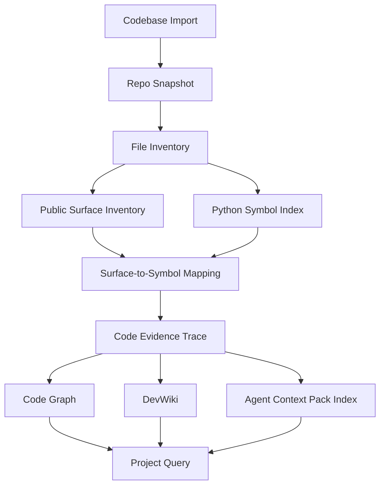

# PRD：Local Knowledge Governance Service V2 — Project Intelligence Service

## 1. 文档信息

**产品名称**：Local Knowledge Governance Service V2
**V2 子产品名称**：Project Intelligence Service / Code Asset Governance
**目标用户**：开发者、维护者、代码审查者、外部 Coding Agent、项目理解 Agent、文档生成 Agent
**核心目标**：让其他 Agent 可以调用本服务，完成一个软件项目的阅读、理解、汇总、证据追踪和开发上下文准备。
**阶段定位**：V2.0 Agent-callable MVP / V2.1 Project Intelligence Expansion / V2.4 Code-Derived Architecture Inference
**当前基础**：V1 已具备本地知识治理底座，包括 workspace、source registry、build operation、distill、LLMWiki、GraphRAG、query、source trace、quality governance、MCP、HTTP、CLI、前端控制台。

---

# 2. 产品背景

当前项目已经不是普通 data service，而是一个本地知识治理底座。它能把本地文件、文本、会议转写、结构化资料等转成可检索、可追踪、可治理的知识资产。

但是，面向软件项目开发场景，目前仍存在明显缺口：

1. 代码仓库还不是正式资产类型。
2. 项目代码、README、API、MCP tools、CLI、配置、测试之间没有统一的项目理解模型。
3. 当前 source trace 主要追踪 source 到 distill/wiki/graph，不能精确追踪到代码行、符号、HTTP route、MCP tool、CLI command。
4. 当前 query 能回答知识问题，但不能稳定生成“给 Agent 用的开发上下文包”。
5. 当前 LLMWiki 面向通用文档知识，尚未扩展为 DevWiki / Project Wiki。
6. 当前 GraphRAG 主要面向知识实体图谱，尚未形成代码仓库图谱。
7. 当前 HTTP/MCP/CLI 能力虽然丰富，但三端能力不完全对齐，外部 Agent 难以快速判断该调用哪个工具。
8. 当前 V2.3 可以把 Drawio/Markdown 等设计侧架构来源与代码事实对齐，但尚不能仅从代码事实中稳定抽象出架构角色、层级、边界、模式候选和设计漂移。

因此，V2 要把“代码仓库/软件项目”作为一种正式知识资产治理起来。

---

# 3. V2 产品愿景

V2 完成后，外部 Agent 可以通过 MCP 或 HTTP 调用本服务，对任意本地项目执行以下流程：

1. 导入一个代码仓库。
2. 生成 repo snapshot。
3. 分析文件树、语言分布、README、配置、测试、入口文件。
4. 提取 HTTP API、MCP tools、CLI commands、前端入口等公开服务面。
5. 提取 Python 符号、模块、类、函数、导入关系。
6. 生成项目摘要、架构摘要、公开能力清单。
7. 生成 DevWiki 页面。
8. 生成项目代码图谱。
9. 回答“这个项目是什么、怎么运行、有哪些能力、核心模块在哪里、某能力由哪些代码实现”等问题。
10. 为 Coding Agent 生成 task-aware 的 Agent Context Pack。
11. 所有重要结论都能追踪到代码文件、符号、行号或文档证据。
12. 从代码事实中推导 code-derived architecture model，并与设计侧 architecture model 做漂移审计。

V2 的核心不是“让 LLM 读完整个仓库”，而是：

> 把项目变成结构化、可查询、可追踪、可治理的开发知识资产。

---

# 4. V2 产品定位

## 4.1 它是什么

V2 是一个面向软件项目的本地项目智能服务：

* Codebase Asset Registry
* Repo Snapshot Service
* Public Surface Inventory Service
* Symbol Index Service
* Code Evidence Trace Service
* DevWiki Service
* Code Graph Service
* Agent Context Pack Service
* Project Query Service
* Code Knowledge Quality Governance Service
* Architecture Source Alignment Service
* Code-Derived Architecture Inference Service

## 4.2 它不是什么

V2 不做以下事情：

1. 不做 IDE 插件本体。
2. 不做实时编辑器补全。
3. 不做在线 SaaS 代码托管。
4. 不做 CI/CD 平台。
5. 不做完整编译器或全语言静态分析器。
6. 不承诺第一版生成完整调用图、数据流图、控制流图。
7. 不把几十万行代码直接塞给 LLM。
8. 不把代码仓库简单拆 chunk 后做普通 RAG。
9. 不替代 GitHub、GitLab、Sourcegraph、IDE、LSP。
10. 不在 V2 MVP 阶段追求复杂前端图谱编辑器。
11. 不把启发式架构角色识别包装成完整调用图、数据流图、控制流图、运行时派发解析或编译器级类型推断。

## 4.3 V2.4 阶段定位

V2.4 的阶段目标是 Code-Derived Architecture Inference：

* 基于 V2.0/V2.1/V2.3 artifacts，从代码事实中推导架构角色、层级、边界、模式候选。
* 在有设计侧架构来源时，对比 design-side architecture model 与 code-derived architecture model。
* 输出 design-code drift findings，用于解释“代码结构图”和“人工架构设计图”之间的偏差。
* 所有高置信架构结论必须有 evidence；低置信结论必须进入 `needs_review`。
* V2.4 不承诺完整静态分析，不把 LLM-only 总结作为架构事实。

V2.4 的权威阶段文档：

* `docs/V2.x/V2_4_TARGET_PRD.md`
* `docs/V2.x/V2_4_TARGET_ARCHITECTURE.md`
* `docs/V2.x/V2_4_DEVELOPMENT_AND_ACCEPTANCE_PLAN.md`
* `docs/V2.x/V2_4_GAP_ANALYSIS.md`
* `docs/V2.x/V2_4_TARGET_STATE.drawio`

---

# 5. 目标用户与使用场景

## 5.1 用户角色

### 角色 A：外部 Coding Agent

目标：快速理解项目，找到相关代码，获得开发任务上下文。

典型问题：

* “我要新增一个 API，应该参考哪些已有实现？”
* “这个 MCP tool 应该注册在哪里？”
* “实现 source import 的关键文件有哪些？”
* “这个能力有哪些 HTTP/MCP/CLI 入口？”
* “我要改 build operation，会影响哪些模块？”

### 角色 B：开发者

目标：快速了解项目结构、能力边界、公开服务和维护风险。

典型问题：

* “当前项目有哪些公开 API？”
* “有哪些能力只有 HTTP，没有 MCP/CLI？”
* “哪些代码文件承担过多职责？”
* “哪些 README 描述和代码事实不一致？”
* “怎么向项目新增一个能力？”

### 角色 C：维护者 / Tech Lead

目标：治理项目知识，保持项目文档、能力清单、代码证据链一致。

典型问题：

* “当前项目架构是否清楚？”
* “公开接口是否过多集中在一个文件？”
* “哪些能力缺少测试？”
* “哪些 DevWiki 页面已经过期？”
* “哪些 Agent 回答缺少证据？”

### 角色 D：文档生成 Agent

目标：调用本服务生成项目 Wiki、API 文档、模块说明和开发指南。

典型问题：

* “生成项目概览文档。”
* “生成 HTTP API 清单。”
* “生成 MCP tool 文档。”
* “生成 CLI 使用文档。”
* “生成新开发者 onboarding 文档。”

---

# 6. 核心用户故事

## US-001：Agent 导入一个本地代码仓库

作为外部 Agent，
我希望传入一个本地项目路径，
让服务把它登记成 codebase asset，
以便后续生成 snapshot、索引、图谱和上下文包。

验收标准：

* 能通过 MCP 导入。
* 能通过 HTTP 导入。
* 能返回 codebase_id。
* 能识别 repo root。
* 能尊重 ignore policy。
* 能记录导入时间、路径、metadata。
* 不应把整个代码仓库当成普通 source 混入 source registry。

## US-002：Agent 生成 repo snapshot

作为外部 Agent，
我希望对某个 codebase 生成 snapshot，
以便知道当前项目的文件树、语言分布、入口文件、配置、测试和文档。

验收标准：

* 返回 snapshot_id。
* 返回文件数量、语言分布、LOC 估算。
* 返回 README/docs/config/tests/entrypoints 列表。
* 返回 ignored files、scan warnings。
* 返回 git branch、commit_sha、dirty_state，如果可用。
* 同一个代码状态应生成稳定 snapshot。
* snapshot 应作为后续 symbol、inventory、graph、DevWiki、Agent Pack 的基础版本。

## US-003：Agent 获取项目公开服务面

作为外部 Agent，
我希望查询某项目对外暴露的 HTTP API、MCP tools、CLI commands、前端入口，
以便理解项目能力边界。

验收标准：

* 能列出 HTTP route。
* 能列出 MCP tool。
* 能列出 CLI command。
* 能标记 target/legacy/internal/experimental。
* 能按 capability 聚合。
* 能指出 HTTP/MCP/CLI 是否能力对齐。
* 每个公开服务必须有 source evidence。

## US-004：Agent 获取项目摘要

作为外部 Agent，
我希望得到项目的一句话定位、架构摘要、核心模块、公开能力和运行方式，
以便快速理解项目。

验收标准：

* 返回 project_overview。
* 返回 architecture_summary。
* 返回 public_capability_summary。
* 返回 entrypoints_summary。
* 返回 storage_summary。
* 返回 build_pipeline_summary。
* 返回 evidence。
* 摘要必须基于 snapshot 和 extracted facts，不允许纯 LLM 幻觉。

## US-005：Agent 查询某个能力的实现证据

作为外部 Agent，
我希望查询“source import 是如何实现的”，
服务能返回对应 HTTP route、MCP tool、CLI command、handler、关键文件和源码行号，
以便我修改或扩展该能力。

验收标准：

* 返回 capability。
* 返回相关 HTTP APIs。
* 返回相关 MCP tools。
* 返回相关 CLI commands。
* 返回 handler symbols。
* 返回 source files 和 line ranges。
* 返回相关 tests，如果能找到。
* 返回 confidence。
* 返回证据链。

## US-006：Agent 请求开发上下文包

作为 Coding Agent，
我希望输入一个开发任务，
服务返回一个适合模型上下文窗口的 Agent Context Pack，
以便我不需要自己全仓搜索就能开始开发。

验收标准：

* 输入 task、codebase_id、snapshot_id、max_tokens。
* 输出 task interpretation。
* 输出 relevant capabilities。
* 输出 relevant files。
* 输出 relevant symbols。
* 输出 relevant public surface。
* 输出 similar implementation patterns。
* 输出 risks。
* 输出 suggested tests。
* 输出 evidence。
* 输出 token estimate。
* 支持 Markdown 和 JSON 两种格式。

## US-007：Agent 生成 DevWiki

作为文档 Agent，
我希望基于代码仓库生成 DevWiki，
以便人类和 Agent 都能阅读项目文档。

验收标准：

* 生成 project overview 页面。
* 生成 architecture 页面。
* 生成 public surface 页面。
* 生成 HTTP API 页面。
* 生成 MCP tools 页面。
* 生成 CLI 页面。
* 每个页面包含 snapshot_id。
* 每个页面包含 evidence。
* 页面能被查询。
* 页面能判断 stale 状态。

## US-008：开发者查看 Code Graph

作为开发者，
我希望看到项目的基础代码图谱，
以便了解文件、模块、符号、公开服务和 capability 的关系。

验收标准：

* 返回 graph nodes。
* 返回 graph edges。
* 支持 Mermaid 导出。
* 支持 JSON graph 导出。
* 第一版只要求确定性关系。
* 不要求完整调用图。
* 能从 surface 追踪到 symbol。
* 能从 capability 追踪到 evidence。

## US-009：维护者进行代码知识质量治理

作为维护者，
我希望对 DevWiki、public surface、Agent Context Pack、code symbol、code route、MCP tool 等对象做质量反馈和修正规则，
以便持续治理项目知识质量。

验收标准：

* 支持新增 code-specific target_type。
* 支持对 DevWiki 页面反馈。
* 支持对 API surface report 反馈。
* 支持对 Agent context pack 反馈。
* 支持生成 correction rule。
* 支持审核 correction rule。
* 支持生成 correction plan。
* query/context pack 读取时能应用已批准规则。

---

# 7. V2 MVP 范围

## 7.1 V2.0 Agent-callable MVP 必须包含

1. Codebase Asset Registry
2. Repo Snapshot
3. Public Surface Inventory
4. Python Symbol Index
5. Surface-to-Symbol Mapping
6. Code Evidence Trace
7. Project Overview / Project Summary
8. Agent Context Pack
9. MCP 工具暴露
10. HTTP API 暴露
11. CLI 基础命令
12. 测试与 contract fixtures

V2.0 的完成标准是外部 Agent 可以通过 HTTP/MCP/CLI 导入项目、生成 snapshot、读取项目结构和公开能力、搜索代码符号、追踪 capability 到 surface/symbol/file/line、获取项目摘要，并生成可用于开发任务的上下文包。

## 7.2 V2.1 Project Intelligence Expansion

以下能力不阻塞 V2.0 Agent-callable MVP，进入 V2.1 / Expansion：

1. DevWiki Baseline
2. Code Graph Baseline
3. Code Knowledge Quality Governance Extension
4. 最小前端只读页面
5. DevWiki / Code Graph / Quality 的前端展示增强

如果产品决定把 DevWiki、Code Graph 或前端只读页提前纳入 V2.0，必须同步更新本 PRD、Remaining Development Plan、Remaining Acceptance Plan，并重新执行阶段前审计。

## 7.3 MVP 不包含

1. 完整跨语言语义索引。
2. 完整调用图。
3. 数据流分析。
4. 控制流分析。
5. 类型推断。
6. 自动修改代码。
7. 自动提交 PR。
8. 深度 IDE 集成。
9. 大型交互式图谱编辑器。
10. 复杂权限系统。
11. 多租户 SaaS。
12. 全量 artifact migration framework。
13. 完整增量构建语义。

---

# 8. 功能需求

## FR-001：Codebase Asset Registry

### 目标

把代码仓库登记为独立资产，而不是普通 source。

### 输入

```json
{
  "workspace_id": "data_service",
  "path": "/local/repo",
  "codebase_id": "optional-stable-id",
  "name": "data_service",
  "metadata": {
    "owner": "local",
    "purpose": "project intelligence baseline"
  },
  "scan_policy": {
    "respect_gitignore": true,
    "include": ["**/*.py", "**/*.md", "**/*.toml", "**/*.json", "**/*.yaml", "**/*.yml", "**/*.vue", "**/*.ts"],
    "exclude": [".git/**", ".venv/**", "node_modules/**", "dist/**", "build/**", "__pycache__/**"],
    "max_file_size_mb": 2,
    "binary_policy": "skip"
  }
}
```

### 输出

```json
{
  "ok": true,
  "workspace_id": "data_service",
  "codebase_id": "codebase_data_service",
  "status": "active",
  "registered_at": "2026-xx-xxTxx:xx:xxZ",
  "artifact_refs": [
    "workspace/assets/codebase/codebase_data_service/codebase.json"
  ]
}
```

### 存储

```text
workspace/assets/codebase/{codebase_id}/codebase.json
```

### 验收标准

* codebase_id 稳定。
* path 必须在 allowed roots 内。
* 支持重复导入同一仓库时返回已有 asset。
* 支持 archive/remove。
* 不影响现有 source registry。

## FR-002：Repo Snapshot Service

### 目标

对 codebase 生成可版本化 snapshot。

### Snapshot 内容

```json
{
  "snapshot_id": "snap_xxx",
  "codebase_id": "codebase_data_service",
  "workspace_id": "data_service",
  "repo": {
    "root": "/local/repo",
    "vcs": "git",
    "branch": "main",
    "commit_sha": "abc123",
    "dirty": true
  },
  "stats": {
    "file_count": 200,
    "loc_total": 50000,
    "languages": {
      "python": { "files": 130, "loc": 42000 },
      "markdown": { "files": 40, "loc": 8000 }
    }
  },
  "important_paths": {
    "readme": ["README.md", "backend/README.md"],
    "docs": ["docs/"],
    "entrypoints": ["backend/app/main.py", "backend/data_service/mcp_stdio.py", "backend/data_service/__main__.py"],
    "tests": ["backend/tests/"],
    "frontend": ["frontend/"],
    "configs": ["backend/pyproject.toml", "frontend/package.json"]
  },
  "warnings": []
}
```

### 存储

```text
workspace/assets/codebase/{codebase_id}/snapshots/{snapshot_id}.json
workspace/assets/codebase/{codebase_id}/snapshots/{snapshot_id}/files.jsonl
workspace/assets/codebase/{codebase_id}/snapshots/{snapshot_id}/stats.json
workspace/assets/codebase/{codebase_id}/snapshots/{snapshot_id}/warnings.jsonl
```

### 验收标准

* snapshot 可重复读取。
* snapshot 可 diff。
* snapshot 可作为后续 build 的输入。
* 大文件、二进制文件、不可读文件要记录 warning。
* 不允许静默失败。

## FR-003：Public Surface Inventory

### 目标

抽取项目对外暴露的能力面。

### Surface 类型

```text
http_api
mcp_tool
cli_command
frontend_page
generated_artifact
storage_artifact
```

### HTTP API Inventory

字段：

```json
{
  "surface_id": "http:POST:/api/workspaces/{workspace_id}/query",
  "surface_type": "http_api",
  "method": "POST",
  "path": "/api/workspaces/{workspace_id}/query",
  "handler": "query_workspace",
  "source_file": "backend/app/api/v1/data_service.py",
  "line_range": [3988, 3998],
  "request_schema": "WorkspaceScopedQueryRequest",
  "response_schema": "QueryResponse",
  "stability": "target",
  "capability": "workspace_query",
  "evidence": []
}
```

### MCP Tool Inventory

字段：

```json
{
  "surface_id": "mcp:knowledge_query_v2",
  "surface_type": "mcp_tool",
  "tool_name": "knowledge_query_v2",
  "handler": "MCPToolDispatcher.call",
  "input_schema": {},
  "capability": "workspace_query",
  "source_file": "backend/data_service/mcp_tool_registry.py",
  "line_range": [27, 52],
  "evidence": []
}
```

### CLI Inventory

字段：

```json
{
  "surface_id": "cli:knowledge query",
  "surface_type": "cli_command",
  "command": "knowledge query",
  "source_file": "backend/data_service/__main__.py",
  "capability": "workspace_query",
  "evidence": []
}
```

### 验收标准

* 能输出所有 HTTP API。
* 能输出所有 MCP tools。
* 能输出所有 CLI commands。
* 能按 capability 聚合。
* 能输出 HTTP/MCP/CLI 对齐矩阵。
* 能标记 legacy/target/internal/experimental。
* 能输出 evidence。
* 能发现 README 与代码的明显不一致。

## FR-004：Python Symbol Index

### 目标

抽取 Python 代码中的确定性符号事实。

### 支持对象

```text
file
module
class
function
method
import
decorator
docstring
constant
```

### Symbol Schema

```json
{
  "symbol_id": "py:function:backend.data_service.mcp_source_tools.handle_source_tool",
  "snapshot_id": "snap_xxx",
  "codebase_id": "codebase_data_service",
  "kind": "function",
  "name": "handle_source_tool",
  "qualified_name": "backend.data_service.mcp_source_tools.handle_source_tool",
  "path": "backend/data_service/mcp_source_tools.py",
  "line_range": [80, 150],
  "signature": "handle_source_tool(name: str, args: dict) -> dict",
  "docstring": null,
  "decorators": [],
  "visibility": "internal",
  "confidence": 1.0,
  "extractor": "python_ast"
}
```

### Import Schema

```json
{
  "from_module": "backend.data_service.mcp_dispatcher",
  "to_module": "backend.data_service.mcp_source_tools",
  "import_type": "from_import",
  "path": "backend/data_service/mcp_dispatcher.py",
  "line_range": [10, 12]
}
```

### 验收标准

* 能解析当前项目 Python 文件。
* 语法错误文件不能导致全局失败。
* 支持 line range。
* 支持 signature。
* 支持 docstring。
* 支持 module dependency graph。
* 支持 symbol search。

## FR-005：Surface-to-Symbol Mapping

### 目标

把公开服务面绑定到代码符号。

### 映射类型

```text
http_route -> handler function
mcp_tool -> tool spec -> dispatcher -> handler
cli_command -> parser branch -> handler/service
frontend_page -> api client call
capability -> surfaces -> symbols
```

### Mapping Schema

```json
{
  "mapping_id": "map_xxx",
  "snapshot_id": "snap_xxx",
  "from": {
    "type": "mcp_tool",
    "id": "mcp:knowledge_source_import"
  },
  "to": {
    "type": "symbol",
    "id": "py:function:backend.data_service.mcp_source_tools.handle_source_tool"
  },
  "relation": "HANDLED_BY",
  "confidence": 0.95,
  "evidence": []
}
```

### 验收标准

* route 能映射 handler。
* MCP tool 能映射 tool spec 和 handler。
* CLI command 能映射 parser/handler。
* mapping 失败时必须标记 unresolved，不可假装成功。
* 所有 mapping 都要有 confidence。

## FR-006：Code Evidence Trace

### 目标

让任何开发摘要、能力描述、DevWiki 页面、Agent Context Pack 都能追踪到代码证据。

### Evidence Schema

```json
{
  "evidence_id": "ev_xxx",
  "workspace_id": "data_service",
  "codebase_id": "codebase_data_service",
  "snapshot_id": "snap_xxx",
  "path": "backend/data_service/mcp_tool_registry.py",
  "start_line": 128,
  "end_line": 132,
  "symbol_id": "optional",
  "surface_id": "optional",
  "extractor": "public_surface_inventory",
  "confidence": 1.0,
  "quote": "optional short excerpt"
}
```

### Trace 类型

```text
file_trace
symbol_trace
surface_trace
capability_trace
devwiki_page_trace
agent_context_trace
```

### 验收标准

* 能从 capability 找到 surface。
* 能从 surface 找到 symbol。
* 能从 symbol 找到 file + line range。
* 能从 DevWiki section 找到 evidence。
* 能从 Agent Context Pack item 找到 evidence。
* 低置信度推断必须显式标记。

## FR-007：Project Overview Service

### 目标

生成项目摘要。

### 输出结构

```json
{
  "project_name": "data_service",
  "one_liner": "本项目是 MCP-first 的本地知识治理底座...",
  "what_it_is": [],
  "what_it_is_not": [],
  "entrypoints": [],
  "core_modules": [],
  "public_services": [],
  "storage_model": [],
  "build_pipeline": [],
  "risks": [],
  "evidence": []
}
```

### 验收标准

* 摘要必须来自 snapshot、inventory、symbol index、baseline docs。
* LLM 可以参与归纳，但不能生成无证据事实。
* 输出必须包含 snapshot_id。
* 输出必须包含 coverage/confidence。

## FR-008：DevWiki Baseline

### 目标

生成项目级 DevWiki。

### 第一版页面

```text
/devwiki/project-overview
/devwiki/architecture
/devwiki/public-surface
/devwiki/http-api
/devwiki/mcp-tools
/devwiki/cli
/devwiki/storage
/devwiki/build-pipeline
/devwiki/developer-onboarding
```

### 页面字段

```json
{
  "page_id": "devwiki:project-overview",
  "slug": "project-overview",
  "title": "Project Overview",
  "snapshot_id": "snap_xxx",
  "body": "...",
  "sections": [],
  "evidence": [],
  "generated_at": "...",
  "stale": false,
  "confidence": 0.88
}
```

### 验收标准

* 页面可读取。
* 页面可搜索。
* 页面能通过 query 使用。
* 页面有 source evidence。
* 页面能判断是否过期。
* 第一版不要求覆盖所有源码文件。

## FR-009：Code Graph Baseline

### 目标

生成基础代码图谱。

### Node 类型

```text
Codebase
Snapshot
Folder
File
Module
Class
Function
Method
Import
HTTPRoute
MCPTool
CLICommand
FrontendPage
Capability
DevWikiPage
EvidenceSpan
```

### Edge 类型

```text
CONTAINS
DEFINES
IMPORTS
EXPOSES_ROUTE
REGISTERS_MCP_TOOL
EXPOSES_CLI_COMMAND
HANDLED_BY
IMPLEMENTS_CAPABILITY
DOCUMENTED_BY
EVIDENCED_BY
GENERATED_FROM
```

### 暂不支持

```text
CALLS
DATA_FLOW
CONTROL_FLOW
FULL_TYPE_INFERENCE
RUNTIME_TRACE
```

### 验收标准

* 支持 graph snapshot。
* 支持 neighbors。
* 支持 capability trace。
* 支持 Mermaid export。
* 支持 JSON graph export。
* 所有边必须标记 extractor/confidence。

## FR-010：Agent Context Pack

### 目标

为外部 Agent 生成任务相关上下文包。

### 输入

```json
{
  "workspace_id": "data_service",
  "codebase_id": "codebase_data_service",
  "snapshot_id": "latest",
  "task": "新增 codebase import MCP 工具，并同步 HTTP API",
  "focus": {
    "paths": [],
    "capabilities": [],
    "symbols": []
  },
  "max_tokens": 16000,
  "format": "markdown",
  "include": [
    "project_overview",
    "public_surface",
    "relevant_symbols",
    "similar_patterns",
    "risks",
    "tests",
    "evidence"
  ]
}
```

### 输出 Markdown 结构

```markdown
# Agent Context Pack

## 1. Task Interpretation
## 2. Project Summary
## 3. Relevant Capabilities
## 4. Relevant Public Surface
## 5. Relevant Files
## 6. Relevant Symbols
## 7. Similar Existing Patterns
## 8. Implementation Guidance
## 9. Risks and Compatibility Notes
## 10. Suggested Tests
## 11. Evidence
```

### 输出 JSON 结构

```json
{
  "pack_id": "acp_xxx",
  "snapshot_id": "snap_xxx",
  "task": "...",
  "token_estimate": 12345,
  "sections": [],
  "items": [],
  "evidence": [],
  "warnings": [],
  "confidence": 0.86
}
```

### 验收标准

* 支持 MCP 调用。
* 支持 HTTP 调用。
* 支持 Markdown/JSON。
* 支持 token budget。
* 输出不应超过 max_tokens。
* 所有关键建议必须带 evidence。
* 如果 evidence 不足，必须明确标记 unknown/needs_review。
* 支持让 Agent 直接把输出作为下一步开发上下文。

## FR-011：Project Query Service

### 目标

支持针对项目的问答。

### 新增 query mode

```text
project
code
public_surface
devwiki
code_graph
agent_context
impact_light
```

### 示例问题

```text
这个项目是什么？
怎么运行？
有哪些 HTTP API？
有哪些 MCP tools？
有哪些 CLI 命令？
source import 是怎么实现的？
新增一个 MCP tool 要改哪些文件？
当前项目最核心的 20 个文件是什么？
哪些能力只有 HTTP，没有 MCP？
哪些文档和代码不一致？
```

### 验收标准

* 支持 mode 路由到不同 strategy。
* 不应把所有逻辑继续塞进 DataService.query。
* answer 必须包含 evidence 或 trace。
* 允许返回 engine_payload。
* 支持 top_k。
* 支持 codebase_id/snapshot_id。

## FR-012：Quality Governance for Code Intelligence

### 目标

把现有质量治理扩展到代码智能对象。

### 新增 target_type

```text
codebase
repo_snapshot
code_file
code_symbol
code_route
code_mcp_tool
code_cli_command
public_surface
capability
devwiki_page
api_surface_report
agent_context_pack
code_graph_edge
```

### 新增 rule_type

```text
wrong_summary
missing_evidence
stale_snapshot
wrong_capability_mapping
wrong_surface_mapping
missing_public_surface
doc_code_mismatch
low_confidence_inference
overbroad_agent_context
unsafe_path_exposure
```

### 验收标准

* 能记录反馈。
* 能生成 correction rule。
* 能审核 rule。
* 能生成 correction plan。
* DevWiki/query/context pack 读取时能应用已批准规则。
* 不影响现有 quality 对象。

---

# 9. MCP 工具设计

## 9.1 新增 MCP tools

### knowledge_codebase_import

导入代码仓库。

输入：

```json
{
  "workspace_id": "string",
  "path": "string",
  "codebase_id": "optional string",
  "name": "optional string",
  "metadata": {},
  "scan_policy": {}
}
```

输出：

```json
{
  "ok": true,
  "codebase_id": "string",
  "artifact_refs": []
}
```

### knowledge_codebase_snapshot

生成 repo snapshot。

输入：

```json
{
  "workspace_id": "string",
  "codebase_id": "string",
  "mode": "full",
  "include_git": true
}
```

输出：

```json
{
  "ok": true,
  "snapshot_id": "string",
  "stats": {},
  "artifact_refs": []
}
```

### knowledge_project_inventory

读取项目公开服务清单。

输入：

```json
{
  "workspace_id": "string",
  "codebase_id": "string",
  "snapshot_id": "latest",
  "surface_types": ["http_api", "mcp_tool", "cli_command"]
}
```

输出：

```json
{
  "ok": true,
  "surfaces": [],
  "capabilities": [],
  "alignment_matrix": {},
  "evidence": []
}
```

### knowledge_project_overview

生成项目摘要。

输入：

```json
{
  "workspace_id": "string",
  "codebase_id": "string",
  "snapshot_id": "latest",
  "detail_level": "brief | standard | deep"
}
```

输出：

```json
{
  "ok": true,
  "overview": {},
  "evidence": []
}
```

### knowledge_code_symbol_search

搜索代码符号。

输入：

```json
{
  "workspace_id": "string",
  "codebase_id": "string",
  "query": "string",
  "kind": "optional",
  "limit": 20
}
```

输出：

```json
{
  "ok": true,
  "symbols": []
}
```

### knowledge_public_surface_trace

追踪公开能力。

输入：

```json
{
  "workspace_id": "string",
  "codebase_id": "string",
  "surface_id": "optional",
  "capability": "optional"
}
```

输出：

```json
{
  "ok": true,
  "trace": {
    "capability": {},
    "surfaces": [],
    "symbols": [],
    "files": [],
    "evidence": []
  }
}
```

### knowledge_devwiki_read

读取 DevWiki 页面。

输入：

```json
{
  "workspace_id": "string",
  "codebase_id": "string",
  "page": "project-overview"
}
```

输出：

```json
{
  "ok": true,
  "page": {},
  "evidence": []
}
```

### knowledge_code_graph_snapshot

读取代码图谱。

输入：

```json
{
  "workspace_id": "string",
  "codebase_id": "string",
  "snapshot_id": "latest",
  "focus": {
    "capability": "optional",
    "surface_id": "optional",
    "symbol_id": "optional"
  }
}
```

输出：

```json
{
  "ok": true,
  "nodes": [],
  "edges": [],
  "communities": [],
  "stats": {}
}
```

### knowledge_agent_context_pack

生成 Agent 上下文包。

输入：

```json
{
  "workspace_id": "string",
  "codebase_id": "string",
  "snapshot_id": "latest",
  "task": "string",
  "max_tokens": 16000,
  "format": "markdown | json",
  "include": []
}
```

输出：

```json
{
  "ok": true,
  "pack_id": "string",
  "format": "markdown",
  "content": "string",
  "evidence": [],
  "warnings": []
}
```

## 9.2 MCP 命名规范

所有 V2 code/project intelligence tools 使用：

```text
knowledge_codebase_*
knowledge_project_*
knowledge_code_*
knowledge_devwiki_*
knowledge_agent_*
```

不建议继续增加大量 legacy wrapper。V2 新工具应直接使用稳定 envelope。

---

# 10. HTTP API 设计

## 10.1 Codebase API

```http
POST /api/workspaces/{workspace_id}/codebases
GET  /api/workspaces/{workspace_id}/codebases
GET  /api/workspaces/{workspace_id}/codebases/{codebase_id}
POST /api/workspaces/{workspace_id}/codebases/{codebase_id}/archive
```

## 10.2 Snapshot API

```http
POST /api/workspaces/{workspace_id}/codebases/{codebase_id}/snapshots
GET  /api/workspaces/{workspace_id}/codebases/{codebase_id}/snapshots
GET  /api/workspaces/{workspace_id}/codebases/{codebase_id}/snapshots/{snapshot_id}
GET  /api/workspaces/{workspace_id}/codebases/{codebase_id}/snapshots/{snapshot_id}/diff
```

## 10.3 Inventory API

```http
GET /api/workspaces/{workspace_id}/codebases/{codebase_id}/inventory
GET /api/workspaces/{workspace_id}/codebases/{codebase_id}/surfaces
GET /api/workspaces/{workspace_id}/codebases/{codebase_id}/capabilities
GET /api/workspaces/{workspace_id}/codebases/{codebase_id}/symbols
GET /api/workspaces/{workspace_id}/codebases/{codebase_id}/symbols/{symbol_id}
```

## 10.4 Trace API

```http
GET /api/workspaces/{workspace_id}/codebases/{codebase_id}/trace/surface/{surface_id}
GET /api/workspaces/{workspace_id}/codebases/{codebase_id}/trace/symbol/{symbol_id}
GET /api/workspaces/{workspace_id}/codebases/{codebase_id}/trace/capability/{capability}
```

## 10.5 DevWiki API

```http
POST /api/workspaces/{workspace_id}/codebases/{codebase_id}/devwiki/build
GET  /api/workspaces/{workspace_id}/codebases/{codebase_id}/devwiki/pages
GET  /api/workspaces/{workspace_id}/codebases/{codebase_id}/devwiki/pages/{page_slug}
```

## 10.6 Code Graph API

```http
GET  /api/workspaces/{workspace_id}/codebases/{codebase_id}/graph
GET  /api/workspaces/{workspace_id}/codebases/{codebase_id}/graph/neighbors
POST /api/workspaces/{workspace_id}/codebases/{codebase_id}/graph/query
GET  /api/workspaces/{workspace_id}/codebases/{codebase_id}/graph/mermaid
```

## 10.7 Agent Context API

```http
POST /api/workspaces/{workspace_id}/codebases/{codebase_id}/agent/context-pack
GET  /api/workspaces/{workspace_id}/codebases/{codebase_id}/agent/context-packs/{pack_id}
```

---

# 11. CLI 设计

## 11.1 新增命令组

```bash
knowledge code import
knowledge code snapshot
knowledge code overview
knowledge code inventory
knowledge code symbols
knowledge code trace
knowledge code graph
knowledge code devwiki
knowledge code context-pack
```

## 11.2 示例

```bash
knowledge code import \
  --workspace-id data_service \
  --path /repo/data_service \
  --codebase-id data_service
```

```bash
knowledge code snapshot \
  --workspace-id data_service \
  --codebase-id data_service
```

```bash
knowledge code context-pack \
  --workspace-id data_service \
  --codebase-id data_service \
  --task "新增 codebase import MCP tool" \
  --max-tokens 16000 \
  --format markdown
```

---

# 12. 前端控制台设计

## 12.1 新增页面

```text
Project Intelligence Overview
Repo Snapshot
Public Surface
Code Inventory
Code Graph
DevWiki
Agent Context Pack
Quality for Code Intelligence
```

## 12.2 MVP 前端原则

* 只读为主。
* 不做复杂图编辑。
* 优先展示 Agent 可调用结果。
* 优先展示 evidence 和 trace。
* 可以继续接入现有 Knowledge Console，但不要继续让单页无限膨胀。

## 12.3 页面功能

### Project Intelligence Overview

展示：

* 项目一句话定位
* 入口文件
* 核心模块
* 公开能力
* 存储结构
* 构建链路
* 风险提示

### Repo Snapshot

展示：

* snapshot_id
* git commit
* dirty state
* 文件数
* LOC
* 语言分布
* README/docs/config/tests
* scan warnings

### Public Surface

展示：

* HTTP API 表格
* MCP tools 表格
* CLI commands 表格
* capability 聚合
* 三端对齐矩阵

### Code Inventory

展示：

* 文件树
* Python symbols
* module dependencies
* high-degree modules

### Code Graph

展示：

* file/module/symbol/surface/capability 图
* Mermaid 预览
* neighbors 查询

### DevWiki

展示：

* DevWiki 页面列表
* 页面内容
* evidence
* stale 状态

### Agent Context Pack

输入：

* task
* max_tokens
* include sections

输出：

* Markdown context pack
* evidence
* warnings

---

# 13. 数据模型

## 13.1 CodebaseAsset

```json
{
  "codebase_id": "string",
  "workspace_id": "string",
  "name": "string",
  "root_path": "string",
  "status": "active | archived | blocked",
  "created_at": "string",
  "updated_at": "string",
  "metadata": {},
  "scan_policy": {}
}
```

## 13.2 RepoSnapshot

```json
{
  "snapshot_id": "string",
  "codebase_id": "string",
  "workspace_id": "string",
  "created_at": "string",
  "git": {},
  "stats": {},
  "important_paths": {},
  "artifact_refs": [],
  "warnings": []
}
```

## 13.3 CodeSymbol

```json
{
  "symbol_id": "string",
  "snapshot_id": "string",
  "kind": "module | class | function | method",
  "name": "string",
  "qualified_name": "string",
  "path": "string",
  "line_range": [1, 10],
  "signature": "string",
  "docstring": "string",
  "visibility": "public | internal | private",
  "confidence": 1.0
}
```

## 13.4 PublicSurface

```json
{
  "surface_id": "string",
  "surface_type": "http_api | mcp_tool | cli_command | frontend_page",
  "name": "string",
  "capability": "string",
  "stability": "target | legacy | internal | experimental",
  "source_file": "string",
  "line_range": [1, 10],
  "schema": {},
  "evidence": []
}
```

## 13.5 Capability

```json
{
  "capability_id": "string",
  "name": "string",
  "description": "string",
  "surfaces": [],
  "symbols": [],
  "evidence": [],
  "confidence": 0.9
}
```

## 13.6 CodeEvidenceSpan

```json
{
  "evidence_id": "string",
  "snapshot_id": "string",
  "path": "string",
  "start_line": 1,
  "end_line": 10,
  "symbol_id": "optional",
  "surface_id": "optional",
  "confidence": 1.0,
  "extractor": "string"
}
```

## 13.7 AgentContextPack

```json
{
  "pack_id": "string",
  "workspace_id": "string",
  "codebase_id": "string",
  "snapshot_id": "string",
  "task": "string",
  "format": "markdown | json",
  "content": "string",
  "sections": [],
  "evidence": [],
  "warnings": [],
  "token_estimate": 12000,
  "created_at": "string"
}
```

---

# 14. Artifact Layout

建议新增：

```text
workspace/
└── assets/
    └── codebase/
        └── {codebase_id}/
            ├── codebase.json
            ├── snapshots/
            │   └── {snapshot_id}/
            │       ├── snapshot.json
            │       ├── files.jsonl
            │       ├── stats.json
            │       ├── warnings.jsonl
            │       ├── symbols.jsonl
            │       ├── imports.jsonl
            │       ├── surfaces.jsonl
            │       ├── capabilities.jsonl
            │       ├── evidence.jsonl
            │       ├── mappings.jsonl
            │       ├── graph.json
            │       └── mermaid/
            │           ├── architecture.mmd
            │           └── public_surface.mmd
            ├── devwiki/
            │   ├── pages/
            │   └── index.json
            └── agent_context/
                └── {pack_id}.json
```

原则：

* 不污染现有 source registry。
* 不污染现有 distill 根 schema。
* 保留桥接到 query/trace/quality 的能力。
* 所有 V2 artifacts 都必须包含 schema_version。

---

# 15. 构建流程

## 15.1 Build Profile

新增 build profile：

```text
codebase_scan
repo_snapshot
public_surface_inventory
python_symbol_index
surface_symbol_mapping
code_evidence
code_graph
devwiki
agent_context_index
quality_audit
```

## 15.2 Build Pipeline



## 15.3 Build Mode

第一版支持：

```text
full
snapshot_only
inventory_only
symbols_only
devwiki_only
graph_only
```

暂不承诺真正增量构建。可以先基于 snapshot diff 做 changed file detection，但产物刷新允许全量。

---

# 16. Agent 调用流程

## 16.1 首次导入项目

```text
Agent -> knowledge_workspace_create
Agent -> knowledge_codebase_import
Agent -> knowledge_codebase_snapshot
Agent -> knowledge_project_inventory
Agent -> knowledge_project_overview
```

## 16.2 生成项目理解

```text
Agent -> knowledge_project_overview
Agent -> knowledge_devwiki_read
Agent -> knowledge_code_graph_snapshot
Agent -> knowledge_public_surface_trace
```

## 16.3 执行开发任务前准备

```text
Agent -> knowledge_agent_context_pack
Agent -> knowledge_code_symbol_search
Agent -> knowledge_public_surface_trace
Agent -> knowledge_code_graph_snapshot
```

## 16.4 问答

```text
Agent -> knowledge_query_v2
mode = project | public_surface | devwiki | code_graph | agent_context
```

## 16.5 质量反馈

```text
Agent/Human -> knowledge_quality_feedback
Agent/Human -> knowledge_correction_rules
Human -> knowledge_review_correction_rule
Agent -> knowledge_correction_plan
```

---

# 17. 非功能需求

## 17.1 可信度

* 每个 generated conclusion 必须有 evidence。
* 没有 evidence 的结论必须标记为 inferred。
* 低置信度结论必须标记 confidence。
* Agent Context Pack 不允许输出无来源的重要开发建议。

## 17.2 性能

MVP 目标：

```text
- 支持 10 万 LOC 项目。
- 支持 5,000 文件以内的 repo snapshot。
- snapshot 生成应在可接受时间内完成。
- Python symbol extraction 应支持语法错误隔离。
- Agent Context Pack 生成应支持 token budget。
```

待产品确认：

```text
- 最大文件数
- 最大 LOC
- 最大 repo size
- 最大单文件大小
- 支持语言范围
```

## 17.3 安全

* 只允许扫描 allowed roots。
* 不返回绝对路径，除非调用方有权限。
* evidence path 默认返回 repo-relative path。
* 跳过 binary files。
* 跳过敏感文件可配置。
* 不主动上传代码到外部服务。
* LLM synthesis 需要明确 provider 配置。
* 允许 offline/mock 模式。

## 17.4 可维护性

* 不继续扩大 `backend/app/api/v1/data_service.py`。
* 不继续扩大 `backend/data_service/service.py`。
* V2 新增独立 code/project intelligence modules。
* 新 HTTP router 独立注册。
* 新 MCP tool 独立模块。
* 新 CLI command group 可拆 helper。
* 所有 artifact 增加 schema_version。

## 17.5 兼容性

* 不破坏 V1 workspace/source/build/query/quality。
* 不破坏 legacy `/api/v1/knowledge/*`。
* 不破坏现有 MCP tools。
* V2 codebase asset 与普通 source 独立。
* 现有 query mode 保持兼容。

---

# 18. 成功指标

## 18.1 产品指标

1. Agent 能在一次 context pack 调用后正确说明项目结构。
2. Agent 能找出某能力对应的 HTTP/MCP/CLI 入口。
3. Agent 能找到某公开能力对应的 handler 文件和 line range。
4. Agent 能基于 context pack 给出合理开发计划。
5. DevWiki 页面能覆盖项目核心能力。
6. 项目摘要中的关键结论都有 evidence。
7. Public surface inventory 能发现三端不对齐问题。

## 18.2 技术指标

1. 当前 data_service 项目自举成功。
2. 当前 40 个 MCP tools 可被 inventory 识别。
3. 当前 target/legacy HTTP API 可被 inventory 识别。
4. 当前 CLI command group 可被 inventory 识别。
5. Python symbol extraction 覆盖主要 backend 文件。
6. Code graph 至少包含 file/module/symbol/surface/capability。
7. Agent Context Pack 支持 16k token budget。
8. V2 新增测试全部通过。
9. 不破坏现有测试。
10. V2 artifacts 可重复读取。

---

# 19. MVP PR 拆分

## PR 1：Codebase Asset Registry

目标：

* 新增 codebase asset registry。
* 支持 import/list/describe/archive。
* 新增 MCP/HTTP/CLI。

涉及模块：

```text
backend/data_service/code_assets/
backend/data_service/mcp_code_tools.py
backend/app/api/v1/code_assets.py
backend/data_service/__main__.py
```

验收：

* 能导入当前项目为 codebase。
* 能生成 codebase.json。
* 能通过 MCP 调用。

## PR 2：Repo Snapshot

目标：

* 生成 snapshot。
* 识别文件树、语言、LOC、README/docs/config/tests。
* 支持 git metadata。

验收：

* 当前项目 snapshot 成功。
* 输出 files.jsonl/stats.json/warnings.jsonl。
* 支持重复读取。

## PR 3：Public Surface Inventory

目标：

* 抽取 HTTP API。
* 抽取 MCP tools。
* 抽取 CLI commands。
* 生成 surfaces.jsonl/capabilities.jsonl。

验收：

* 能识别当前项目 HTTP/MCP/CLI。
* 能输出三端对齐矩阵。
* 能标记 target/legacy。

## PR 4：Python Symbol Index

目标：

* AST 抽取 module/class/function/method/import。
* 生成 symbols.jsonl/imports.jsonl。

验收：

* 当前项目 Python 文件可解析。
* 语法错误隔离。
* 支持 symbol search。

## PR 5：Surface-to-Symbol Mapping + Evidence

目标：

* route/tool/CLI 映射到 symbol。
* 生成 evidence spans。

验收：

* source import/query/build/quality 等核心能力能 trace 到文件和行号。
* 未解析映射标记 unresolved。

## PR 6：Project Overview + Query Mode

目标：

* 新增 project overview service。
* 新增 query mode：project/public_surface。

验收：

* 能回答“项目是什么、怎么运行、有哪些公开能力”。
* 回答包含 evidence。

## PR 7：Agent Context Pack

目标：

* 新增 `knowledge_agent_context_pack`。
* 支持 Markdown/JSON。
* 支持 max_tokens。
* 支持 evidence。

验收：

* 给定开发任务，能生成可用于 Agent 开发的上下文包。
* 输出包含相关文件、符号、公开服务、风险、测试建议。

## PR 8：DevWiki Baseline

目标：

* 生成 project overview、architecture、public surface、HTTP、MCP、CLI 页面。

验收：

* 页面可读、可查、可追踪 evidence。
* 页面包含 snapshot_id/stale 状态。

## PR 9：Code Graph Baseline

目标：

* 生成基础 code graph。
* 支持 graph snapshot/neighbors/Mermaid。

验收：

* graph 包含 file/module/symbol/surface/capability。
* 能追踪 capability 到 evidence。

## PR 10：Quality Governance Extension

目标：

* 扩展 quality target_type/rule_type。
* 支持 DevWiki/API surface/Agent Pack 的反馈治理。

验收：

* 能对 agent_context_pack 记录反馈。
* 能生成 correction rule。
* 能应用 approved correction rule。

---

# 20. 风险与应对

## 风险 1：代码资产和普通 source 混淆

应对：

* codebase asset 独立 registry。
* source registry 保持单文件/文本语义。
* query/trace 层做桥接。

## 风险 2：继续扩大已有大文件

应对：

* 新增 `code_assets.py` router。
* 新增 `mcp_code_tools.py`。
* 新增 code/project intelligence package。
* 禁止把 V2 主逻辑塞进 `data_service.py` 或 `service.py`。

## 风险 3：LLM 幻觉

应对：

* 先抽取确定性事实。
* 所有结论绑定 evidence。
* 无 evidence 标记 inferred。
* Agent Pack 中重要建议必须带 source。

## 风险 4：静态分析不准确

应对：

* 第一版只做确定性关系。
* 复杂 CALLS/DATA_FLOW 延后。
* 所有推断边带 confidence。

## 风险 5：大型仓库性能

应对：

* ignore policy。
* 文件大小限制。
* snapshot cache。
* changed file detection。
* 后续再做真正增量构建。

## 风险 6：MCP/HTTP/CLI 能力漂移

应对：

* Public Surface Inventory 定期生成。
* public surface guard 测试。
* 三端对齐矩阵。
* DevWiki 页面基于 inventory 自动更新。

## 风险 7：证据链粒度不足

应对：

* MVP 至少做到 file + symbol + line range。
* 后续扩展到 statement/block 级。
* Agent Pack 必须显示证据粒度。

---

# 21. 开放问题

1. V2 codebase asset 是否必须独立 registry？建议：是。
2. MVP 证据链粒度最低到 file/symbol，还是必须 line-level？建议：核心 public surface 必须 line-level。
3. V2 是否先补真正 incremental build？建议：不阻塞 MVP。
4. code graph 是否复用 GraphRAG DB？建议：第一版独立 code graph artifact，query 层桥接。
5. Agent Context Pack 首发支持 MCP 还是 HTTP？建议：两者都支持，MCP 优先。
6. 前端是否拆独立页面？建议：新增 CodePage，不继续扩大单页。
7. 第一版语言范围？建议：Python + Markdown + JSON/YAML/TOML + 基础 TS/Vue inventory。
8. 最大仓库规模目标？需要产品侧确认。
9. 是否需要导出 OpenAPI/AsyncAPI？建议：HTTP API inventory 后续可导出 OpenAPI。
10. 是否要支持 Git history？建议：MVP 只记录当前 commit，历史分析后置。

---

# 22. V2.0 Agent-callable MVP 完成定义

V2.0 Agent-callable MVP 可以宣布完成，当且仅当满足以下条件：

1. 一个外部 Agent 可以通过 MCP 导入一个本地项目。
2. Agent 可以生成 repo snapshot。
3. Agent 可以获取项目摘要。
4. Agent 可以获取公开服务清单。
5. Agent 可以查询 HTTP/MCP/CLI 对齐关系。
6. Agent 可以搜索代码符号。
7. Agent 可以追踪某个 capability 到文件、符号、行号。
8. Agent 可以获取 Project Overview / Project Summary。
9. Agent 可以生成 Agent Context Pack。
10. Agent Context Pack 足以指导另一个 Coding Agent 开始开发。
11. 所有关键结论都有 evidence 或 `needs_review`。
12. 现有 V1 功能不被破坏。
13. V2 新增能力有测试覆盖。
14. 当前 data_service 项目可以作为自举样例完整跑通。

DevWiki、Code Graph、Code Quality Governance Extension 和最小前端只读页属于 V2.1 / Expansion 完成条件，不阻塞 V2.0 Agent-callable MVP。

---

# 23. 一句话总结

V2 的产品目标不是“做一个代码 RAG”，而是：

> 把一个软件项目治理成可由 Agent 调用、可阅读、可理解、可汇总、可追踪、可生成开发上下文的本地项目知识资产。

---

# Codex Review Notes

## 建议 1：补充与当前基线的对齐关系

PRD 应显式引用 `docs/V2.x/V2_PROJECT_BASELINE.md`，说明 V2 复用哪些 V1 能力：workspace、MCP registry、target HTTP envelope、quality governance、source trace contract、LLMWiki storage、GraphRAG query façade。同时明确不复用或不混入的部分：codebase asset 不进入现有 source registry，code graph 不直接写入现有 GraphRAG DB，V2 router 不继续堆进 `backend/app/api/v1/data_service.py`。

## 建议 2：收窄 MVP，避免第一版过宽

当前 MVP 同时包含 registry、snapshot、surface、symbol、mapping、evidence、overview、query、context pack、DevWiki、graph、quality、frontend，范围偏大。V2.0 Agent-callable MVP 必须项收敛为：

1. Codebase Registry
2. Repo Snapshot
3. Public Surface Inventory
4. Python Symbol Index
5. Surface-to-Symbol Mapping + Evidence
6. Project Overview / Project Summary
7. Agent Context Pack
8. 最小 HTTP/MCP/CLI

DevWiki、Code Graph、Quality Extension 和最小前端只读页面作为 V2.1 / Expansion，除非产品明确要求首发并同步更新本 PRD 与验收计划。

## 建议 3：把 schema_version 变成所有 artifact 的硬性要求

PRD 在 Artifact Layout 中提到 `schema_version`，但各 JSON schema 示例没有字段。建议所有持久化对象统一加入 `schema_version`、`created_at`、`updated_at`，并在适用位置包含 `workspace_id`、`codebase_id`、`snapshot_id`，避免 V2 后续无法迁移 artifacts。

## 建议 4：明确 ID 生成规则

建议在 PRD 增补确定性 ID 规则：

| 对象 | 建议规则 |
|---|---|
| codebase_id | 默认 `codebase_` + normalized repo name，同 workspace 内唯一 |
| snapshot_id | commit_sha + dirty fingerprint + scan policy hash；无 git 时用 file manifest hash |
| surface_id | `http:GET:/api/...`、`mcp:tool_name`、`cli:knowledge code import` |
| symbol_id | `py:function:{qualified_name}`，同名冲突时加 path hash |
| evidence_id | path + line range + extractor hash |

## 建议 5：补 Path 安全模型

PRD 提到 allowed roots，但需要明确来源。建议默认：

* codebase import path 必须位于 workspace root 或 configured allowed roots 下。
* response 默认返回 repo-relative path。
* 只有 debug/admin mode 返回 absolute path。
* 默认跳过 `.env`、credentials、private keys、large binary。

## 建议 6：明确 LLM 只参与 synthesis，不参与事实抽取

建议分三层描述：

1. deterministic extraction：snapshot、surface、symbol、import、evidence
2. inferred mapping：capability grouping、similar patterns、risk notes
3. LLM synthesis：overview、DevWiki、context pack prose

所有 inferred/LLM 内容必须带 evidence 或 `needs_review`。

## 建议 7：HTTP API 减少重复入口

当前 HTTP 设计同时有 `/inventory`、`/surfaces`、`/capabilities`、`/symbols`。建议首发保留：

* `GET /inventory` 返回聚合视图
* `GET /surfaces`
* `GET /symbols`
* `GET /trace/...`

`capabilities` 可以先作为 inventory 子字段，避免第一版 API 过碎。

## 建议 8：MCP 工具首发控制在 5 个以内

建议 MVP 首发：

* `knowledge_codebase_import`
* `knowledge_codebase_snapshot`
* `knowledge_project_inventory`
* `knowledge_code_symbol_search`
* `knowledge_agent_context_pack`

DevWiki、code graph、overview 可先由 inventory/context pack 间接覆盖，后续再拆工具。

## 建议 9：CLI 先做只读闭环

CLI 首发建议：

* `knowledge code import`
* `knowledge code snapshot`
* `knowledge code inventory`
* `knowledge code symbols`
* `knowledge code context-pack`

`trace`、`devwiki`、`graph`、`overview` 可等对应服务稳定后补齐。

## 建议 10：补自举验收场景

PRD 应把当前仓库作为强制 fixture：以当前 `data_service` repo 为 codebase，必须识别 FastAPI 入口、MCP stdio 入口、console scripts、Vue frontend、主要 tests、至少 40 个 MCP tools、target/legacy HTTP route 分层。

## 建议 11：调整 PR 拆分顺序

建议拆分为：

1. Registry + artifact foundation
2. Snapshot + file manifest
3. Public surface inventory
4. Python symbol index
5. Mapping + evidence trace
6. MCP/HTTP/CLI read APIs convergence
7. Agent context pack
8. DevWiki baseline
9. Code graph baseline
10. Quality extension

Query mode 应放在 DevWiki/Graph 之后，或只做最小 project query façade。
