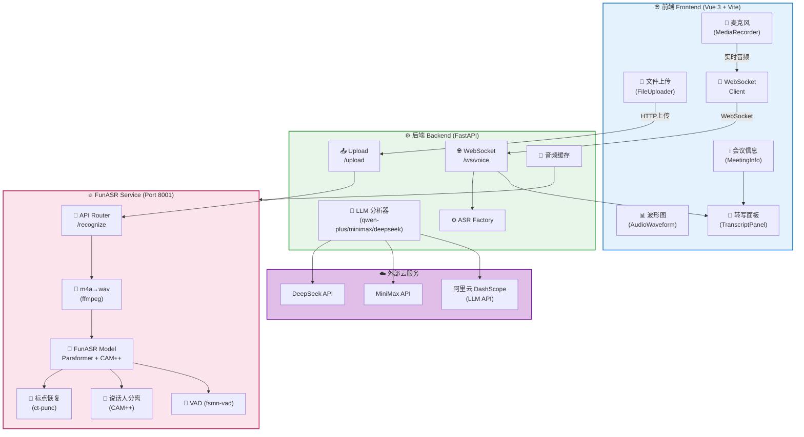
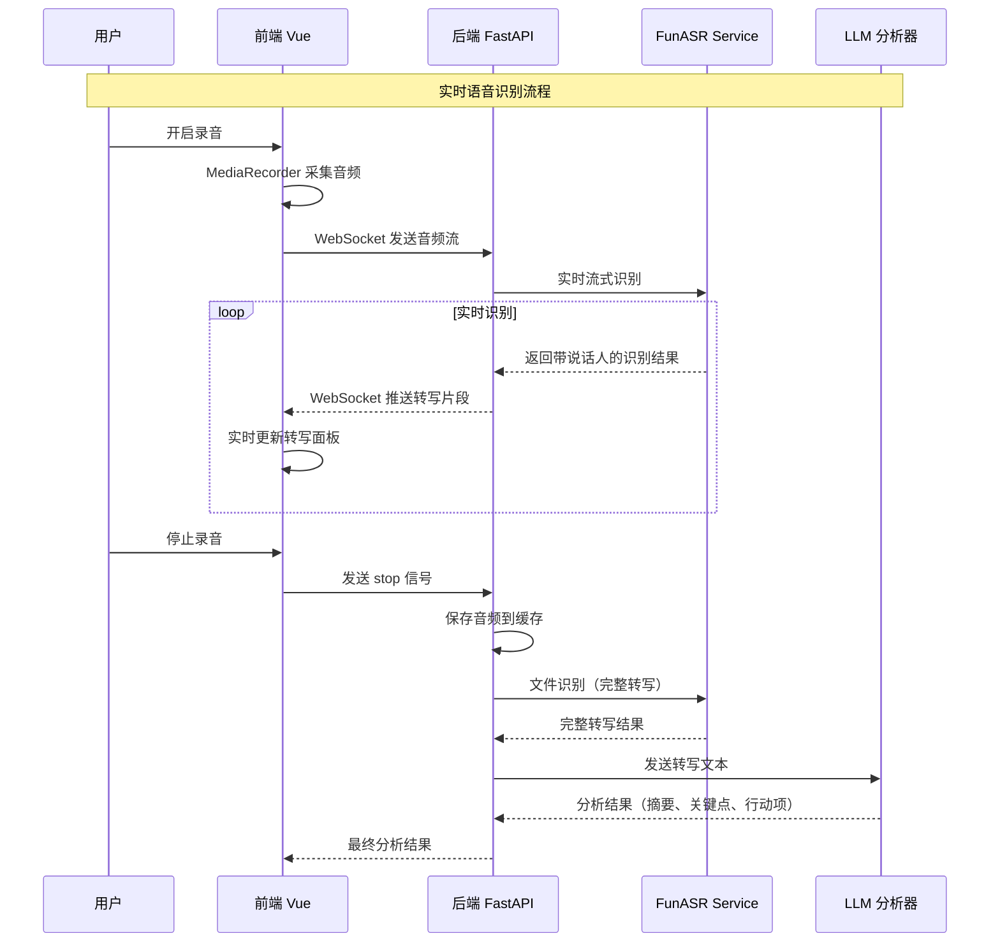
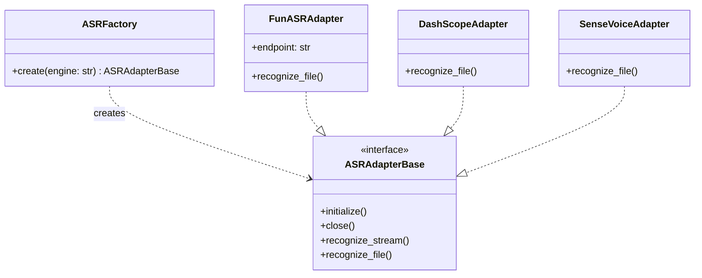

# 会议语音助手 - 系统架构图

## 架构概览



## 核心数据流



## ASR 适配器工厂模式



## 目录结构

```
meeting-voice-assistant/
├── frontend/                    # Vue 3 + Vite 前端
│   └── src/
│       ├── components/           # Vue 组件
│       │   ├── AudioRecorder.vue
│       │   ├── AudioWaveform.vue
│       │   ├── FileUploader.vue
│       │   ├── TranscriptPanel.vue
│       │   └── MeetingInfo.vue
│       ├── composables/           # 组合式函数
│       │   ├── useAudioRecorder.ts
│       │   └── useWebSocket.ts
│       └── stores/               # Pinia 状态
│
├── backend/                     # Python FastAPI 后端
│   ├── app/
│   │   ├── api/v1/
│   │   │   ├── ws.py            # WebSocket 端点
│   │   │   └── upload.py        # 文件上传端点
│   │   ├── core/
│   │   │   ├── asr/             # ASR 适配器
│   │   │   │   ├── base.py
│   │   │   │   ├── factory.py
│   │   │   │   ├── funasr_adapter.py
│   │   │   │   ├── dashscope.py
│   │   │   │   └── sensevoice.py
│   │   │   ├── realtime_spk/    # 实时说话人分离
│   │   │   ├── llm_analyzer.py  # LLM 分析
│   │   │   └── audio_cache.py   # 音频缓存
│   │   └── config.py
│   └── funasr_service/          # FunASR 微服务
│       ├── main.py
│       ├── api.py
│       └── model_loader.py
│
└── docs/architecture/
    └── diagrams/               # 架构图
        ├── system-architecture.drawio
        └── system-architecture.md
```

## 技术栈

| 层级 | 技术 | 说明 |
|------|------|------|
| 前端框架 | Vue 3 + TypeScript | SPA 应用 |
| 前端构建 | Vite | 开发服务器和构建工具 |
| 后端框架 | FastAPI | Python ASGI 框架 |
| 实时通信 | WebSocket | 音频流传输 |
| ASR 引擎 | FunASR | 阿里云开源语音识别 |
| 说话人分离 | CAM++ | FunASR 内置模型 |
| LLM | qwen-plus / MiniMax / DeepSeek | 会议分析 |
