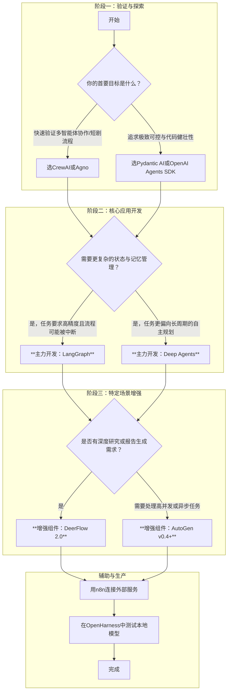

# Hermes配置微信飞书401认证错误解决

## Metadata

- Conversation ID: 758e5c7e-9b73-43f2-99be-0bb39f43f895
- Created At: 2026-04-16T18:33:43.433000+08:00
- Updated At: 2026-04-23T11:09:50.082000+08:00

## Question

Hermes配置微信、飞书的时候报错：⚠️ Error code: 401 - {'type': 'error', 'error': {'type': 'authentication_error', 'message': "login fail: Please carry the API secret key in the 'Authorization' field of the request header"}, 'request_id': '063008088f5f978866fd3724e137127b'}

## Core Conclusion

N/A

## Keywords

Hermes, 配置微信, 飞书的时候报错, Error, code, type, error, authentication_error

## Conversation

### Turn 1 · User

Hermes配置微信、飞书的时候报错：⚠️ Error code: 401 - {'type': 'error', 'error': {'type': 'authentication_error', 'message': "login fail: Please carry the API secret key in the 'Authorization' field of the request header"}, 'request_id': '063008088f5f978866fd3724e137127b'}

### Turn 2 · Unknown

用户在使用Hermes时遇到了401认证错误，错误信息提示需要在请求头中携带API密钥。为了全面了解问题，我需要同时进行多项搜索，以覆盖Hermes的官方文档、常见问题、错误信息以及相关的微信、飞书配置解决方案。

搜索结果显示了一些相关页面。为了全面获取信息，我们需要同时打开这些页面。

这些资料涵盖了Hermes配置微信和飞书时可能出现的401错误及其解决方法。我的回答将涵盖错误原因分析、针对微信和飞书的解决方案、通用排查步骤和总结。回答会引用这些资料。

根据你提供的 `401` 错误信息，这个“Authentication_error”核心问题通常指向**凭证配置错误或缺失**。简单来说，就是 Hermes 在尝试连接微信或飞书时，没能提供平台所需的、正确的身份验证信息[reference:0]。

### 🎯 问题排查第一步：确定是"微信"还是"飞书"？

由于你的配置同时涉及微信和飞书，但二者的认证机制和配置方法完全不同。请先确认这个错误是发生在为哪个平台测试连接的时候。

#### 如果是配置飞书时报错

飞书的配置通常需要你在飞书开放平台创建应用，并在 Hermes 中填写正确的 **App ID** 和 **App Secret**[reference:1][reference:2]。

*   **详细检查与解决方案：**
    1.  **核对 App ID 与 App Secret 是否正确**
        *   登录**飞书开放平台**，进入你的自建应用[reference:3]。
        *   在“凭证与基础信息”页面，找到 `App ID` 和 `App Secret`[reference:4]。`App Secret` 是隐藏的，需要点击“查看”才能复制。
        *   务必确认粘贴时没有多余的空格或遗漏字符[reference:5]。
    2.  **重新运行 Hermes 配置向导**
        *   在终端执行 `hermes gateway setup`，并选择 `Feishu` 进行重新配置[reference:6]。
        *   按提示依次填入 `App ID`、`App Secret`。对于 `User IDs`，测试时可先留空；`Domain` 和 `Connection mode` 保持默认即可[reference:7]。
    3.  **检查飞书平台应用权限**
        *   在飞书开放平台应用的“权限管理”中，确认已添加并获批了 **`im:message`** 和 **`im:resource`** 等核心权限[reference:8]。
        *   权限配置后，记得需要**重新发布**应用新版本才能生效[reference:9]。

#### 如果是配置微信时报错

微信（个人号）的接入方式比较特殊，主要是通过**扫码登录**获取凭证，而不是手动填写 API Key[reference:10]。

*   **详细检查与解决方案：**
    1.  **确保 Gateway 正常运行**
        *   微信连接依赖于 Hermes 的 `gateway` 服务，请务必在终端运行 `hermes gateway` 启动它[reference:11]。
    2.  **检查扫码登录状态**
        *   运行 `hermes gateway` 后，终端会显示二维码。使用你的**个人微信**扫码并确认登录[reference:12]。
        *   如果扫码后终端没有输出 `Weixin connection successful, account_id=...` 的成功信息，说明登录未完成或失败[reference:13]。
    3.  **手动检查环境变量文件**
        *   扫码成功后，凭证应自动保存在 `~/.hermes/.env` 文件中。你可以手动打开该文件，检查是否存在以下关键变量[reference:14]：
            ```
            WEIXIN_ACCOUNT_ID=你的账户ID
            WEIXIN_TOKEN=你的Token
            WEIXIN_DM_POLICY=open
            ```
        *   如果变量缺失，可以手动补全并保存，然后重启网关[reference:15][reference:16]。

### 🛠️ 通用排查步骤 (适用于两种平台)

如果上述针对性排查无效，可以试试下面的通用方法：

1.  **彻底清除旧凭证**：删除 `~/.hermes/` 目录下的 `.env` 配置文件，然后重新运行 `hermes gateway setup` 进行完整配置[reference:17]。
2.  **使用 `hermes doctor` 命令**：这是一个集成的诊断工具，可以帮助你快速定位配置中的常见问题[reference:18][reference:19]。
3.  **检查网络连通性**：确保你的服务器可以正常访问飞书 (`open.feishu.cn`) 或微信 (`ilogin.weixin.qq.com`) 的API域名[reference:20]。
4.  **启用调试日志**：在运行 `hermes gateway` 前设置环境变量 `DEBUG=*`，可以输出更详细的日志信息，帮助精确定位问题[reference:21]。
5.  **检查 Hermes 版本**：确保你的 Hermes Agent 是最新版本，旧版本可能存在兼容性 bug。可以使用 `hermes update` 来更新。

### 💎 总结

简单来说，**这个 `401` 错误的核心问题就是“钥匙”对不上“锁”**。

你可以遵循“**先定位平台 → 核对该平台的凭证 → 检查网络与服务状态**”的逻辑，基本就能解决。如果经过这些步骤后问题依旧，建议你先专注于解决一个平台（比如先搞定微信），成功后再去配置另一个。这样可以排除变量干扰，更快地定位问题根源。

### Turn 3 · User

hermes的模型配置信息在哪？

### Turn 4 · Unknown

用户想知道Hermes的模型配置信息存储在哪里。从之前的对话来看，我们之前讨论过微信和飞书的配置问题。用户可能想了解模型配置文件的路径、格式以及如何修改。为了全面获取信息，我需要同时进行多项搜索，涵盖不同的关键词和可能的配置位置。

搜索结果显示了一些相关页面。为了全面获取信息，我们需要同时打开这些页面。

这些资料详细说明了配置文件的位置。我的回答将涵盖配置文件的位置、如何查看和编辑配置、模型配置的关键部分、配置方法以及常见问题排查。

Hermes 的配置信息主要存放在用户主目录下的 `.hermes` 文件夹里，这里面有管理基础设置和模型连接的 `config.yaml`，也有专门存放敏感密钥的 `.env` 文件。

我把这些核心配置文件整理成了表格，方便你对照查找：

| 文件 | 作用 | Linux / macOS 路径 | Windows 路径 |
| :--- | :--- | :--- | :--- |
| **主配置文件** | 模型、工具等核心设置 | `~/.hermes/config.yaml`[reference:0] | `C:\Users\你的用户名\.hermes\config.yaml`[reference:1] |
| **环境变量文件** | 存储 API 密钥等敏感信息 | `~/.hermes/.env`[reference:2] | `C:\Users\你的用户名\.hermes\.env`[reference:3] |
| **会话数据库** | 存放跨会话的记忆 | `~/.hermes/state.db`[reference:4] | 路径规则同上 |

### 🔍 查看与编辑配置

查看和管理配置，推荐使用 Hermes 内置的命令，比手动找文件更安全方便：

*   **运行诊断**：使用 `hermes doctor` 检查配置问题[reference:5][reference:6]。
*   **编辑配置**：使用 `hermes config edit` 在默认编辑器中安全打开主配置文件[reference:7][reference:8]。
*   **查看当前配置**：使用 `hermes config` 快速查看生效的设置[reference:9]。
*   **配置 API 密钥**：使用 `hermes config set OPENROUTER_API_KEY <你的密钥>` 一键设置[reference:10][reference:11]。

### ✍️ 模型配置的关键部分

模型的配置核心是 `config.yaml` 中的 `model` 字段。下面是一个简单的示例：

```yaml
# ~/.hermes/config.yaml
model:
  default: "anthropic/claude-3.5-sonnet"
  provider: "openrouter"
  base_url: "https://openrouter.ai/api/v1"
  # 注意：不要在配置文件中写 API 密钥，应使用环境变量
```

关键字段说明：
*   **`default`**: 指定默认使用的模型名称。
*   **`provider`**: 指定模型提供商，如 `openai`, `openrouter`, `ollama` 等[reference:12]。
*   **`base_url`**: 用于自定义 API 端点，指向代理或本地服务[reference:13]。

### ⚙️ 配置模型的方法

1.  **方法一：交互式配置（推荐新手）**
    在终端运行 `hermes setup`，然后跟随提示选择服务商、输入 API 密钥并选择模型，程序会自动完成配置[reference:14]。

2.  **方法二：命令行直接配置（推荐）**
    使用命令快速配置，例如：
    *   **设置 API Key**：`hermes config set OPENROUTER_API_KEY sk-or-v1-你的key`[reference:15]
    *   **切换模型**：`hermes model`，在交互菜单中自由选择[reference:16]

3.  **方法三：手动编辑配置文件（高级）**
    先运行 `hermes config edit` 编辑 `config.yaml` 文件，在 `.env` 文件中保存 API 密钥，最后在终端执行 `source ~/.hermes/.env` 让配置生效。

### ⚠️ 常见问题排查

如果配置后模型仍无法调用，可以对照这个清单逐一排查：

*   **检查文件路径**：用 `ls -l ~/.hermes/config.yaml ~/.hermes/.env` (Linux/macOS) 或检查 Windows 下的对应目录，确认文件存在且路径正确[reference:17]。
*   **检查文件格式**：用在线 YAML 校验工具检查 `config.yaml` 语法；确认 `.env` 文件内容为 `KEY=value` 的纯键值对格式，且无多余空格[reference:18][reference:19]。
*   **检查模型参数**：在 `config.yaml` 中确认 `model` 区块下的 `default`、`provider`、`base_url` 和 `api_key` (或 `api_key_env`) 四个字段是否都已正确填写[reference:20]。
*   **查看调试日志**：在运行 Hermes 前设置环境变量 `HERMES_LOG_LEVEL=DEBUG`，通过详细日志查找问题根源[reference:21]。

**安全提醒**：请务必只在 `.env` 文件中保存你的 API 密钥，不要在 `config.yaml` 里硬编码。这样可以有效防止在分享代码或文件时意外泄露凭证[reference:22]。

如果配置过程中遇到具体的报错，可以告诉我详细的错误信息，我再帮你进一步排查。

### Turn 5 · User

Hermes如何配置minimax模型

### Turn 6 · Unknown

用户想了解如何在Hermes中配置MiniMax模型。根据历史对话，用户已经知道配置文件的位置（`~/.hermes/config.yaml`和`~/.hermes/.env`）。我需要提供具体的配置步骤。为了全面获取信息，我需要同时进行多项搜索，涵盖Hermes配置MiniMax的通用方法、可能涉及的特定参数、以及MiniMax API的官方文档。

搜索结果显示了一些相关页面。为了全面了解Hermes配置MiniMax模型的方法，我们需要同时打开这些页面。

这些资料提供了配置MiniMax模型的方法。我的回答将涵盖几种配置方法：使用交互式向导、手动配置、命令行配置。回答会引用多个来源。

配置 MiniMax 模型到 Hermes，推荐使用官方的交互式命令，这是最简单高效的方式。

### ⚙️ 方法一：使用 `hermes model` 交互式配置（推荐）

1.  **启动配置向导**：在终端中运行 `hermes model` 命令。
2.  **选择服务商**：根据你所在的地区和网络情况，选择对应的端点：
    *   **中国大陆用户**：选择 **"MiniMax China (mainland China endpoint)"**[reference:0]。
    *   **国际用户**：选择 **"MiniMax (global endpoint)"**[reference:1]。
3.  **输入 API 密钥**：根据提示，输入你在 MiniMax 平台获取的 **Token Plan API Key**[reference:2]。
4.  **选择模型**：在向导中选择你想使用的模型，例如 **MiniMax-M2.7**[reference:3]。
5.  **保存并验证**：确认配置信息并保存。

配置完成后，可以用命令 `hermes "用中文介绍一下你自己"` 快速测试模型是否正常响应。

### ⚙️ 方法二：手动配置

除了交互式向导，你也可以手动编辑配置文件。

1.  **编辑 `.env` 文件**
    打开位于 `~/.hermes/.env` 的环境变量文件，添加你的 MiniMax API 密钥：
    ```bash
    # 中国大陆端点
    MINIMAX_CN_API_KEY=你的MiniMax_Token_Plan_API密钥
    
    # 国际端点
    MINIMAX_API_KEY=你的MiniMax_Token_Plan_API密钥
    ```
    > 请确保密钥名称与所选端点严格对应[reference:4]。

2.  **编辑 `config.yaml` 文件**
    运行 `hermes config edit`，在 `model` 部分添加或修改 MiniMax 的配置：
    ```yaml
    # ~/.hermes/config.yaml
    model:
      default: "minimax/m2.7" # 设置默认模型，可根据需要修改
      providers:
        - name: "minimax"
          base_url: "https://api.minimaxi.com/v1" # 中国大陆端点
          # 国际端点可使用: "https://api.minimax.io/v1"
          api_key_env: "MINIMAX_CN_API_KEY" # 指定对应的环境变量名
    ```
    手动配置更灵活，但也更容易出错，推荐优先使用第一种方法。

### 🔑 准备工作：获取 MiniMax API 密钥

配置 Hermes 之前，需要先获取 MiniMax 的 API 密钥。这里有两个关键点需要特别注意：

*   **密钥类型**：必须使用 **Token Plan API Key**，它与普通的“按量计费 API Key”是两种不同的密钥，并不通用[reference:5][reference:6]。
*   **获取路径**：
    1.  访问 [MiniMax 开放平台](https://platform.minimaxi.com) 并登录[reference:7]。
    2.  订阅 **Token Plan**[reference:8]。
    3.  在 Token Plan 管理页面创建你的专属 **Token Plan API Key**[reference:9][reference:10]。

### 📋 MiniMax 主要模型列表

在配置时，你可以从以下主流文本模型中挑选，Hermes 均支持[reference:11][reference:12]：

*   **MiniMax-M2.7**：性能最强的旗舰模型，也是官方推荐的首选。
*   **MiniMax-M2.7-highspeed**：高速版本，推理速度更快。
*   **MiniMax-M2.5**：优化代码生成和重构任务。
*   **MiniMax-M2.5-highspeed**：M2.5的高速版本。
*   **M2-her**：专为角色扮演和多轮对话设计。

> MiniMax 也提供音频、图像生成等模型[reference:13]，但在 Hermes 中主要配置和使用的是其文本生成模型。

### 🔧 常见问题排查

如果配置完成后模型无法正常工作，可以按照以下清单排查：

1.  **检查网络连通性**：在终端运行 `curl -I https://api.minimaxi.com` (国内) 或 `curl -I https://api.minimax.io` (国际)，确保可以正常访问 MiniMax 的 API 地址[reference:14]。
2.  **核对密钥类型**：再次确认使用的是 **Token Plan API Key**，而不是按量计费 API Key[reference:15]。
3.  **验证 Hermes 版本**：确保 Hermes 版本不低于 v0.8.0[reference:16]，可以在终端运行 `hermes --version` 查看。
4.  **重启终端或服务**：手动修改配置文件后，需要重启终端或相关服务，才能使新的环境变量生效。
5.  **使用诊断工具**：运行 `hermes doctor` 命令，它会自动检查并报告常见的配置问题[reference:17]。

### Turn 7 · User

wsl内如何打开~/.hermes/.env 进行编辑

### Turn 8 · Unknown

我们需提供在 WSL 中编辑文件的具体方法，包括命令行编辑器和图形界面方法，并说明路径。需强调 WSL 中的 ~ 代表 Linux 用户主目录，并给出常用命令示例。要准确、实用，涵盖 nano、vim、code 等编辑器。

在 WSL（Windows Subsystem for Linux）环境中，`~/.hermes/.env` 的路径与普通 Linux 完全一致。你可以使用以下任一方法打开并编辑它。

### 1. 使用终端内的命令行编辑器（最直接）

打开 WSL 终端，输入以下命令之一：

- **使用 `nano`（适合新手）**
  ```bash
  nano ~/.hermes/.env
  ```
  编辑完成后：
  - 按 `Ctrl + X` 退出
  - 按 `Y` 确认保存
  - 按 `Enter` 确认文件名

- **使用 `vim` / `vi`（更强大）**
  ```bash
  vim ~/.hermes/.env
  ```
  进入后按 `i` 进入编辑模式，编辑完成后：
  - 按 `Esc` 退出编辑模式
  - 输入 `:wq` 保存并退出

### 2. 使用 Windows 上的图形化编辑器（如 VS Code）

如果你在 Windows 中安装了 VS Code，可以在 WSL 终端中直接调用：

```bash
code ~/.hermes/.env
```

这会在 Windows 的 VS Code 中打开该文件，享受完整的图形界面编辑体验。

### 3. 通过 Windows 资源管理器访问（仅查看/复制用）

虽然可以直接访问，但 **不推荐** 用 Windows 记事本直接编辑 Linux 配置文件，可能会导致换行符错误。

如需查看文件位置，可以在 WSL 终端中运行：
```bash
explorer.exe .
```
这会在当前 WSL 目录下打开 Windows 资源管理器。然后你可以找到 `.hermes` 文件夹（可能被隐藏，需在资源管理器中开启“显示隐藏文件”）。

### 4. 如果 `.hermes` 文件夹不存在

如果你还没有配置过 Hermes，可能该文件夹尚未生成。可以手动创建：
```bash
mkdir -p ~/.hermes
```
然后再用上述编辑器创建并编辑 `.env` 文件。

### 常见问题提醒
- **文件命名**：确保文件名为 `.env`，开头有英文句点，这是 Linux 隐藏文件的命名方式。
- **内容格式**：每行格式为 `变量名=值`，例如：
  ```
  MINIMAX_CN_API_KEY=你的密钥
  ```
- **保存后生效**：如果是通过 `hermes gateway` 运行的守护进程，保存文件后需要重启服务才能加载新变量。

如果你在编辑后遇到任何权限或格式问题，可以随时告诉我具体的错误提示。

### Turn 9 · User

administrator@WIN-IDGU3FG2NTF:/mnt/c/Users/Administrator$ cd ~/home/administrator/.hermes/.env
-bash: cd: /home/administrator/home/administrator/.hermes/.env: No such file or directory如何进入》

### Turn 10 · Unknown

我们注意到用户在WSL中的路径输入出现了错误。用户输入了 `cd ~/home/administrator/.hermes/.env`，这导致了一个不存在的路径，因为 `~` 已经代表了用户主目录 `/home/administrator`，所以路径变成了 `/home/administrator/home/administrator/.hermes/.env`。正确的做法是直接 `cd ~/.hermes` 或者 `cd /home/administrator/.hermes`，然后编辑文件。需要解释清楚路径的层次结构，并指导用户正确进入目录和编辑文件。同时提醒 `.env` 是文件而非目录，不能 `cd` 进入。

你遇到的这个问题很典型，是两个小误会叠加在了一起：

1. **路径重复了**：`~` 这个符号本身就代表你的用户主目录 `/home/administrator`。你输入 `~/home/administrator/...`，实际指向的路径就变成了 `/home/administrator/home/administrator/...`，这当然是不存在的。

2. **把文件当成了文件夹**：`.env` 是一个**文件**，不是文件夹。`cd` 命令是用来进入**文件夹**的，不能用来打开文件。

### ✅ 正确的操作步骤

你可以按照下面这几步来做，非常简单：

**第一步：先进入正确的文件夹**
```bash
cd ~/.hermes
```
或者你也可以用完整路径：
```bash
cd /home/administrator/.hermes
```

**第二步：使用编辑器打开 `.env` 文件**
推荐使用 `nano` 编辑器，对新手很友好：
```bash
nano .env
```

**第三步：编辑并保存**
- 在 `nano` 里输入你的密钥内容（比如 `MINIMAX_CN_API_KEY=你的密钥`）。
- 保存方法：按键盘上的 `Ctrl + X`，然后按 `Y` 确认，最后按 `Enter` 退出。

### 💡 一句话总结
直接在终端里执行：
```bash
nano ~/.hermes/.env
```
这条命令会直接帮你打开那个文件进行编辑，连 `cd` 的步骤都省了。

### ⚠️ 小提醒
如果执行 `nano ~/.hermes/.env` 时提示文件或目录不存在，说明你还没有运行过 `hermes` 来生成这个文件夹。你可以先手动创建它：
```bash
mkdir -p ~/.hermes
```
然后再执行 `nano ~/.hermes/.env` 就可以了。

### Turn 11 · User

⚠️  API call failed (attempt 1/3): AuthenticationError [HTTP 401]
   🔌 Provider: minimax  Model: MiniMax-M2.7
   🌐 Endpoint: https://api.minimax.io/v1
   📝 Error: HTTP 401: login fail: Please carry the API secret key in the 'Authorization' field of the request header (1004)
   📋 Details: {'type': 'authorized_error', 'message': "login fail: Please carry the API secret key in the 'Authorization' field of the request header (1004)", 'http_code': '401'}
⚠️ Non-retryable error (HTTP 401) — trying fallback...
❌ Non-retryable error (HTTP 401): HTTP 401: login fail: Please carry the API secret key in the 'Authorization' field of the request header (1004)
❌ Non-retryable client error (HTTP 401). Aborting.
   🔌 Provider: minimax  Model: MiniMax-M2.7
   🌐 Endpoint: https://api.minimax.io/v1
   💡 Your API key was rejected by the provider. Check:
      • Is the key valid? Run: hermes setup
      • Does your account have access to MiniMax-M2.7?
 ─  ⚕ Hermes  ───────────────────────────────────────────────────────────────────────────────────────────────────────────────────────────────────────────────────────────────────────────────────────

     Error: Error code: 401 - {'type': 'error', 'error': {'type': 'authorized_error', 'message': "login fail: Please carry the API secret key in the 'Authorization' field of the request header
     (1004)", 'http_code': '401'}, 'request_id': '06300bbb19191bccf7cffd16924918f6'}

### Turn 12 · Unknown

用户报告Hermes配置MiniMax模型时遇到401认证错误。我需要提供排查步骤。根据提示，可能的问题包括API密钥无效、账户权限问题、端点配置错误等。为了全面覆盖，我需要同时进行多项搜索，涵盖MiniMax API配置、Hermes配置、常见错误解决方案、端点差异、密钥获取等方面。

搜索结果显示了一些相关资源。为了全面排查问题，我们需要同时打开这些结果。

这些搜索结果提供了相关信息和排查步骤。我的回答将涵盖几个方面：首先介绍如何使用交互式配置；然后检查端点（Base URL）与密钥的区域匹配问题；接着解释如何验证API密钥的有效性；然后检查配置文件中的认证变量和网关服务状态；最后提供其他故障排除技巧。

你遇到的401认证错误，通常是因为**API端点(Base URL)和API密钥的区域不匹配**。

根据你的错误信息，问题在于你连接了国际端点 `https://api.minimax.io/v1`，但这需要对应的**国际版API密钥**才能验证通过。请对照下表，重新确认你的密钥和端点区域：

| 区域 | 正确的 API 端点 (Base URL) | API 密钥获取平台 |
| :--- | :--- | :--- |
| **国内版** | `https://api.minimaxi.com/v1` | [platform.minimaxi.com](https://platform.minimaxi.com) |
| **国际版** | `https://api.minimax.io/v1` | [platform.minimax.io](https://platform.minimax.io) |

> **注意**：两个平台的账号和密钥是独立的，并不通用[reference:0]。国内用户使用国际端点，或反之，都会导致认证失败[reference:1]。

请按以下步骤操作：

### 🔑 第1步：获取正确的 API 密钥

Hermes 需要的是 **Token Plan 专属 API 密钥**，而非普通的按量计费密钥[reference:2][reference:3]。

1.  登录到正确的 MiniMax 开发者平台（根据你的区域选择国内或国际版）。
2.  确认你已订阅了 **Token Plan** 套餐。
3.  在平台的“**接口密钥**”或“**Token Plan**”管理页面，创建一个新的 **Token Plan API Key** 并复制。
    *   国内版获取地址：[点击这里](https://platform.minimaxi.com/user-center/basic-information/interface-key)[reference:4]。
    *   国际版获取地址：[点击这里](https://platform.minimax.io/user-center/basic-information/interface-key)[reference:5]。

### ⚙️ 第2步：在Hermes中重新配置

1.  **清除旧配置 (可选)**：
    在终端执行 `hermes config clear` 或直接删除 `~/.hermes/` 目录，可以从头开始。

2.  **使用交互式命令**：
    运行 `hermes model`，在配置向导中，根据你的密钥区域选择：
    *   **国内版密钥**：选择 "**MiniMax China (mainland China endpoint)**"[reference:6]。
    *   **国际版密钥**：选择 "**MiniMax (global endpoint)**"[reference:7]。

3.  **输入密钥**：在提示时，粘贴你在第1步中复制的API密钥。

4.  **选择模型**：选择 "**MiniMax-M2.7**"[reference:8]。

5.  **测试**：保存配置后，运行 `hermes "用中文介绍一下你自己"` 来测试连接是否成功。

### 🛠️ 第3步：问题排查

如果以上步骤无效，再检查以下几点：

*   **密钥和端点是否匹配**：确保国内版密钥对应国内端点（`api.minimaxi.com`），国际版对应国际端点（`api.minimax.io`）[reference:9][reference:10]。
*   **密钥是否正确**：检查 `~/.hermes/.env` 文件中的 `MINIMAX_API_KEY` 或 `MINIMAX_CN_API_KEY` 变量值是否正确。
*   **文件权限**：确保 `~/.hermes/.env` 文件权限为 `600` (-rw-------)，只允许你自己读写。
*   **重启终端**：修改 `.env` 文件后，最好重启终端或运行 `source ~/.hermes/.env`，确保新变量生效。
*   **检查账户状态**：登录MiniMax平台，确认Token Plan订阅有效且账户余额充足[reference:11]。

完成以上配置后，Hermes就应该能成功连接MiniMax模型了。如果问题仍然存在，可以把新的错误信息发给我，我们再一起看看。

### Turn 13 · User

NANO如何保存退出 如何打开帮助模式？

### Turn 14 · Unknown

我们需回答两个问题：nano编辑器如何保存退出，以及如何打开帮助模式。需要给出简洁准确的快捷键说明，适用于WSL/Linux环境。要区分“保存退出”和“仅退出不保存”以及“帮助模式”的触发方法。可以附带一些常见提示。

在 `nano` 编辑器中，掌握以下核心快捷键就能流畅操作（`^` 代表 `Ctrl` 键）：

### 💾 如何保存并退出

1.  **保存当前文件**  
    按 `Ctrl + O`  
    - 底部会提示 `File Name to Write: 文件名`  
    - 直接按 `Enter` 确认保存

2.  **退出编辑器**  
    按 `Ctrl + X`  
    - 如果文件已修改但未保存，它会问 `Save modified buffer?`  
    - 按 `Y` 确认保存，再按 `Enter` 确认文件名  
    - 按 `N` 放弃修改直接退出

> **快捷组合**：`Ctrl + X` → `Y` → `Enter` 一气呵成，保存并退出。

### 🆘 如何打开帮助模式

- **在编辑界面内**：直接按 `Ctrl + G`  
  这会打开完整的帮助文档，列出所有快捷键。

- **在终端命令行**：输入 `man nano` 或 `nano --help` 查看外部手册。

### 📋 Nano 常用快捷键速查表

| 功能 | 快捷键 | 说明 |
| :--- | :--- | :--- |
| 保存 | `Ctrl + O` | 写入文件 |
| 退出 | `Ctrl + X` | 离开 nano |
| 帮助 | `Ctrl + G` | 显示所有命令帮助 |
| 剪切整行 | `Ctrl + K` | 删除光标所在行 |
| 粘贴 | `Ctrl + U` | 粘贴之前剪切的内容 |
| 搜索文本 | `Ctrl + W` | 查找关键字 |
| 撤销 | `Alt + U` | 撤销上一步操作 |
| 跳转到行首 | `Ctrl + A` | 行首 |
| 跳转到行尾 | `Ctrl + E` | 行尾 |
| 显示行号 | `Alt + #` | 切换行号显示（部分版本支持） |

### ⚠️ 特别提醒

- 底部两行就是**快捷键提示栏**，默认显示最常用的几个，例如 `^X Exit`、`^O Write Out`。
- 如果你误按了 `Ctrl + Z`（挂起进程），输入 `fg` 回车即可回到 nano。
- 如果不小心进入了只读模式，保存时可能会提示 `[ Error writing ... ]`，这时需要确认文件权限是否正确。

如果需要编辑 `/etc` 下的系统文件，记得用 `sudo nano 文件路径` 来获取写入权限。

### Turn 15 · User

hermes可以接入到deepseek吗

### Turn 16 · Unknown

用户想知道Hermes是否可以接入DeepSeek。我需要提供相关信息。为了全面获取信息，我需要同时进行多项搜索，涵盖Hermes是否支持DeepSeek、如何配置、可能存在的兼容性问题以及相关文档。

搜索结果显示了一些相关页面。为了全面获取信息，我们需要同时打开这些页面。

这些资料显示Hermes可以接入DeepSeek。我的回答将涵盖几个方面：首先确认支持，然后提供配置方法，包括交互式配置和手动配置，最后进行总结。

可以的，Hermes 支持接入 DeepSeek 模型。它本身作为一个调度框架，可以通过 OpenAI 兼容的 API 协议接入 DeepSeek 等第三方模型[reference:0]。

配置接入 DeepSeek 主要有两种方法，推荐使用官方命令，简单快捷：

### ⚙️ 方法一：使用 `hermes model` 交互式配置 (推荐)

这是最简单、官方推荐的方式，跟着向导一步步来就行。

1.  **启动配置向导**：在终端中执行命令：
    ```bash
    hermes model
    ```

2.  **选择提供商**：在出现的提供商列表中，先选择 **`More providers`**，然后再选择 **`Custom endpoint`**[reference:1]。对于推理模型，你还可以添加 `--enable-auto-tool-choice` 和 `--tool-call-parser` 参数来开启工具调用能力[reference:2]。

3.  **填入 DeepSeek 信息**：根据提示填入以下关键信息：
    *   **Base URL (API地址)**: `https://api.deepseek.com/v1`
    *   **API Key (API密钥)**: 粘贴你在 DeepSeek 平台获取的 `API Key`[reference:3]。
    *   **Model (模型名称)**: 填入你想使用的模型，例如 `deepseek-chat` 或 `deepseek-coder`[reference:4]。

4.  **完成配置**：保存后，你的 Hermes 应该就能使用 DeepSeek 模型了。

### 📝 方法二：手动编辑配置文件

如果你更喜欢直接修改配置文件，或者需要更精细的控制，也可以手动操作。

1.  **编辑 `.env` 文件**
    在 `~/.hermes/.env` 文件中添加你的 DeepSeek API Key：
    ```bash
    # 你可以在 ~/.hermes/.env 文件中添加
    DEEPSEEK_API_KEY=你的DeepSeek_API_Key
    ```

2.  **编辑 `config.yaml` 文件**
    运行 `hermes config edit` 命令，或者直接用编辑器打开 `~/.hermes/config.yaml` 文件，在 `model` 部分添加以下内容[reference:5][reference:6]：
    ```yaml
    # ~/.hermes/config.yaml
    model:
      default: deepseek-chat # 设置默认模型，可以修改
      provider: custom
      base_url: https://api.deepseek.com/v1
      api_key: DEEPSEEK_API_KEY # 这里填入上面设置的环境变量名
    ```
    配置完成后，重启终端或执行 `source ~/.hermes/.env` 让环境变量生效。

### 🔑 准备工作：获取 DeepSeek API Key

无论用哪种方法，你都需要一个 DeepSeek 的 API Key。

1.  访问 **DeepSeek 开放平台**：[https://platform.deepseek.com/](https://platform.deepseek.com/)。
2.  注册并登录你的账号。
3.  在控制台的“**API Keys**”页面，创建一个新的 API Key 并复制保存好[reference:7][reference:8]。DeepSeek 的官方文档也提供了详细的接入指引[reference:9]。

### 💡 常见问题排查

*   **检查网络连通性**：在终端运行 `curl -I https://api.deepseek.com`，确保网络可以正常访问 DeepSeek 的 API 地址。
*   **核对 API Key**：确保在 Hermes 中填写的 `API Key` 与你从 DeepSeek 平台获取的一致。
*   **使用诊断工具**：运行 `hermes doctor` 命令，它会自动检查并报告常见的配置问题。
*   **更新 `requests` 库**：DeepSeek 的 API 对接有版本要求，建议确保 Python 的 `requests` 库版本不低于 `2.31.0`[reference:10]。
*   **检查上下文长度**：DeepSeek-V3 支持最高 **128K** 的上下文窗口。如果需要进行长文本处理，可以在配置文件中将 `context_window_size` 设置为 `128000` 或更高，以充分利用其能力[reference:11]。

配置成功后，就可以用 `hermes` 命令测试一下了。如果遇到具体报错，可以把错误信息发给我，我再帮你看看。

### Turn 17 · User

重新渲染这个代码graph TD
    subgraph 阶段一：验证与探索
        A[开始] --> B{你的首要目标是什么？};
        B --> C(快速验证<br>多智能体协作/短剧流程);
        C --> D[选CrewAI或Agno];
        B --> E(追求极致可控<br>与代码健壮性);
        E --> F[选Pydantic AI或<br>OpenAI Agents SDK];
    end

    subgraph 阶段二：核心应用开发
        D --> G{需要更复杂的<br>状态与记忆管理?};
        F --> G;
        G --> H(是，任务要求高精度<br>且流程可能被中断);
        H --> I[**主力开发：LangGraph**];
        G --> J(是，任务更偏向<br>长周期的自主规划);
        J --> K[**主力开发：Deep Agents**];
    end

    subgraph 阶段三：特定场景增强
        I --> L{是否有深度研究或<br>报告生成需求?};
        K --> L;
        L --> M(是);
        M --> N[**增强组件：DeerFlow 2.0**];
        L --> O(需要处理高并发<br>或异步任务);
        O --> P[**增强组件：AutoGen v0.4+**];
    end

    subgraph 辅助与生产
        N --> Q[用n8n连接外部服务];
        P --> Q;
        Q --> R[在OpenHarness中测试本地模型];
        R --> S[完成];
    end

### Turn 18 · Unknown

我们收到一个需求：用户提供了一个Mermaid格式的流程图代码（graph TD），希望我们“重新渲染这个代码”。用户之前一直在询问关于Hermes配置的问题，现在突然给出一个流程图代码，要求重新渲染。我需要理解用户的意图：可能是希望我们以更清晰、美观的方式展示这个流程图，或者将其转换为其他格式（如ASCII流程图、列表结构等），因为纯文本环境中Mermaid代码无法直接渲染成图片。用户可能想要一个可视化的替代品，比如用文字描述流程图结构，或者提供一个可以在支持Mermaid的平台上查看的代码块，或者转换成文本流程图。

根据对话历史，用户是在终端环境中使用Hermes和nano，可能现在需要将这个流程图整合到文档中，或者只是希望我们检查这个流程图是否合理。要求是“重新渲染”，可以理解为用一种人类可读的方式呈现该流程图的逻辑。

因此，我会提供两种输出：
1. 将Mermaid代码块美化呈现，并提示可以在支持Mermaid的编辑器或平台（如GitHub、Obsidian、Typora）中查看。
2. 提供一个基于文本的流程图描述，用缩进和箭头来展示决策路径。

同时，注意流程图内容是关于AI Agent框架选择的，与Hermes无关，但我们可以直接按要求做。

回答结构：先解释在纯文本环境无法直接渲染图片，然后给出Mermaid代码块和文本版流程图。

在当前纯文本的对话环境中，我无法直接将 Mermaid 代码渲染成可交互的图形。不过，我可以为你提供两种替代呈现方式：

---

### 方式一：优化排版后的 Mermaid 代码（可直接复制到支持平台查看）



> 你可以将上面这段代码复制到 [Mermaid Live Editor](https://mermaid.live) 或支持 Mermaid 的 Markdown 编辑器（如 Typora、Obsidian、GitHub）中直接查看图形。

---

### 方式二：文本结构化流程图（纯文本展示逻辑）

**阶段一：验证与探索**

```
开始
  │
  └─► 你的首要目标是什么？
        ├─► 快速验证多智能体协作/短剧流程 ──► 选 CrewAI 或 Agno
        └─► 追求极致可控与代码健壮性 ────► 选 Pydantic AI 或 OpenAI Agents SDK
```

**阶段二：核心应用开发**

```
(来自阶段一的两个分支)
        └─► 需要更复杂的状态与记忆管理？
              ├─► 是，任务要求高精度且流程可能被中断 ──► **主力开发：LangGraph**
              └─► 是，任务更偏向长周期的自主规划 ────► **主力开发：Deep Agents**
```

**阶段三：特定场景增强**

```
(来自阶段二的两个主力框架)
        └─► 是否有深度研究或报告生成需求？
              ├─► 是 ──────────────────────────► **增强组件：DeerFlow 2.0**
              └─► 需要处理高并发或异步任务 ────► **增强组件：AutoGen v0.4+**
```

**辅助与生产**

```
(来自阶段三的两个增强组件)
        └─► 用 n8n 连接外部服务
              └─► 在 OpenHarness 中测试本地模型
                    └─► 完成
```

---

如果需要我调整呈现风格（例如生成 ASCII 字符画流程图、详细步骤说明，或转为 PlantUML 语法），可以告诉我你的具体使用场景～
