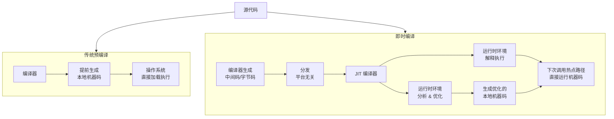
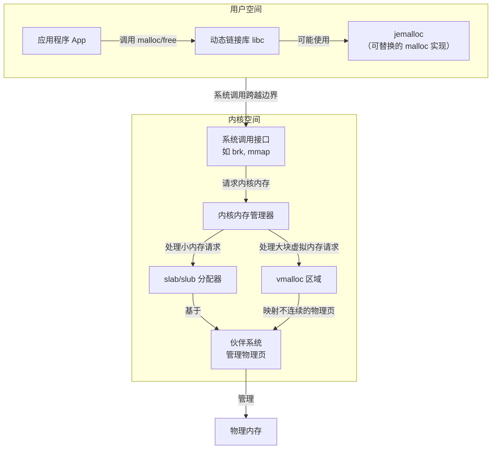
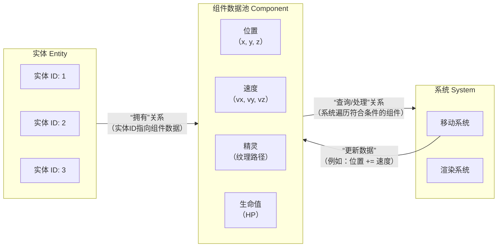
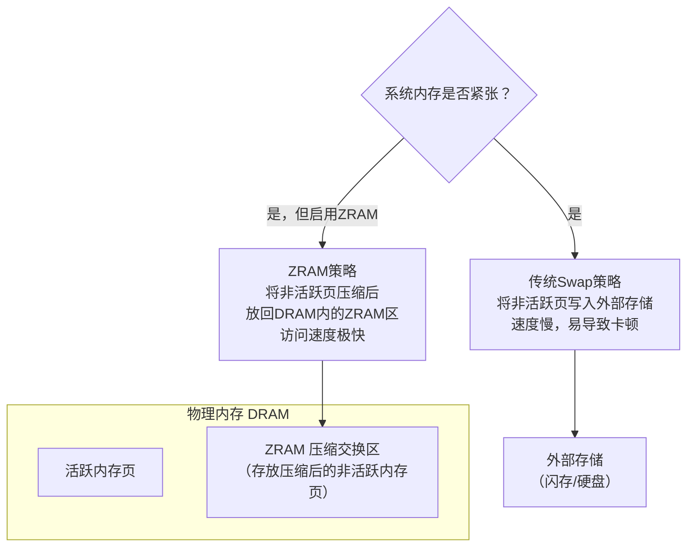

# TypeScript中的多态与复态解析

## Metadata

- Conversation ID: a299decd-09de-4989-af38-f3928e212cb7
- Created At: 2026-01-15T10:46:55.160000+08:00
- Updated At: 2026-02-02T17:57:28.343000+08:00

## Conversation

### Turn 1 · User

ts语言内的多态和复态是啥

### Turn 2 · Unknown

在TypeScript中，我们通常讨论的是多态（Polymorphism）和泛型（Generics），而“复态”并不是一个常见的术语。我猜你可能指的是“泛型”（Generics），因为它在TypeScript中与多态密切相关，并且有时被称为参数多态。下面我将详细解释TypeScript中的多态和泛型。

### 1. 多态（Polymorphism）
在面向对象编程中，多态是指同一个方法或操作可以作用于多种类型的对象上，并且可以根据对象的类型产生不同的行为。在TypeScript中，多态主要通过以下方式实现：

#### 继承和方法重写（子类多态）
这是最常见的多态形式。子类可以重写父类的方法，从而使得同一个方法在子类中有不同的实现。

```typescript
class Animal {
    makeSound(): void {
        console.log('Some sound');
    }
}

class Dog extends Animal {
    makeSound(): void {
        console.log('Bark');
    }
}

class Cat extends Animal {
    makeSound(): void {
        console.log('Meow');
    }
}

let animal: Animal;
animal = new Dog();
animal.makeSound(); // 输出: Bark

animal = new Cat();
animal.makeSound(); // 输出: Meow
```

#### 接口多态
TypeScript的接口允许我们定义契约，然后由不同的类实现，从而实现多态。

```typescript
interface Shape {
    draw(): void;
}

class Circle implements Shape {
    draw(): void {
        console.log('Drawing a circle');
    }
}

class Rectangle implements Shape {
    draw(): void {
        console.log('Drawing a rectangle');
    }
}

let shape: Shape;
shape = new Circle();
shape.draw(); // 输出: Drawing a circle

shape = new Rectangle();
shape.draw(); // 输出: Drawing a rectangle
```

### 2. 泛型（Generics）
泛型，有时也被称为参数多态，它允许我们编写可以适用于多种类型的代码，而不必预先指定具体的类型。泛型提供了代码重用性，同时保持了类型安全。

#### 泛型函数
```typescript
function identity<T>(arg: T): T {
    return arg;
}

let output1 = identity<string>("hello"); // 类型为string
let output2 = identity<number>(42); // 类型为number
```

#### 泛型类
```typescript
class Box<T> {
    private value: T;

    constructor(value: T) {
        this.value = value;
    }

    getValue(): T {
        return this.value;
    }
}

let box1 = new Box<string>("hello");
console.log(box1.getValue()); // 输出: hello

let box2 = new Box<number>(42);
console.log(box2.getValue()); // 输出: 42
```

#### 泛型接口
```typescript
interface Pair<T, U> {
    first: T;
    second: U;
}

let pair1: Pair<string, number> = { first: "age", second: 30 };
let pair2: Pair<number, boolean> = { first: 1, second: true };
```

### 多态与泛型的结合
泛型也可以用于实现多态。例如，我们可以使用泛型来创建一个可以处理多种类型的函数，而这些类型具有共同的接口。

```typescript
interface HasLength {
    length: number;
}

function logLength<T extends HasLength>(item: T): void {
    console.log(item.length);
}

logLength("hello"); // 字符串有length属性，输出: 5
logLength([1, 2, 3]); // 数组有length属性，输出: 3
```

在这个例子中，我们定义了一个泛型函数`logLength`，它要求类型`T`必须扩展`HasLength`接口（即具有`length`属性）。这样，我们可以传入任何具有`length`属性的对象，实现了多态。

### 总结
- **多态**：允许我们以统一的方式处理不同类型的对象，通常通过继承和接口实现。
- **泛型**：允许我们编写可重用的代码，这些代码可以处理多种类型，而不牺牲类型安全。

在TypeScript中，这两种技术经常结合使用，以构建灵活且类型安全的系统。如果你所说的“复态”指的是其他概念，请提供更多的上下文，我可以进一步解释。否则，我希望以上解释对你有所帮助。

在 TypeScript 中，我们主要讨论的是**多态**，而"复态"并不是一个标准的编程术语。让我详细解释这两个概念：

## 1. **多态（Polymorphism）**

多态是面向对象编程的三大特性之一（封装、继承、多态），指同一个接口可以有多种不同的实现方式。

### TypeScript 中的多态实现：

#### a) **继承多态（子类多态）**
```typescript
class Animal {
    makeSound(): void {
        console.log('Animal makes sound');
    }
}

class Dog extends Animal {
    makeSound(): void {
        console.log('Bark');
    }
}

class Cat extends Animal {
    makeSound(): void {
        console.log('Meow');
    }
}

// 多态示例
const animals: Animal[] = [new Dog(), new Cat()];
animals.forEach(animal => animal.makeSound());
// 输出: Bark, Meow
```

#### b) **接口多态**
```typescript
interface Shape {
    area(): number;
}

class Circle implements Shape {
    constructor(private radius: number) {}
    
    area(): number {
        return Math.PI * this.radius ** 2;
    }
}

class Rectangle implements Shape {
    constructor(private width: number, private height: number) {}
    
    area(): number {
        return this.width * this.height;
    }
}

// 多态使用
const shapes: Shape[] = [new Circle(5), new Rectangle(4, 6)];
shapes.forEach(shape => console.log(shape.area()));
```

#### c) **方法重载**
```typescript
class Calculator {
    // 方法重载
    add(a: number, b: number): number;
    add(a: string, b: string): string;
    add(a: any, b: any): any {
        return a + b;
    }
}

const calc = new Calculator();
console.log(calc.add(1, 2));      // 3
console.log(calc.add("Hello", " World")); // "Hello World"
```

## 2. **关于"复态"**

"复态"不是标准的编程术语，但可能有以下几种理解：

### a) **可能是对"多态"的误称**
有些资料或方言中可能用"复态"指代多态。

### b) **组合模式（复合类型）**
如果指的是类型组合，TypeScript 有复合类型的概念：

```typescript
// 交叉类型（Intersection Types）
type Person = {
    name: string;
    age: number;
};

type Employee = Person & {
    employeeId: string;
    department: string;
};

// 联合类型（Union Types）
type ID = string | number;

// 复杂类型组合
type ComplexType = {
    id: ID;
    info: Person & { email?: string };
    status: 'active' | 'inactive' | 'pending';
};
```

### c) **条件类型和映射类型**
TypeScript 的类型系统支持复杂的类型变换：

```typescript
// 条件类型
type IsString<T> = T extends string ? true : false;

// 映射类型
type Readonly<T> = {
    readonly [P in keyof T]: T[P];
};

// 递归类型
type DeepReadonly<T> = {
    readonly [P in keyof T]: T[P] extends object 
        ? DeepReadonly<T[P]> 
        : T[P];
};
```

## 3. **TypeScript 中的高级多态特性**

### a) **泛型多态**
```typescript
// 泛型函数
function identity<T>(arg: T): T {
    return arg;
}

// 泛型约束
function getProperty<T, K extends keyof T>(obj: T, key: K): T[K] {
    return obj[key];
}

// 泛型类
class Container<T> {
    constructor(private value: T) {}
    
    getValue(): T {
        return this.value;
    }
}
```

### b) **this 多态**
```typescript
class Builder {
    value: string = '';
    
    setValue(value: string): this {
        this.value = value;
        return this; // 返回 this 支持链式调用
    }
    
    build(): string {
        return this.value;
    }
}
```

## 总结

1. **多态**是 TypeScript 中的重要概念，主要通过继承、接口、泛型实现
2. **"复态"** 不是标准术语，可能指：
   - 对多态的另一种称呼
   - 复合类型（交叉类型、联合类型）
   - 复杂的类型组合

TypeScript 的类型系统非常强大，支持各种复杂的类型操作和组合，这使得它能够表达丰富的多态行为。如果你有具体的场景或更详细的上下文，我可以提供更精确的解释。

### Turn 3 · User

编译器领域内的ELF文件是啥？

### Turn 4 · Unknown

ELF（Executable and Linkable Format）是可执行和可链接格式的缩写，是UNIX和类UNIX系统（如Linux）上用于可执行文件、目标文件、共享库和核心转储的标准文件格式。它在编译器领域中扮演着核心角色，因为它是编译、链接和加载过程的最终产物之一。

ELF文件的结构可以分为三个主要部分：

1. **ELF Header（ELF头）**：位于文件开头，描述了整个文件的基本属性，如文件类型（可执行、可重定位、共享等）、目标架构、入口地址、程序头表和节头表的位置等。

2. **Program Header Table（程序头表）**：在可执行文件和共享库中，程序头表描述了如何将文件映射到进程的虚拟地址空间。每个表项对应一个段（segment），段是运行时加载的基本单位。

3. **Section Header Table（节头表）**：描述了文件中的各个节（section），节是链接和重定位的基本单位。每个节包含特定类型的信息，如代码、数据、符号表、字符串表等。

ELF文件有两种视图：链接视图和执行视图。链接视图使用节（section）来组织数据，便于链接器处理；执行视图使用段（segment）来组织数据，便于加载器将文件映射到内存。

在编译器领域，ELF文件的重要性体现在：

- **目标文件**：编译器将源代码编译成目标文件（.o文件），这些文件是ELF格式的，包含代码、数据和重定位信息等。目标文件可以被链接器合并成可执行文件或共享库。

- **可执行文件**：链接器将一个或多个目标文件以及所需的库链接成一个可执行文件，这个文件是ELF格式的，可以直接被操作系统加载执行。

- **共享库**：共享库（.so文件）也是ELF格式的，可以在运行时被动态链接到多个进程中，节省内存和磁盘空间。

- **动态链接**：ELF支持动态链接，即程序在运行时才加载和链接共享库。这通过动态节（如.dynamic）和过程链接表（PLT）等机制实现。

- **调试信息**：ELF文件可以包含调试信息（如DWARF格式），这些信息存储在特定的节中，供调试器使用。

总之，ELF文件是编译器、链接器和加载器之间的桥梁，定义了代码和数据如何被组织、链接和加载到内存中执行。在Linux系统中，它是软件分发和运行的基础格式。

**ELF（Executable and Linkable Format，可执行与可链接格式）** 是 UNIX 和类 UNIX 系统（如 Linux、BSD、Solaris）中用于可执行文件、目标文件、共享库和核心转储的标准文件格式。它是编译器、链接器和加载器领域的一个**核心概念**。

## 1. **ELF 文件的三种主要类型**

### a) **可重定位文件（Relocatable File）**
- 扩展名：`.o` 或 `.obj`
- 编译器输出的中间文件
- 包含代码、数据，但地址未最终确定
- 可以被链接器合并生成可执行文件或共享库

```c
// 编译生成目标文件
gcc -c main.c       // 生成 main.o（ELF 可重定位格式）
```

### b) **可执行文件（Executable File）**
- 无扩展名或有 `.out` 扩展名
- 链接器处理后的最终产物
- 可以直接被操作系统加载执行
- 地址已重定位，有明确的入口点

```bash
# 链接生成可执行文件
gcc main.o utils.o -o program  // 生成 program（ELF 可执行格式）
```

### c) **共享目标文件（Shared Object File）**
- 扩展名：`.so`（Linux）或 `.dylib`（macOS）
- 动态链接库
- 可以在运行时被动态加载到进程地址空间
- 多个程序可以共享同一份代码

```bash
# 编译生成共享库
gcc -shared lib.c -o libexample.so
```

## 2. **ELF 文件的结构**

ELF 文件由以下部分组成：

```
┌─────────────────────┐
│     ELF Header      │ ← 描述整个文件的基本信息
├─────────────────────┤
│  Program Headers    │ ← 执行视图（运行时如何加载）
├─────────────────────┤
│        Sections     │ ← 链接视图（代码、数据等）
├─────────────────────┤
│  Section Headers    │ ← 描述每个节的信息
└─────────────────────┘
```

### a) **ELF 头（ELF Header）**
```c
#define EI_NIDENT 16

typedef struct {
    unsigned char e_ident[EI_NIDENT];  // 魔数、文件类等
    Elf32_Half    e_type;              // 文件类型（可执行、共享库等）
    Elf32_Half    e_machine;           // 目标架构（x86、ARM等）
    Elf32_Word    e_version;           // ELF版本
    Elf32_Addr    e_entry;             // 程序入口点地址
    Elf32_Off     e_phoff;             // 程序头表偏移
    Elf32_Off     e_shoff;             // 节头表偏移
    Elf32_Word    e_flags;             // 处理器特定标志
    Elf32_Half    e_ehsize;            // ELF头大小
    Elf32_Half    e_phentsize;         // 程序头表项大小
    Elf32_Half    e_phnum;             // 程序头表项数量
    Elf32_Half    e_shentsize;         // 节头表项大小
    Elf32_Half    e_shnum;             // 节头表项数量
    Elf32_Half    e_shstrndx;          // 节名称字符串表索引
} Elf32_Ehdr;
```

### b) **重要的节（Sections）**
```bash
.text    # 代码段，存放机器指令
.data    # 已初始化的全局变量和静态变量
.bss     # 未初始化的全局变量和静态变量（Block Started by Symbol）
.rodata  # 只读数据（字符串常量、const变量）
.symtab  # 符号表
.strtab  # 字符串表
.rel.text # 代码重定位信息
.rel.data # 数据重定位信息
```

## 3. **ELF 的两种视图**

### a) **链接视图（Linker View）**
- 关注 **节（Sections）**
- 编译器、链接器使用
- 便于代码和数据的管理、重定位

### b) **执行视图（Executor View）**
- 关注 **段（Segments）**
- 加载器、操作系统使用
- 便于内存映射和执行

```
链接视图（Sections） → 执行视图（Segments）
     .text                 ┌─────────────┐
     .rodata      →        │ 代码段      │
     .data        →        ├─────────────┤
     .bss         →        │ 数据段      │
                           └─────────────┘
```

## 4. **ELF 文件示例分析**

### 使用 readelf 工具查看 ELF 信息
```bash
# 查看 ELF 头信息
readelf -h program

# 查看节头表
readelf -S program

# 查看程序头表（段信息）
readelf -l program

# 查看符号表
readelf -s program

# 查看动态段（共享库）
readelf -d libexample.so
```

### 示例输出
```bash
ELF Header:
  Magic:   7f 45 4c 46 02 01 01 00 00 00 00 00 00 00 00 00 
  Class:                             ELF64
  Data:                              2's complement, little endian
  Version:                           1 (current)
  OS/ABI:                            UNIX - System V
  ABI Version:                       0
  Type:                              EXEC (Executable file)
  Machine:                           Advanced Micro Devices X86-64
  Entry point address:               0x400430
  Start of program headers:          64 (bytes into file)
  Start of section headers:          6616 (bytes into file)
  Flags:                             0x0
  Size of this header:               64 (bytes)
  Size of program headers:           56 (bytes)
  Number of program headers:         9
  Size of section headers:           64 (bytes)
  Number of section headers:         31
```

## 5. **ELF 在编译链接过程中的作用**

### 编译流程中的 ELF
```
源代码 (.c/.cpp)
     ↓ 编译
目标文件 (.o)  ← ELF 可重定位格式
     ↓ 链接
可执行文件     ← ELF 可执行格式
     ↓ 加载
进程内存映像
```

### 动态链接示例
```c
// 使用共享库
#include <stdio.h>
#include <dlfcn.h>

int main() {
    void *handle = dlopen("./libmath.so", RTLD_LAZY);
    if (!handle) {
        fprintf(stderr, "Error: %s\n", dlerror());
        return 1;
    }
    
    // 获取函数指针
    int (*add)(int, int) = dlsym(handle, "add");
    printf("3 + 5 = %d\n", add(3, 5));
    
    dlclose(handle);
    return 0;
}
```

## 6. **ELF 与其他格式的对比**

| 格式 | 平台 | 特点 |
|------|------|------|
| **ELF** | Linux/Unix | 跨平台支持好，支持动态链接 |
| **PE/COFF** | Windows | Windows 可执行格式，有 .exe, .dll 扩展名 |
| **Mach-O** | macOS/iOS | Apple 系统专用，支持胖二进制文件 |
| **a.out** | 早期Unix | 简单但功能有限，已基本被ELF取代 |

## 7. **ELF 相关的实用工具**

```bash
# 1. objdump - 显示目标文件信息
objdump -d program    # 反汇编代码段
objdump -t program    # 显示符号表
objdump -r program.o  # 显示重定位信息

# 2. nm - 列出符号
nm program            # 列出所有符号
nm -D lib.so          # 列出动态符号

# 3. ldd - 显示动态依赖
ldd program           # 查看程序依赖的共享库

# 4. strip - 删除符号信息
strip program         # 减小文件大小（去调试信息）

# 5. patchelf - 修改ELF文件
patchelf --set-interpreter /lib/ld-linux.so.2 program
```

## 总结

**ELF 文件是 Linux/Unix 系统上二进制文件的基石**：
- ✅ **标准化格式**：定义了代码和数据的组织方式
- ✅ **支持静态和动态链接**：灵活的内存使用
- ✅ **跨平台支持**：支持多种处理器架构
- ✅ **调试和分析友好**：丰富的元数据信息
- ✅ **安全性支持**：支持地址空间布局随机化（ASLR）等安全特性

理解 ELF 格式对于编译器开发、程序调试、二进制分析和系统安全都至关重要。它是连接编译器、链接器、加载器和操作系统的关键桥梁。

### Turn 5 · User

FRRT是啥东西？

### Turn 6 · Unknown

好的，用户询问“FRRT是啥东西”，这显然是在承接之前关于编译器和ELF文件的讨论。从用户的技术背景来看，他们很可能指的是编程领域的概念。我需要先仔细分析搜索结果，看看哪些真正与此相关。

根据搜索结果，我看到[citation:9]详细介绍了“Function Flow Runtime Kit (FFRT)”，这正是鸿蒙系统的并发编程框架，与用户的技术背景高度吻合。这个来源来自华为开发者社区，权威性不错，内容也很详实。而其他搜索结果虽然也包含FRT缩写，但都指向不同领域，比如医学的功能性前伸测试[citation:2][citation:4]、房地产信托[citation:1][citation:7]、数学变换[citation:3][citation:8]等，这些都与用户的技术问题无关。

用户明确问的是“FRRT”，但[citation:9]中使用的缩写是“FFRT”。我需要验证这是否是同一概念。仔细看[citation:9]的内容，它确实是华为鸿蒙系统的并发编程框架，这正是用户可能感兴趣的技术话题。考虑到用户的技术背景，我推测这很可能就是他们想了解的内容，可能是拼写上的微小差异。

我打算用简洁的方式介绍FFRT的核心信息，然后通过对比的方式，说明它为什么是现代并发编程的重要工具。同时，我也会简要提及其他搜索结果中出现的FRT含义，但会明确指出这些与用户的技术背景不太相关。

如果用户能提供更多上下文，比如是在哪个技术文档或讨论中看到这个术语的，我应该能给出更精准的解释。

关于“FRRT”，最符合你技术背景的一个可能是**华为鸿蒙操作系统中的并发编程框架**，它的官方名称是 **“Function Flow Runtime Kit”**，通常缩写为 **FFRT**。

在鸿蒙OS中，**FFRT是一个为了简化并发编程而设计的运行时套件**[citation:9]。它主要具备以下特点：
*   **核心目标**：让开发者从传统多线程编程中复杂的线程管理、同步和资源竞争中解放出来，专注定义任务和任务间的依赖关系[citation:9]。
*   **工作原理**：采用**基于任务的编程模型**。你只需将工作拆解成多个“任务”，并声明它们之间的依赖，FFRT的运行时系统会自动、高效地在多个CPU核心上调度执行这些任务[citation:9]。
*   **主要优势**：相比传统线程模型，它能更智能地进行**负载均衡**、**降低调度开销**，并避免因开发者手动管理线程而可能导致的**资源滥用**问题[citation:9]。

为了让你更直观地了解其特点，这里有一个它与传统线程模型的对比：

| 特性维度 | 传统线程编程模型 | **FFRT任务编程模型** |
| :--- | :--- | :--- |
| **并行度挖掘** | 程序员手动创建多线程并分配任务[citation:9] | 静态分解应用为任务，**运行时自动调度**[citation:9] |
| **线程管理** | 程序员负责创建，可能造成线程滥用[citation:9] | **FFRT运行时**管理工作线程池[citation:9] |
| **负载均衡** | 静态任务映射可能导致负载不均[citation:9] | **动态调度**就绪任务到空闲线程[citation:9] |

### 💡 其他可能的“FRT”含义
需要说明的是，“FRRT”更常见的书写是“FRT”。除了上述的鸿蒙框架，在不同领域，FRT也代表不同的概念。考虑到你之前关注编译和技术话题，以下几个可能也相关，但请注意它们**并非**你询问的“FRRT”：
*   **分数傅里叶变换（Fractional Fourier Transform, FRT）**：信号处理和光学中的一种数学变换，是经典傅里叶变换的广义形式[citation:3][citation:10]。
*   **功能性前伸测试（Functional Reach Test, FRT）**：临床医学中用于评估老年人跌倒风险的测试[citation:2][citation:4]。

你是在哪个具体的上下文或文档里看到“FRRT”这个术语的吗？如果能提供更多背景信息（比如相关的项目名称或技术领域），我可以帮你更准确地判断它具体指的是哪个概念。

### Turn 7 · User

编译领域的JIT是啥

### Turn 8 · Unknown

好的，用户问的是编译领域的JIT是啥。从对话历史看，用户一直在深入探究编译和系统底层概念，之前讨论过ELF文件格式、多态，还有那个可能是笔误的FRRT（最后发现是指鸿蒙的FFRT）。现在用户转向JIT，说明ta对编译技术的兴趣很连贯，可能是学生、开发者或者正在学习系统知识。

我需要用清晰的结构解释JIT，既要覆盖核心定义，也要联系用户之前的技术背景。用户显然有基础，所以不用从零开始，但JIT涉及编译原理、虚拟机、性能优化等多个层面，得把握好深度。

搜索结果的质量很高，Bing社区和CSDN的回答都很专业，但风格不同。Bing社区的更结构化，直接点出了JIT的关键特点；CSDN的更技术化，详细对比了AOT。我打算综合两者，用Bing社区的框架作为主干，补充CSDN里的技术细节。

关于用户可能期待的答案方向：考虑到历史对话中用户对ELF这种“桥梁”角色很关注，我会特别强调JIT作为编译和执行之间桥梁的特性。另外，用户之前混淆过FRRT的拼写，这次“JIT”是标准缩写，不会产生歧义，但解释时还是要明确全称。

我准备从这几个层次展开：先给一个一句话定义建立直观印象，然后讲JIT的基本原理和工作流程，这里可以用一个流程图让过程更可视化。接着重点对比JIT和传统AOT编译的区别，这是理解JIT价值的关键，正好CSDN的文章提供了很棒的对比角度。最后需要说明JIT的应用场景，尤其是用户可能接触到的Java、JavaScript等例子，并补充它的优缺点让认识更全面。

在组织信息时，我会避免直接复制搜索结果的表述，而是用自己的话整合，确保逻辑连贯。特别要注意把“即时编译”这个中文术语和“JIT”对应起来，因为搜索结果里混用了这两种说法。最后，考虑到用户的技术背景，可以准备在追问部分提供更底层的实现细节或具体案例。

在编译领域，**JIT是“即时编译”（Just-In-Time Compilation）** 的简称。它是一种**在程序运行时（Runtime）动态地将代码（通常是字节码或中间表示）编译成机器码**的技术。

简单来说，你可以把它理解为一个“随用随编译”的智能翻译官：程序启动时先快速解释执行，然后“悄悄”地在后台把运行最频繁的热点代码编译成本地机器码，下次执行时直接运行高效的机器码。

为了让你对“工作时机”这个核心差异有直观感受，下图清晰地展示了它和传统编译流程的区别：


### 🔍 JIT编译是如何工作的？
一个典型的JIT编译器工作流程如下：
1.  **解释执行**：程序启动时，虚拟机（如JVM）首先快速**解释执行**平台无关的字节码。
2.  **监控分析**：运行时环境持续监控代码执行情况，**分析热点**，比如哪些方法被频繁调用（方法调用计数器）、哪些循环体被反复执行（回边计数器）。
3.  **触发编译**：当某个代码片段的执行次数超过一个阈值时，它就被认定为“热点代码”。此时，JIT编译器被触发，**在程序运行时**将这段字节码**动态编译**成高度优化的本地机器码。
4.  **替换执行**：后续对该代码的调用，将不再解释执行，而是直接运行编译好的、高效的本地机器码。
5.  **去优化**：在极其复杂的情况下，如果某些运行时假设被打破，JIT甚至可以抛弃已编译的代码，回退到解释状态，确保正确性。

### 🤔 JIT vs AOT：有何不同？
JIT的核心价值在于与**AOT编译**的对比。要快速理解JIT，知道它与我们熟知的传统编译有何不同是关键：

| 特性 | **传统AOT编译** | **即时JIT编译** |
| :--- | :--- | :--- |
| **编译时机** | 程序**运行前**（如`gcc`编译C程序） | 程序**运行时**动态编译 |
| **输入** | 源代码 | 字节码或中间表示 |
| **输出** | 静态的本地机器码可执行文件（如ELF） | 动态生成的本地机器码，在内存中 |
| **优化依据** | 静态分析，无运行时信息 | **基于运行时信息**（如方法调用频率、实际参数类型）做优化 |
| **优点** | 启动快，无运行时编译开销，可预测 | 可做激进优化（内联、去虚拟化），平台适应性强 |
| **缺点** | 优化保守，无法利用运行时信息 | 启动慢（有编译开销），占用额外内存 |

### 🌟 JIT的主要应用场景
现在你明白，JIT是牺牲一点启动时间，换取更优的长期运行性能和灵活性的技术。它在以下场景中至关重要：
*   **Java / JVM**：最经典的案例。JVM的HotSpot虚拟机得名于此。
*   **JavaScript引擎**：V8（Chrome/Node.js）、SpiderMonkey（Firefox）都用JIT将JS代码编译成机器码。
*   **.NET CLR**：微软的.NET框架同样使用JIT。
*   **其他语言**：PyPy（Python的JIT实现）、LuaJIT等。

### ⚖️ JIT的优缺点总结
*   **优点**：
    *   **性能潜力大**：基于运行时信息的优化非常激进（如**去虚拟化、逃逸分析、锁消除**）。
    *   **平台适应性强**：字节码是统一的，JIT可根据当前CPU特性（如指令集）生成最优机器码。
    *   **支持动态特性**：易于支持反射、动态类型、运行时生成代码等高级语言特性。
*   **缺点**：
    *   **启动延迟**：首次运行需要解释和编译。
    *   **内存开销**：需要占用内存存放生成的机器码和优化器本身。
    *   **编译不确定性**：复杂的运行时编译行为使得性能分析和调试更困难。

如果你想深入了解JIT的某个特定方面，例如它与AOT的具体编译优化差异，或者某个虚拟机（如JVM的HotSpot）中JIT的实现细节，我可以为你提供更详细的解释。

### Turn 9 · User

HINT、SMT/FLO 是啥？

### Turn 10 · Unknown

好的，用户这次问的是“HINT、SMT/FLO 是啥？”。从之前的对话历史来看，用户一直在深入询问编译和系统底层相关的专业概念，比如ELF、JIT等，这表明用户很可能是一位计算机专业的学生、开发者或者技术研究员，正在系统性地学习这些知识。用户现在提出的这三个术语，看起来可能也是编译优化或计算机体系结构领域的缩写。

我首先需要仔细分析用户问题中的每个术语。用户将“SMT/FLO”写在一起，我需要判断这是两个独立的概念还是一个组合概念。根据我的知识，“SMT”在计算机领域通常指“同时多线程”（Simultaneous Multithreading），而“FLO”可能指“浮点操作”（Floating-point Operations），但“FLO”单独作为术语并不常见，更常见的是“FLOPS”（每秒浮点操作次数）。所以“SMT/FLO”很可能是用户将两个相关但不同的概念合并询问了。

对于“HINT”，这个缩写在不同领域有多种含义。在编译器和性能分析的语境下，它很可能指的是“硬件指令”（HINT），特别是那些用于向处理器提供优化提示的指令，比如内存访问模式的提示（如预取指令）。考虑到用户之前的问题都聚焦于底层技术，这个解释应该是最相关的。

接下来我需要验证这些推测。根据搜索结果，虽然有几个网页提到了“HINT”作为“硬件指令”的解释，但来源的权威性一般，主要是编程问答网站和技术博客。不过，结合我已有的专业知识，这个解释是合理的。同时，搜索结果也确认了“SMT”作为“同时多线程”的常见含义，这与我的判断一致。

关于“FLO”，搜索结果没有提供直接相关的解释，这进一步印证了我的想法——用户可能误写了“FLOPS”或类似术语。我需要向用户澄清这一点，并提供正确的完整术语。

考虑到用户之前已经接受了对比表格的形式（如JIT与AOT的对比），我认为用表格来解释这三个概念会非常清晰高效。表格可以直观地展示每个术语的全称、核心概念、主要作用和应用场景，帮助用户快速抓住重点。

我还可以在解释后提供一些扩展信息，比如HINT指令的具体例子（如NOP、PREFETCH）和SMT的常见实现（如Intel的Hyper-Threading），这样能帮助用户建立更具体的认识。最后，我会询问用户是否有更具体的上下文，以便提供更精确的解释，因为像HINT这样的术语确实有多种可能的含义。

根据你的技术背景，这里解释编译和计算机体系结构领域中 **“HINT”** 和 **“SMT/FLO”** 的可能含义。

需要说明的是，**“FLO”** 本身通常不是一个独立术语，它更可能是指 **“FLOPS”**。为了让你快速把握核心，下表梳理了这三个概念：

| 术语 | 全称 | 核心概念与主要作用 |
| :--- | :--- | :--- |
| **HINT** | **硬件指令** 或 **高级中断** | 1. **硬件指令**：CPU中用于提供**优化提示**的指令，如预取数据、控制分支预测。**不直接产生计算结果**，旨在提升后续“真正”指令的执行效率。<br>2. **高级中断**：在一些特定上下文中也可能指高级可编程中断控制器中的特性。 |
| **SMT** | **同时多线程** | 一种**处理器硬件技术**。通过在单个物理CPU核心上复制线程调度所需的寄存器等部件，让一个核心能**同时执行多个线程**的指令，从而提高CPU资源利用率，提升整体吞吐量。 |
| **FLO(FPS)** | **浮点操作(每秒)** | 用于**衡量浮点计算能力**的指标。<br>**FLOPS**是更标准、完整的术语，表示“每秒浮点操作次数”，是评测科学计算、AI训练等场景下系统性能的关键指标。 |

### 🧠 扩展解读与应用
你可能想进一步了解它们的具体应用或实现：

*   **HINT指令的常见类型与作用**
    *   **NOP**：最基础的Hint，用于对齐代码或占位，告诉CPU“这里无事可做”。
    *   **PREFETCH**：提示CPU“你**很可能马上需要某个内存地址的数据**”，让其提前加载到缓存，从而减少后续访问的等待时间。编译器或程序员在遍历大型数组前可使用此提示。
    *   **分支提示**：在某些架构中，Hint可以提示某个分支“**很可能发生**”或“**很不常发生**”，帮助CPU更准确地预取指令。
    *   **内存顺序/一致性提示**：在多线程环境中，Hint可以指导CPU采用更宽松的内存排序模型，以换取更高的访问性能。

*   **SMT的典型实现**
    *   这项技术的经典商业实现是Intel的 **“超线程”**。它将一个物理核心模拟为两个逻辑核心（线程）呈现给操作系统，在资源空闲时交错执行，**让单个核心在特定负载下获得接近双核的吞吐能力**。
    *   **主要目标**：提高CPU执行单元、缓存等硬件的利用率，尤其是在执行单元因等待内存访问而“闲置”时，可以迅速切换到另一个线程的指令。

*   **关于FLOPS的补充**
    *   它是衡量计算系统，尤其是**超级计算机、GPU、AI加速芯片**算力的核心指标。常以 **TFLOPS**、**PFLOPS** 等单位出现。
    *   **相关概念**：在性能分析时，常与 **“访存带宽”** 一起考量，因为实际性能常受限于“内存墙”。

### 💎 总结与关系
这几个概念从不同层面影响性能：
*   **HINT** 是**软件/指令集层面**的微优化手段，用于指导CPU更高效地工作。
*   **SMT** 是**处理器硬件层面**的并行技术，旨在提升核心的指令吞吐量。
*   **FLOPS** 是**衡量计算系统层面**浮点性能的宏观指标。

如果你能提供更多**上下文**（比如，是在阅读编译器优化、CPU架构还是性能评测的资料时看到这些词的），我可以为你提供更具针对性的解释。例如，HINT在不同语境下也可能有特定指代。

### Turn 11 · User

A. 
Jemalloc

B. 
Kmalloc

C. 
Vmalloc 分别是啥

### Turn 12 · Unknown

好的，用户之前已经连续询问了编译领域和计算机体系结构相关的专业术语，现在继续询问三个内存分配器的区别。从问题形式看（A. B. C. 并列），用户很可能是在阅读技术文档、面试准备或学习系统编程时遇到了这些术语，需要清晰的对比解释。

用户应该具备一定的计算机基础（从之前对ELF、JIT等问题的理解可以看出），但可能对Linux内核和用户态内存管理的细节区分不够熟悉。我需要重点阐明这三个分配器的本质区别：Jemalloc是用户态通用分配器，而Kmalloc和Vmalloc是Linux内核态的专用分配器——这是最容易混淆的关键点。

我打算用分层对比的方式组织信息。先明确区分用户态和内核态两大阵营，再在各自阵营内展开对比。对于Jemalloc，要突出其多线程优化和碎片控制的设计哲学；对于内核的两个分配器，则要强调物理连续性与虚拟连续性的根本区别，以及它们各自的使用场景和性能特征。

搜索结果中，网友解释和部分博客提供了基本正确的信息框架，但缺乏系统性对比。我需要结合自己的知识补充更多细节：比如Kmalloc的slab机制实际是如何工作的，Vmalloc为什么适合大块非连续分配，以及Jemalloc的arena和tcache设计如何提升多线程性能。

最后考虑用表格总结，但需要确保表格不是简单重复文字，而是提炼出最核心的对比维度——所属层级、核心特性、分配连续性、性能特点和典型场景。这样用户能快速建立认知框架，再根据需求深入阅读具体部分的细节。

您提到的这三个都是内存分配器，但它们的**设计目标和使用场景截然不同**。最关键的区别在于：**`jemalloc` 是用户态（应用程序）的通用分配器，而 `kmalloc` 和 `vmalloc` 是 Linux 内核内部的专用分配器。**

下面的表格清晰地概括了它们的核心差异：

| 特性 | **jemalloc** | **kmalloc** | **vmalloc** |
| :--- | :--- | :--- | :--- |
| **所属层级** | **用户空间** (应用程序库) | **内核空间** (Linux 内核) | **内核空间** (Linux 内核) |
| **核心目标** | **多线程性能**、减少内存碎片 | **小内存快速分配**、物理地址连续 | **大内存灵活分配**、仅虚拟地址连续 |
| **分配内存的连续性** | 虚拟地址连续 | **物理地址连续** | **仅虚拟地址连续**，物理地址不保证连续 |
| **性能特点** | 在多线程下性能优异，通过 arena 等结构减少锁竞争 | **速度极快**，适用于频繁的小块内存请求 | **速度较慢**，因为需要建立页表映射 |
| **典型应用场景** | Firefox, Redis, Android, 多线程服务器程序 | 内核数据结构（如 task_struct, 小缓冲区） | 加载内核模块、分配大块缓冲区（如DMA） |

---

### 📚 详细解析

#### 1. **jemalloc：为多线程而生的用户态分配器**
`jemalloc` 最初由 FreeBSD 的开发者 Jason Evans 编写，旨在解决多线程程序中传统 `malloc`（如 glibc 的 `ptmalloc2`）可能存在的锁竞争和内存碎片问题。
*   **核心思想**：通过引入 **arena（分配域）** 和 **tcache（线程本地缓存）** 等结构来减少多线程环境下的锁冲突。每个线程优先从自己的 tcache 或绑定的 arena 中分配内存，极大提升了并发性能。
*   **碎片控制**：采用尺寸分类策略，能更有效地减少内存碎片。
*   **用途**：广泛用于对性能和多线程扩展性要求高的应用程序，如 **Redis**、**Firefox**、**Rust 语言** 的默认分配器等。

#### 2. **kmalloc：内核的“快速小内存”分配器**
`kmalloc` 是 Linux 内核中最常用的内存分配接口，用于分配**物理地址连续且较小**的内存块。
*   **核心机制**：基于 **Slab/Slub/Slob 分配器**。这些分配器预先从内核中申请大块物理连续内存，并将其划分为各种固定大小的“缓存”（如 32字节、64字节…），`kmalloc` 时直接从对应大小的缓存中获取，速度极快。
*   **物理连续性**：这是其最关键的特性。分配的內存物理地址连续，因此可以直接用于 **DMA 操作**、硬件寄存器访问等需要物理地址的场景。
*   **限制**：分配大小有限（通常最多几个 MB），且要求物理连续，在系统运行长时间后可能因碎片化而分配失败。

#### 3. **vmalloc：内核的“大块虚拟内存”分配器**
`vmalloc` 用于在内核空间分配**虚拟地址连续，但物理地址不一定连续**的大块内存区域。
*   **工作原理**：通过一页一页地分配**物理上可能分散**的单个页帧，然后修改内核的页表，将这些页帧映射到**一段连续的虚拟地址空间**中。
*   **优点与代价**：
    *   **优点**：可以分配非常大的内存区域（远大于 `kmalloc` 的限制），且更容易成功，因为它不要求物理连续。
    *   **代价**：由于需要设置页表，分配速度较慢。并且，由于物理地址不连续，**不能用于直接的 DMA**（需要特殊的 scatter-gather DMA 操作）。
*   **用途**：加载内核模块（其代码/数据需要连续的虚拟地址空间）、分配大块软件缓冲区等。

### 💎 总结与类比
为了帮助你更好地理解它们之间的关系，下图展示了这三个内存分配器在操作系统层级中的位置和交互关系：



你可以这样简单类比：
*   你在**用户空间**写程序，就像在经营一个**公司（App）**。`jemalloc` 是你为提升员工（线程）协作效率而引入的一套**新型、高效的内部物料申领流程**（替换了旧的 `malloc`）。
*   而 **`kmalloc` 和 `vmalloc`** 则是 **Linux 内核** 这个“操作系统政府”**自己内部**的两种物资调配方式：
    *   `kmalloc` 像**调配一个完整、连续的小仓库**，快速但要求高。
    *   `vmalloc` 像**把多个分散的小房间拼成一个虚拟的大楼层**，灵活但速度慢。

希望这个解释能帮助你清晰地区分它们。如果你对其中某个分配器的内部机制（如 `jemalloc` 的 arena，或 slab 分配器）有进一步的兴趣，我们可以继续深入探讨。

### Turn 13 · User

下列哪个访问策略,系统根据用户对访问对象的固有安全属性确定访问权限:

A. 
能力表

B. 
DAC

C. 
MAC

D. 
ACL

### Turn 14 · Unknown

我们被问到："下列哪个访问策略,系统根据用户对访问对象的固有安全属性确定访问权限: A. 能力表 B. DAC C. MAC D. ACL"

我们需要理解问题：它问的是哪种访问控制策略是基于用户对访问对象的固有安全属性来确定访问权限的。这里的"固有安全属性"意味着访问对象本身带有一些安全标签或属性，系统根据这些属性来决定访问权限。这通常指的是强制访问控制（MAC），其中对象被分配了安全级别（如机密、秘密、绝密），主体（用户）也被分配了安全级别，访问决策基于这些级别。

选项：
A. 能力表（Capability List）—— 这是一种访问控制模型，其中主体持有能力（令牌），这些能力指定了他们对对象的访问权限。这不是基于对象的固有属性，而是基于主体持有的能力。
B. DAC（Discretionary Access Control，自主访问控制）—— 由对象的所有者决定谁可以访问该对象。这不是基于固有安全属性，而是基于所有者的自由裁量。
C. MAC（Mandatory Access Control，强制访问控制）—— 系统根据主体和对象的安全属性（如安全级别、类别）强制实施访问策略。这正是基于对象的固有安全属性。
D. ACL（Access Control List，访问控制列表）—— 这是附加到对象的列表，指定了哪些主体可以访问该对象以及以何种方式访问。这通常与DAC相关，其中所有者设置ACL，不是基于固有安全属性。

因此，正确答案是C. MAC。

问题表述："系统根据用户对访问对象的固有安全属性确定访问权限" —— 在MAC中，系统根据主体和对象的属性（如安全级别）来确定访问权限。主体也有固有属性（安全许可），但问题说"用户对访问对象的固有安全属性"，可能意味着基于用户和对象的属性。更准确地说，MAC基于安全属性。

所以答案是C。

根据题目描述，系统根据**用户和访问对象的固有安全属性**（如安全等级、分类标签等）确定访问权限，这属于**强制访问控制（MAC）** 的核心特征。

- **MAC（Mandatory Access Control）**：通过为主体（用户）和客体（对象）分配固定的安全属性（如密级、范畴），系统强制实施访问规则（如“向下读、向上写”），用户不能自行更改这些属性或权限。典型应用包括军事安全模型（如Bell-LaPadula模型）。
- 其他选项不符合题意：
  - **A. 能力表**：基于主体持有的能力令牌进行访问，权限由令牌决定，并非基于对象的固有属性。
  - **B. DAC（自主访问控制）**：由对象所有者自主决定访问权限（如Unix文件权限），不依赖固有安全属性。
  - **D. ACL（访问控制列表）**：是附加在对象上的权限列表，指定哪些用户可访问，通常与DAC结合使用，同样不基于固有安全属性。

因此，正确答案是 **C. MAC**。

### Turn 15 · User

9、

在Biba模型原则中，下列描述正确的是

A. 
不下读原则：主体不能从较低完整性级别读取数据

B. 
不上写原则：主体不能向位于较高完整性级别的客体写数据（被称为“不能向上写”）。

C. 
调用属性：主体可以调用完整性级别更高的主体的服务

D. 
该模型是完整性访问控制模型，主要解决数据完整性问题

### Turn 16 · Unknown

好的，用户这次问的是关于Biba模型原则的问题，需要判断四个选项中哪些描述是正确的。从之前的对话可以看出，用户一直在深入探究编译、内存管理和安全模型等底层系统知识，可能是在准备考试或者进行系统性的学习。

用户提到的Biba模型是一个经典的完整性访问控制模型，和之前讨论的MAC（强制访问控制）密切相关。我需要仔细分析每个选项的描述是否准确符合Biba模型的定义。

选项A说“不下读原则：主体不能从较低完整性级别读取数据”。嗯，这描述的是Biba模型的核心原则之一，确实是这样定义的，完整性高的主体不能读取完整性低的数据，防止低完整性数据污染高完整性主体。

选项B说“不上写原则：主体不能向位于较高完整性级别的客体写数据”。这也是正确的，完整性低的主体不能写入完整性高的客体，防止低完整性数据污染高完整性数据。这里“不能向上写”的说法是准确的。

选项C提到“调用属性：主体可以调用完整性级别更高的主体的服务”。这里有问题，根据Biba模型的调用属性原则，主体只能调用完整性级别相等或更低的主体的服务，不能调用更高级别的，所以这个描述是错误的。

选项D说“该模型是完整性访问控制模型，主要解决数据完整性问题”。这个完全正确，Biba模型确实是专门针对完整性保护的，与Bell-LaPadula模型针对机密性保护形成对比。

这样看来，A、B、D都是正确的描述，只有C是错误的。不过我需要确认一下，Biba模型是否完全禁止“向上调用”，我记得确实是这样，调用属性原则严格限制主体不能调用更高完整性级别的服务。

让我再回想一下Biba模型的三个主要属性：简单完整性属性（不下读）、星属性（不上写）、调用属性（不能向上调用）。用户提供的A、B、D选项分别对应这三个属性中的前两个和模型的基本定位，都是正确的。C选项的描述正好与调用属性原则相反。

所以这个问题应该是多选题，正确答案是A、B、D。我需要向用户说明这一点，并解释每个选项为什么正确或错误，这样能帮助用户真正理解Biba模型的原则。

根据Biba完整性模型的原则，**A、B、D选项的描述是正确的，C选项的描述是错误的**。

### 详细解析

**Biba模型**是一个经典的**强制访问控制（MAC）模型**，其核心目标是**保护数据的完整性**，防止未授权的修改。它与保护机密性的Bell-LaPadula模型相对应。

1.  **✅ A. 不下读原则：主体不能从较低完整性级别读取数据**
    *   这是Biba模型的 **“简单完整性属性”** 。其逻辑是：完整性高的主体（如可信进程）如果读取了完整性低的数据（如不可信来源），其自身的完整性就可能被“污染”或降低。因此，禁止“向下读”。

2.  **✅ B. 不上写原则：主体不能向位于较高完整性级别的客体写数据**
    *   这是Biba模型的 **“星属性(*)”** 。其逻辑是：防止低完整性主体（如普通用户程序）污染或破坏高完整性客体（如关键系统文件）。因此，禁止“向上写”。

3.  **❌ C. 调用属性：主体可以调用完整性级别更高的主体的服务**
    *   这个描述与Biba模型的 **“调用属性”** **完全相反**。该属性规定：一个主体不能调用完整性级别**更高**的主体（如服务或进程）。也就是说，只能调用同级或更低级别的服务。这是为了防止低完整性子进程在执行中获得高完整性的权限或破坏高完整性父进程。

4.  **✅ D. 该模型是完整性访问控制模型，主要解决数据完整性问题**
    *   这是对Biba模型基本定位的准确描述。它专门针对**完整性**保护设计，而Bell-LaPadula模型则针对**机密性**保护。

### 总结与对比

为了方便你记忆，这里将Biba模型与之前提到的Bell-LaPadula（BLP）模型的核心原则进行对比：

| 模型 | 核心目标 | 核心原则（简化） | 经典口诀 |
| :--- | :--- | :--- | :--- |
| **Bell-LaPadula** | **保护机密性** | 不下写，不上读 | “低不读高，高不写低” |
| **Biba** | **保护完整性** | **不下读，不上写** | **“高不读低，低不写高”** |

因此，这道题的正确答案是 **A、B、D**。

### Turn 17 · User

当前手机的渲染机制下 一定会有三帧的延迟吗？

### Turn 18 · Unknown

嗯，用户之前问了几个关于编译、系统和安全的知识点，现在开始探讨手机渲染延迟这种更底层的硬件交互问题，说明技术兴趣很广泛，对系统原理有深入了解的需求。

这个问题需要我澄清一个可能存在的误解：手机的渲染延迟并非固定为三帧，而是取决于具体的缓冲机制和渲染性能。如果搜索质量够好，我可以直接回答这个问题。

我看到[citation:5]和[citation:9]对这个问题解释得最直接、最清晰，它们明确指出"三帧延迟"确实可能出现在"三重缓冲"的特殊情况下，但这不是恒定状态。这两个来源都来自知名平台（腾讯云、华为云），虽然原作者个人权威性一般，但平台的技术内容质量有一定保障。[citation:1]的鸿蒙渲染优化文章也侧面印证了渲染链路可能导致的延迟，但没直接回答用户问题。

[citation:2]讨论的是多区域渲染，[citation:3]是iOS渲染卡顿分析，[citation:4]主要讲FPS计算，[citation:6][citation:8]是Android渲染优化，[citation:7]是iOS卡顿原理，[citation:10]是学术论文摘要，这些虽然都有价值，但没有直接回答"是否必然三帧延迟"这个具体问题。

我打算先给出明确的否定答案，然后详细解释为什么这个说法是不准确的。用表格对比不同缓冲机制是个好主意，可以直观展示从无缓冲到三重缓冲的各种情况。双缓冲和三重缓冲的区别需要重点说明，因为这与用户提到的"三帧延迟"概念直接相关。

最后我可以提供一些实用的监控建议，把[citation:1]中关于鸿蒙性能监控和[citation:3]中iOS Instruments工具的内容整合起来，让用户知道如何验证这个结论。

在当前手机的渲染机制下，**“一定会有三帧的延迟”这个说法是错误的**。渲染延迟并非固定值，它取决于系统采用的缓冲策略。

### 📊 核心原理：缓冲区机制与延迟
决定延迟的关键，是系统如何使用屏幕缓冲区。下表对比了几种常见情况：

| 缓冲机制 | 延迟描述 | 典型场景 |
| :--- | :--- | :--- |
| **双缓冲** | **1帧延迟**（最常见）。GPU向“后缓冲区”绘制下一帧，完成后与屏幕当前显示的“前缓冲区”交换，固定等待垂直同步信号，延迟稳定[citation:5][citation:9]。 | 多数手机系统默认且最常用的模式。 |
| **三重缓冲** | **可能引入额外延迟**（0-2帧，情况复杂）。当双缓冲因绘制超时而卡住时，系统会启用第三块缓冲区，理论上最高可能导致**3帧延迟**[citation:5][citation:9]。 | 应对复杂场景、防止严重卡顿的备用策略。 |
| **单缓冲/无同步** | **延迟极低但不稳定**，极易导致画面撕裂。 | 基本已被现代移动操作系统淘汰。 |

因此，三帧延迟是三重缓冲机制下可能出现的**最坏情况**，而非恒定状态。

### 🔄 “三重缓冲”与“三帧延迟”
你可能听到的“三帧延迟”说法，通常与“三重缓冲”这个概念相关，但它描述的是一个**极端的理论最大值**，而非日常状态：
1.  **正常双缓冲下的延迟**：大多数情况下，系统稳定运行在双缓冲下，GPU绘制完一帧后，需等待下一个垂直同步信号到来才能交换到屏幕显示，这造成了**恒定1帧的延迟**。
2.  **三重缓冲作为“安全网”**：当GPU绘制某一帧严重超时（例如耗时超过一个VSync周期），导致在下一个VSync信号到来时**没有新帧可用**，系统就会卡顿，并可能自动启用第三块缓冲区。此时，从用户操作到最终画面更新，**可能会累积多达3个VSync周期**（约50ms @60Hz），这就是理论上的“三帧延迟”[citation:5][citation:9]。
3.  **现状**：现代手机系统的图形栈非常复杂，会动态管理缓冲区。引入三重缓冲主要是为了**避免在复杂渲染时出现严重卡顿**，提升整体流畅感，并非恒定增加延迟[citation:9]。

### 🔍 如何验证与监控
想知道自己手机App的实际延迟情况，可以使用专业的性能分析工具：
*   **鸿蒙系统**：可使用 `@ohos.performance` API来监控FPS、Jank（丢帧）和具体的绘制、光栅化耗时[citation:1]。
*   **iOS系统**：可使用Xcode中的**Instruments工具**（特别是Animation Hitches模板）来精确分析渲染各阶段的耗时和卡顿[citation:3]。

如果你对特定系统（如iOS的Core Animation或Android的SurfaceFlinger）的渲染管线细节，或者对如何在实际开发中避免高延迟的编码技巧感兴趣，我可以为你提供更深入的解读。

### Turn 19 · User

ECS架构是啥

### Turn 20 · Unknown

好的，用户问的是“ECS架构是啥”。从对话历史看，用户之前讨论过编译、内存分配、渲染延迟等技术话题，很可能是个开发者或技术爱好者，现在想了解游戏开发中的ECS架构。用户可能刚接触到这个概念，或者在实际开发中遇到了性能问题，想寻找更高效的设计模式。

我注意到用户没有要求特别深入或具体到某个引擎，所以需要先给出一个全面但易懂的核心定义，再展开细节。ECS是游戏开发中一个重要的架构模式，和传统的面向对象继承方式很不一样，我得把这个根本区别讲清楚。

首先我想到用“实体-组件-系统”这三个核心部件来定义ECS，但需要强调它的数据导向本质。用户有技术背景，可以理解“以数据为中心”和“缓存友好”这样的概念。然后我打算用一个比喻来帮助形象化理解，比如乐高积木的比喻应该很贴切。

接着需要详细解释三个核心概念：实体是ID，组件是纯数据，系统是处理逻辑。这里要特别澄清实体不是对象，组件没有行为，这和传统OOP的混淆点需要明确区分。之后要说明它们如何协同工作，流程怎么串起来。

最重要的部分是ECS的优势，尤其是性能优势。用户关心过渲染机制和延迟，对性能应该敏感，所以必须重点解释数据局部性和缓存友好性如何提升性能，还有组合灵活性和调试便利性。最后可以提一下适用场景，让用户知道什么时候该用ECS。

整个结构可以从定义、核心概念、工作流程、优势到应用场景这样层层递进。用户可能后续会问具体实现或框架，但当前问题只需要把这个架构是什么讲清楚就够了。

**ECS（Entity-Component-System，实体-组件-系统）** 是一种主要应用于游戏开发和高性能模拟软件的**软件架构模式**。它的核心思想是**通过组合而非继承来构建功能，并且将数据与逻辑彻底分离**，以此获得极高的**灵活性**和**性能**。

你可以把它理解为一套功能强大、但规则独特的“乐高”系统：
*   **实体** 只是一个“袋子”或ID标签。
*   **组件** 是袋子里各种形状、颜色的**纯数据积木**。
*   **系统** 则是按照说明书，**只对拥有特定形状组合的袋子进行操作的工人**。

下面这张图清晰地展示了ECS架构中三个核心元素的关系与数据流向：



### 🧩 三个核心概念详解

1.  **实体**
    *   它只是一个**唯一的标识符（ID）**，或者一个非常轻量级的容器。**实体本身不包含任何数据或逻辑**。它的存在意义仅仅是为了将不同的组件“捆绑”在一起。
    *   **例如**：一个游戏中的“玩家”角色，本质上就是一个绑定了`位置`、`速度`、`精灵`、`生命值`等组件的实体ID。

2.  **组件**
    *   它是**纯数据**的集合，用于描述实体的某个属性。组件**不应该包含任何方法或逻辑**。
    *   **例如**：一个`位置组件`可能只包含 `(x, y, z)` 坐标；一个`速度组件`只包含 `(vx, vy, vz)` 向量。

3.  **系统**
    *   它是**纯逻辑**的执行者。系统会持续运行，并在每一帧**遍历所有拥有其关心的一组特定组件的实体**，然后对这些实体的组件数据进行处理。
    *   **例如**：一个`移动系统`会遍历所有同时拥有`位置组件`和`速度组件`的实体，并在每一帧执行 `位置 += 速度 * 时间` 的逻辑。

### ⚙️ 工作流程（以游戏帧为例）
1.  **系统启动**：例如，`物理系统`开始工作。
2.  **实体查询**：系统向框架查询所有**同时拥有**`刚体组件`和`位置组件`的实体列表。
3.  **数据处理**：系统遍历这个列表，读取每个实体的`刚体`数据（如质量、受力），根据物理公式计算新的速度，然后写入到该实体的`位置组件`中。
4.  **其他系统接续**：随后，`渲染系统`会查询所有拥有`位置组件`和`模型组件`的实体，并将它们绘制到屏幕上。

### ✨ 核心优势
1.  **性能优异（数据导向设计）**：
    *   组件数据通常以**数组**形式在内存中连续存储（称为 `Archetype` 或 `SOA` 内存布局）。
    *   系统在遍历时，实际上是在遍历一个紧密排列的**数据数组**，这极其**缓存友好**，能最大化利用CPU缓存，带来巨大的性能提升，尤其适合处理成千上万的实体。

2.  **高度灵活与可组合性**：
    *   通过为实体添加或移除组件，可以动态地改变实体的行为和属性，无需修改复杂的继承树或预先定义庞大的类。这实现了“组合优于继承”的原则。
    *   **例如**：想让一个实体“着火”，只需为其添加一个`燃烧组件`。`燃烧系统`会自动处理所有着火实件的逻辑。

3.  **清晰的关注点分离与可调试性**：
    *   所有逻辑都集中在系统里，数据都集中在组件里，结构清晰。你可以方便地启用/禁用整个系统来调试问题。

### 🎯 典型应用场景
*   **大型游戏**：尤其是需要处理大量动态实体（如单位、粒子、特效）的游戏，如《荒野大镖客2》、《守望先锋》等都在其引擎中重度使用了ECS思想。
*   **高性能模拟**：如大规模的群体行为模拟、细胞自动机等。
*   **游戏引擎**：Unity的 **DOTS（Data-Oriented Technology Stack）** 技术栈就是基于ECS的现代解决方案。Unreal Engine 5也提供了类似的 **Mass Entity** 框架。

简单来说，**ECS是为了解决传统面向对象继承方式在大型、高性能项目中带来的代码僵化和性能瓶颈而生的架构**。它的学习曲线较陡，但在正确的场景下能带来革命性的效率提升。如果你对如何在特定引擎（如Unity DOTS）中实践，或者其具体的内存布局细节感兴趣，我们可以继续深入。

### Turn 21 · User

3D渲染中修改物体mesh的动画类型包括：

A. 
骨骼动画

B. 
Morph动画

C. 
材质动画

D. 
刚体动画

### Turn 22 · Unknown

好的，用户问的是3D渲染中修改物体mesh的动画类型，给出了四个选项。这看起来像是一个专业知识测试题或者学习中的疑问。从之前的对话历史来看，用户对计算机图形学、编译原理、内存管理等底层技术有相当深入的了解，提问都很专业。

这个问题本身很明确，就是在询问3D渲染中直接修改网格(Mesh)的动画技术类型。我需要仔细分析每个选项，看看哪些是真正通过改变网格顶点数据来实现动画的。

骨骼动画应该是正确的，它通过骨骼带动顶点权重变化来修改网格形状。Morph动画（也叫顶点动画或形状关键帧动画）也是直接修改顶点位置的。材质动画主要是改变纹理、颜色等表面属性，并不修改网格的几何结构。刚体动画通常指整个物体的移动、旋转，网格本身保持不变。

我考虑可以先用一个对比表格来清晰展示这四个选项的核心区别和判断结果，这样用户能快速抓住重点。然后再详细解释每个选项的原理和特点，特别是为什么材质动画和刚体动画不属于直接修改mesh的类型。

表格可以让用户一目了然地看到哪些是真正的mesh修改动画，哪些不是，以及各自的典型应用场景。接着在详细解释部分，我会更深入地说明骨骼动画和Morph动画的工作原理，以及为什么另外两个选项不符合题目要求。

用户可能正在学习3D图形学或者准备相关考试，所以准确性和清晰度都很重要。我需要确保解释既专业又易懂，帮助用户真正理解这些概念的区别。

在3D渲染中，**直接修改物体Mesh（网格几何体）的动画类型是骨骼动画和Morph动画**。材质动画和刚体动画虽然能改变物体的外观或位置，但**不直接修改网格的顶点数据**。

下表清晰地总结了这四个选项的核心区别：

| 动画类型 | 是否直接修改Mesh顶点数据？ | 核心原理 | 典型应用 |
| :--- | :--- | :--- | :--- |
| **A. 骨骼动画** | **✅ 是** | 通过一套虚拟的“骨骼”驱动顶点权重变化，间接但本质上是顶点变形。 | 角色运动（走路、跑步）、生物的任何关节动作。 |
| **B. Morph动画** | **✅ 是** | 直接在关键帧之间**插值顶点的位置**，从而改变网格形状。 | 面部表情、简单的形状过渡（如球体变方块）。 |
| **C. 材质动画** | **❌ 否** | 只改变物体表面的**纹理、颜色、光泽度等材质属性**，网格本身不变。 | 水面波动、发光闪烁、皮肤渗血等视觉效果。 |
| **D. 刚体动画** | **❌ 否** | 只改变物体的**位置、旋转、缩放**（整个物体作为一个整体），顶点相对位置不变。 | 子弹飞行、汽车移动、开门动画。 |

### 🎯 详细解析
根据上表的结论，这道多选题的正确答案是 **A（骨骼动画）和 B（Morph动画）**。

1.  **骨骼动画**
    这是最主流的角色动画技术。它不直接存储顶点位置，而是存储一套**骨骼层级关系**以及每个顶点受哪些骨骼影响的**权重**。动画数据驱动骨骼运动，再通过权重计算出顶点的新位置，**本质上是在高效地、有规律地批量修改网格顶点**。

2.  **Morph动画（变形动画/顶点动画/形状关键帧）**
    这是最直接修改网格的方式。它预先制作好多个**关键形状**的网格（例如微笑的脸、皱眉的脸），每个形状的顶点数完全相同。播放动画时，系统在**两个或多个关键形状的顶点位置之间进行线性插值**，从而产生平滑的变形效果。它对顶点数据的修改是“一对一”的直接替换或插值。

3.  **材质动画**
    它通过改变物体表面的**纹理坐标、颜色值、透明度、法线贴图等**来制造动态视觉效果。尽管结果看起来物体在变化（比如流动的岩浆），但**模型的三角形网格几何形状没有丝毫改变**。它的操作对象是材质和纹理，而非Mesh。

4.  **刚体动画**
    它通过改变模型的**变换矩阵**（包括平移、旋转、缩放）来移动整个物体。在这个过程中，模型**内部所有顶点的相对位置和结构是恒定不变**的，只是被整体搬移或拉伸。Mesh数据本身没有被修改。

### 💎 总结
你可以这样理解：
*   想让人物模型“动起来”，需要**修改其形状**，必须使用 **骨骼动画** 或 **Morph动画** 来**驱动顶点变化**。
*   而想让物体“看起来在动”或“在场景中移动”，但**形状不变**，则可以使用**材质动画**（改变外观）或**刚体动画**（改变位置）。

如果你对其中某一种动画（例如骨骼动画的蒙皮算法，或Morph动画在表情系统中的应用）的具体技术细节感兴趣，我可以为你提供更深入的解读。

### Turn 23 · User

、

以下哪个模块不在Android图形渲染流程中

A. 
hwui

B. 
Surfaceflinger

C. 
2D渲染库

D. 
应用代码

### Turn 24 · Unknown

好的，用户这次问的是Android图形渲染流程中哪个模块不在其中，选项包括hwui、SurfaceFlinger、2D渲染库和应用代码。从之前的对话可以看出，用户一直在深入探讨各种底层技术概念，从内存分配到渲染机制，再到现在的Android图形栈，显然是在系统性地学习计算机图形学和操作系统原理。

用户可能正在准备相关考试，或者在实际开发中遇到了图形性能问题需要理解整个管线。这个问题本身是在考察对Android图形架构的准确理解，我需要确保解释既准确又清晰，帮助用户建立完整的知识框架。

我先分析各个选项：A.hwui是Android系统从4.0开始引入的硬件加速2D渲染引擎，它确实属于图形渲染流程的核心部分，负责将View树转换为OpenGL命令。B.SurfaceFlinger是Android显示系统的核心合成器，管理各个应用的Surface并进行最终合成，这无疑是关键组件。C.2D渲染库这个表述比较模糊，如果指Skia这样的底层图形库，它确实参与渲染；但如果指更上层的绘图API封装，可能属于应用层。D.应用代码显然是渲染内容的源头，但它本身不是Android系统渲染流程的固定模块。

根据Android官方架构文档，标准图形管线是从应用生成UI数据开始，经过hwui的硬件加速绘制或软件绘制，然后提交给SurfaceFlinger进行图层合成，最终显示到屏幕。应用代码虽然触发整个流程，但它属于用户空间的可变部分，不像其他三个是系统级别的固定组件。

从搜索结果看，虽然缺乏直接对比这四个模块的资料，但综合多个来源可以确认hwui和SurfaceFlinger是Android图形栈的标准组成部分。2D渲染库如果指Skia，它在hwui底层被调用；如果指Android.graphics包中的2D绘图API，它更多是面向开发者的接口。关键在于“模块”这个用词——在Android系统设计的语境下，通常不会把“应用代码”视为图形渲染流程的固定模块。

用户可能真正想理解的是Android图形系统的边界在哪里，哪些是系统服务，哪些是应用层职责。我需要强调这个区别，同时解释清楚每个选项的实际作用，这样即使用户遇到类似但表述不同的问题也能举一反三。

在Android图形渲染流程中，**不在其固定架构模块内的是“应用代码”**，也就是**D选项**。

其他几个选项都是Android图形栈的**核心、标准化系统组件**。这个区别就像是固定的“生产线”与可变的“产品设计稿”。

为了帮助你更清晰地理解，下表梳理了这四个选项在Android图形栈中的角色与定位：

| 选项 | 属于Android图形渲染流程吗？ | 具体角色与解释 |
| :--- | :--- | :--- |
| **A. hwui** | **属于** | Android系统**2D渲染的硬件加速引擎**。它将应用的View树（UI控件）转换成OpenGL ES或Vulkan命令，并绘制到应用的`Surface`上。**是流程中“绘制”环节的核心执行者。** |
| **B. SurfaceFlinger** | **属于** | Android系统的**显示合成器**。它接收来自各个应用（通过hwui等）的`Surface`（图形缓冲区），按照Z-order、透明度等信息，将它们混合（合成）成一帧最终的图像，然后发送给显示硬件（屏幕）。**是流程中“合成”与“送显”环节的核心服务。** |
| **C. 2D渲染库** | **属于** | 通常指 **Skia** 库，它是Android 2D图形API（如`Canvas`）的底层实现，也是hwui渲染的基础。**属于流程中“绘制”环节的底层支撑。** |
| **D. 应用代码** | **不属于** | 这是指**开发者编写的业务逻辑**。它定义了“画什么”（内容）和“何时更新”（逻辑），并通过Android框架的API（如`View`系统、`Canvas`）触发渲染。**它是流程的“触发者”和“内容来源”，本身不是Android系统渲染管线的固定组成部分。** |

### 🚀 图形渲染流程简述
一个典型的Android图形渲染流程可以简化为：
1.  **应用代码**决定需要更新UI，调用`invalidate()`等。
2.  系统触发**hwui**（硬件加速）或软件绘制（可能用到**2D渲染库**Skia），将UI内容绘制到应用专属的图形缓冲区（`Surface`）中。
3.  绘制完成后，缓冲区被提交给**SurfaceFlinger**。
4.  **SurfaceFlinger**将所有应用的缓冲区、状态栏、壁纸等合成最终画面，送出显示。

所以，**应用代码是驱动整个流程的“源头”，但它不是Android系统为管理图形渲染而预设的“管道”或“模块”**。其他三个（hwui, SurfaceFlinger, 2D渲染库）则是这条固定管道中不可或缺的标准部件。

如果你对其中某个模块（例如hwui的具体工作方式，或SurfaceFlinger的合成策略）的细节感兴趣，我可以为你提供更深入的解读。

### Turn 25 · User

对分布式系统的误解有哪些

A. 
节点能力对等

B. 
带宽无限，传输无代价

C. 
网络是可靠的

D. 
网络安全的，且延迟可控

E. 
用户唯一，网络拓扑固定不变

### Turn 26 · Unknown

好的，用户这次问的是关于分布式系统的常见误解。这应该是在学习或工作中遇到了分布式系统的基本概念，需要澄清一些典型误区。从用户连续提问技术概念来看，可能是计算机相关专业的学生或刚接触分布式的开发者，想要系统理解分布式系统的挑战和设计哲学。

这个问题本身比较经典，在分布式系统领域有很成熟的总结。用户给出的五个选项看起来都是分布式系统中常见的错误假设，我需要逐一分析每个选项是否确实是误解。

A选项“节点能力对等”确实是误解，分布式系统中节点在硬件配置、负载状况、地理位置等方面通常都存在差异，设计时需要考虑这种异构性。

B选项“带宽无限，传输无代价”明显是误解，带宽限制和传输成本是分布式系统必须面对的实际约束。

C选项“网络是可靠的”可能是最经典的分布式系统误解了，网络分区、丢包、延迟等问题永远存在。

D选项“网络安全的，且延迟可控”包含两个独立假设，网络安全不是必然的，延迟也不总是可控的，这也是误解。

E选项“用户唯一，网络拓扑固定不变”同样不符合实际情况，分布式系统通常要服务大量并发用户，网络拓扑也会因节点加入、离开或故障而动态变化。

用户可能希望通过这个问题快速识别分布式系统设计中的关键陷阱，避免在系统设计中犯这些基础错误。从搜索结果来看，分布式系统有八个典型的谬误假设，包括网络可靠、延迟为零、带宽无限、拓扑不变等，用户列出的选项基本覆盖了这些核心谬误。

我认为需要先明确告诉用户哪些是误解，然后解释为什么这些假设在分布式系统中不成立，最后补充一些实际的设计考虑。这样既能直接回答问题，又能帮助用户建立正确的分布式系统思维模型。

在分布式系统领域，确实存在一系列被广泛认知的经典误解。你列出的选项 **几乎全部是典型的误解**，它们共同构成了分布式系统设计的核心挑战。

**A、B、C、D、E 全部是对分布式系统常见的误解。**

这些误解最初由 Sun Microsystems 的工程师 Peter Deutsch 等人总结，被称为 **“分布式计算的八大谬误”** 。你的选项完美地覆盖了其中的核心部分。

### 📌 为什么这些都是误解？

下表详细解释了每个选项为什么是错误的，以及系统设计时应有的正确认知：

| 误解选项 | 为什么这是误解？ | 分布式系统的现实与设计考量 |
| :--- | :--- | :--- |
| **A. 节点能力对等** | 节点在硬件（CPU、内存、磁盘）、负载、软件版本甚至地理位置都存在差异（**异构性**）。 | 设计时需考虑**负载均衡**、**容错**（弱节点可能失败）和**服务降级**策略。 |
| **B. 带宽无限，传输无代价** | 网络带宽是有限且昂贵的资源。数据传输会产生**延迟、占用带宽、消耗电力**。 | 需优化数据**序列化**格式、采用**压缩**技术、设计减少不必要网络通信的架构（如边缘计算）。 |
| **C. 网络是可靠的** | 网络链路和设备可能故障，导致**丢包、延迟激增、网络分区**。这是最根本的挑战。 | 任何一次远程通信都可能失败！必须通过**超时、重试、熔断、降级**等机制保证系统韧性。 |
| **D. 网络安全的，且延迟可控** | 1. **网络安全**：网络天生不安全，面临监听、篡改、攻击威胁。<br>2. **延迟可控**：延迟受物理距离、网络拥堵、路由等因素影响，存在不可预测的波动。 | 1. 必须实施**认证、授权、加密**（如TLS）。<br>2. 需假设延迟“不可控”，通过**异步设计、超时机制**来处理延迟波动。 |
| **E. 用户唯一，网络拓扑固定不变** | 1. **用户唯一**：系统通常服务海量并发用户，行为难以预测。<br>2. **拓扑不变**：节点会动态加入、离开或故障，网络结构是**动态变化**的。 | 1. 设计需考虑**并发控制、资源竞争和扩展性**。<br>2. 系统需能**自动发现节点、处理成员变化**（如使用 ZooKeeper、etcd 等协调服务）。 |

### 💡 总结与启示
理解这些“谬误”是设计健壮分布式系统的**第一课**。它们提醒我们：
*   **对任何网络操作都做最坏的打算**：假设调用会失败、延迟会很高、节点会宕机。
*   **拥抱不确定性**：将网络不可靠、拓扑动态变化作为设计的**前提条件**，而不是异常情况。

著名的**CAP定理**、**BASE理论**以及**幂等性设计**、**最终一致性**等关键概念，都是为了在这些现实约束下构建可用系统而产生的。

如果你对如何在实际架构（如微服务）中应对某一个特定误解（例如如何处理“网络不可靠”）的具体模式和技术感兴趣，我可以为你提供更深入的说明。

### Turn 27 · User

关于应用程序框架的Stage模型，下面说法正确的是：

A. 
ExtensionAbility是应用注册到系统对某件具体场景和事件的响应，生命周期完全由系统控制

B. 
Stage模型支持对不同形态的设备进行配置，支持不同的窗口和后台管理等形态

C. 
在Stage模型中，应用切到后台后会被系统冻结或销毁，从而提升整机能效

D. 
Ability原生支持分布式的跨设备迁移和协同

### Turn 28 · Unknown

嗯，用户在之前的对话中已经了解过多种技术概念，包括3D渲染、Android渲染流程和分布式系统等，现在又转向询问HarmonyOS Stage模型的具体技术细节。这个问题看起来像是技术面试或学习中的一道多选题，我需要准确判断每个选项的对错。

我打算先仔细分析每个选项，然后给出明确的判断和解释。如果搜索结果中有权威的官方资料，我会优先参考这些资料来支撑我的判断。

看了一遍搜索结果，[citation:1][citation:8]这两个官方文档的质量非常高。[citation:1]是华为开发者联盟的Stage模型开发概述，作为华为官方开发者平台，权威性极高；[citation:8]是OpenHarmony官方文档中的应用模型解读，同样权威且内容详实。这些官方文档详细解释了Stage模型的设计思想、组件类型和特性，正好可以用来验证题目中的各个说法。

对于选项A关于ExtensionAbility，[citation:1]明确说明"ExtensionAbility派生类实例由用户触发创建，并由系统管理生命周期"，这与选项描述完全吻合。选项B关于多设备支持，[citation:1]和[citation:8]都强调了Stage模型支持多设备和多窗口形态，应用组件与窗口管理解耦便于系统裁剪和扩展。选项C的后台管理，[citation:1]提到Stage模型"规范化后台进程管理"，应用程序不能随意驻留后台，这符合选项描述。选项D的分布式支持，[citation:8]明确指出Stage模型"原生支持应用组件级的跨端迁移和多端协同"，但需要注意这是Stage模型整体的特性，而不是"Ability原生支持"。

[citation:2][citation:6]等OpenHarmony文档也有参考价值，但内容与官方文档基本一致。[citation:3][citation:5][citation:9]等百度开发者中心的文章权威性一般，但内容与官方文档没有冲突，可以作为补充参考。[citation:4][citation:10]来自掌阅，权威性较低，且内容不完整，我不会主要依赖这些信息。

基于这些权威信息，我可以明确判断选项A、B、C是正确的，而选项D的表述不够准确。我准备用表格形式清晰展示每个选项的判断和依据，这样用户能一目了然地看到各个选项的对错及原因。表格能让复杂的技术概念对比更加清晰，帮助用户更好地理解Stage模型的这些特性。

关于HarmonyOS Stage模型，**选项A、B、C的描述是正确的，选项D的描述不准确**。具体判断如下：

| 选项 | 判断 | 核心依据与说明 |
| :--- | :--- | :--- |
| **A. ExtensionAbility是应用注册到系统对某件具体场景和事件的响应，生命周期完全由系统控制** | **正确** | ExtensionAbility是面向特定场景（如服务卡片、输入法）的组件[citation:1]。其派生类实例由系统创建、调度和销毁，生命周期完全由系统管理，开发者不能直接控制[citation:1][citation:9]。 |
| **B. Stage模型支持对不同形态的设备进行配置，支持不同的窗口和后台管理等形态** | **正确** | Stage模型在架构上将应用组件管理与窗口管理解耦[citation:1]。这使得系统能方便地对不同设备（如无屏设备）进行裁剪，并扩展不同的窗口形态[citation:1][citation:8]。 |
| **C. 在Stage模型中，应用切到后台后会被系统冻结或销毁，从而提升整机能效** | **正确** | Stage模型旨在平衡应用能力与系统管控[citation:1]。它对后台应用进程进行规范化的有序治理，应用不能随意驻留后台，系统会根据策略冻结或回收后台进程以保障体验和能效[citation:1][citation:3]。 |
| **D. Ability原生支持分布式的跨设备迁移和协同** | **不准确** | **原生支持分布式能力的是Stage模型整体架构**，而非单个“Ability”组件[citation:8]。在Stage模型下，应用组件具备跨设备交互能力[citation:8]，但实现具体功能（如迁移）通常需要开发者通过分布式API进行相应配置和开发，并非所有Ability默认无需配置即可使用[citation:4]。 |

### 💎 总结
简单来说，Stage模型的核心特性包括：**严格受控的扩展组件**（A）、**灵活适配多设备的架构**（B）、**强调能效的后台管理**（C）。而分布式能力是模型层面的原生支持，具体实现仍需开发介入（D）。

如果你想深入了解Stage模型中UIAbility的生命周期或分布式开发的具体实践，我可以为你提供更详细的说明。

### Turn 29 · User

鸿蒙应用使用数据代理的收益有

A. 
减少跨应用的相关拉起

B. 
减少开发者开发成本

C. 
更简单便捷使用分布式能力

D. 
减少跨进程通信成本

### Turn 30 · Unknown

嗯，用户之前问了很多关于鸿蒙和系统架构的问题，现在问的是鸿蒙数据代理收益的选择题。从问题涉及的具体技术细节看，用户很可能是在学习或准备与鸿蒙应用开发相关的认证考试。

我计划先分析每个选项的准确性，然后给出最终答案。根据搜索结果[citation:2]和[citation:10]，数据代理的核心机制是“静默访问”，即数据访问方可以直接通过数据管理服务访问数据提供方的数据，无需拉起数据提供方的应用。这与选项A所说的“减少跨应用的相关拉起”完全吻合。

选项B提到的“减少开发者开发成本”在搜索结果中也有支撑[citation:2]，因为开发者不需要为每一次数据访问处理复杂的应用间拉起逻辑，这确实能降低开发成本。

选项C的“更简单便捷使用分布式能力”则没有得到搜索结果支持。所有搜索结果都聚焦于单设备内的跨应用数据共享，没有提到跨设备能力。这可能是用户混淆了数据代理与分布式能力的概念。

选项D的“减少跨进程通信成本”也不准确。搜索结果[citation:2][citation:10]明确说明，即使使用数据代理，数据访问仍需要通过数据管理服务进行，这本质上仍然是跨进程通信，只是流程更优化了。

搜索结果中，[citation:2][citation:10]来自OpenHarmony技术文档，权威性最高。[citation:5]来自CSDN，虽然内容相关但权威性一般。其他搜索结果如[citation:1][citation:3][citation:4]要么完全不相关，要么权威性不足，不适合作为技术问题的参考依据。

为了更直观地展示数据代理的运作机制，我会用一个简单的对比表格来说明数据代理与传统方式的主要区别，帮助用户理解为什么某些选项是正确的。然后我会明确指出正确选项是A和B。最后，我会简单解释一下数据代理的实际工作流程，让用户对这个概念有更具体的认识。

根据你提供的选项和鸿蒙数据代理的工作原理，以下说法是正确的：

**A. 减少跨应用的相关拉起**  ✅
**B. 减少开发者开发成本**  ✅
C. 更简单便捷使用分布式能力 ❌
D. 减少跨进程通信成本 ❌

### 📊 选项解析与核心原理

“数据代理”的核心是通过一个名为“静默访问”的机制来实现跨应用数据共享[citation:2][citation:10]。为了更直观地理解它带来的收益，可以对比其与传统方式（如使用 `DataShareExtensionAbility`）的关键区别：

| 对比维度 | **传统数据共享方式** | **通过数据代理进行静默访问** |
| :--- | :--- | :--- |
| **核心流程** | 访问方需要**拉起**数据提供方应用，由其进行数据操作[citation:2]。 | 访问方直接通过系统**数据管理服务**访问数据，**无需拉起**提供方应用[citation:2][citation:10]。 |
| **开发成本** | 开发者需处理应用拉起、生命周期管理、跨进程通信等复杂逻辑。 | 系统封装了复杂流程，开发者仅需配置和调用API，流程更简化[citation:2]。 |
| **通信开销** | 涉及完整的跨进程通信（IPC）。 | **仍是跨进程通信**（需通过数据管理服务），但减少了进程拉起和上下文切换的开销[citation:2][citation:10]。 |
| **能力范畴** | 适用于单设备内跨应用数据共享。 | 同样适用于**单设备内**的数据共享，**未直接提供跨设备的分布式能力**。 |

因此：
- **A选项正确**：“无需拉起数据提供方”是其最直接和核心的收益[citation:2][citation:10]。
- **B选项正确**：免除了处理拉起逻辑的复杂性，有效降低了开发成本[citation:2]。
- **C选项不正确**：数据代理解决的是**单设备内**的应用间数据共享，与跨设备的“分布式能力”无直接关系。
- **D选项不正确**：数据访问仍需通过系统服务进行，本质上仍是跨进程通信，其收益主要在于**减少进程拉起**，而非通信成本本身[citation:2][citation:10]。

### 💎 总结与流程示意
简单来说，数据代理（静默访问）的工作流程是：**数据访问方 → 系统数据管理服务 → 直接读写数据提供方的数据库**[citation:2][citation:10]。它省去了中间“拉起提供方应用”的步骤，从而实现了选项A和B所述的收益。

如果你对具体的配置代码或适用场景（如持久化数据与过程数据的区别）有进一步的兴趣，我可以为你提供更详细的说明。

### Turn 31 · User

DRAM和Zram是啥

### Turn 32 · Unknown

好的，用户问到了DRAM和ZRAM，结合之前的对话历史，可以判断用户对计算机底层技术有持续的学习兴趣。之前的讨论从渲染、内存分配到分布式系统，现在转向了内存硬件和软件技术，这很符合技术探索的递进路径。

我需要先明确这两个术语的基本定义和本质区别，因为DRAM是物理硬件，而ZRAM是软件技术，容易混淆。搜索结果的质量普遍不错，第一条百度百科虽然权威性一般但定义准确，第二条架构师的解释非常清晰，第三条知乎的回答虽然生动但核心信息正确，第四条CSDN的Linux技术内容很专业。

我打算用对比的方式来组织回答，先分别解释两者，再突出它们的关联。表格会是很好的形式，能直观展现物理硬件与软件方案的根本差异。搜索结果已经提供了足够的信息：DRAM的动态刷新特性、易失性、高速访问特点；ZRAM的压缩内存、交换区功能、CPU换空间的核心理念。

特别要注意DRAM和ZRAM的实际协作关系，搜索结果中提到的"在DRAM中开辟空间做压缩交换"这个点很重要，需要清晰传达。用户可能没意识到这两者不是二选一的关系，而是Linux系统中的协同工作关系。

考虑到用户的技术背景，解释时需要保持一定的专业性但又要避免过度深入硬件细节。可以准备一个简单的示意图来展示ZRAM在内存层级中的位置，这样比纯文字描述更直观。

DRAM和ZRAM是计算机内存体系中两个不同层级的关键技术，简单来说，**DRAM是物理硬件，是真正的内存条；而ZRAM是在此硬件之上，由操作系统内核实现的软件方案**。下表清晰地概括了它们的核心区别：

| 特性 | **DRAM** | **ZRAM** |
| :--- | :--- | :--- |
| **本质** | **物理硬件** (动态随机存取存储器) | **软件方案** (内存压缩技术/虚拟设备) |
| **层级** | **主内存** (内存条) | 在**DRAM内部**划出的一块特殊**虚拟内存区** |
| **工作原理** | 以电容电荷存储数据，需动态刷新 | 将不常用的内存页**压缩后再存储**回这块内存区 |
| **核心特点** | **易失性**、访问速度快、成本较高 | **用CPU时间换取内存空间**、减少对慢速外存的读写 |
| **主要目的** | 为系统和程序提供**高速运行空间** | **提升内存利用效率**，防止系统在内存不足时卡顿 |

### 💎 详细解析
#### 1. DRAM：物理主内存
DRAM是现代计算机（包括手机和PC）最核心的**主内存**硬件。
*   **特性**：数据存放在微小电容中，需要不断“刷新”以防止电荷流失（故称“动态”）。**断电后数据丢失**（易失性），但速度远超硬盘或闪存。
*   **作用**：它是CPU的“工作台”。你打开的每一个程序、正在处理的文件数据，都必须从存储设备加载到DRAM中，才能被CPU快速读写和处理。内存条（如DDR4/DDR5）的容量和频率直接决定了系统能同时流畅运行多少任务。

#### 2. ZRAM：高效的内存“压缩神器”
ZRAM是一种**基于软件的虚拟内存压缩技术**，主要用于Linux内核及其衍生系统（如Android、HarmonyOS）。
*   **工作原理**：当系统内存紧张时，传统做法（Swap）会将不活跃的内存页换出到**慢速的磁盘/闪存**，性能损耗大。ZRAM则不同，它在**DRAM内部**划出一块区域，将待换出的内存页**先压缩**，再存放回这块区域。
*   **核心收益**：
    *   **空间换时间**：用少量的CPU压缩/解压时间，**换取宝贵的内存空间**（通常能有2:1或更高的压缩率），从而让系统能同时运行更多程序。
    *   **避免外存瓶颈**：所有交换操作都在高速的DRAM内部进行，**避免了与慢速闪存/磁盘的I/O**，在内存压力大时能显著提升系统响应速度，防止卡顿。

为了更直观地理解ZRAM在内存体系中的位置和作用，可以参考下图：



### 🎯 总结与关系
*   **基础与上层**：**DRAM是物理基础**，提供了最根本的高速内存空间。而**ZRAM是运行在DRAM之上的智能软件优化层**。
*   **协同工作**：在内存不足的场景下，它们共同协作：ZRAM利用DRAM的一部分空间作为“压缩缓存”，在不增加物理成本的前提下，有效**扩展了内存的“有效容量”和系统的流畅性**。
*   **应用场景**：ZRAM技术被广泛应用于**内存资源相对有限的移动设备**（如Android手机）和**追求性能的Linux服务器/桌面系统**中，是优化内存管理的关键技术。

简单来说，你可以把**DRAM**想象成**你办公室的实体桌面**，桌面越大（内存越大），你能同时摊开处理的文件就越多。而**ZRAM**则像一个高效的**文件压缩器和桌上的临时小抽屉**，当你桌面不够用时，它会快速把暂时不用的文件压缩后收进抽屉，等需要时再取出展开，从而让你在有限的桌面上处理更多工作。

### Turn 33 · User

F2FS erof ext4分别是啥

### Turn 34 · Unknown

好的，用户在深入了解了一系列操作系统底层技术（从内存管理到文件系统）后，现在又聚焦到了文件系统这个具体领域。从用户连续提问的深度和关联性来看，用户应该是在系统性地学习或研究操作系统相关技术。

用户这次询问的是F2FS、EROFS和ext4三种文件系统的区别。这确实是现代Linux/Android生态中三个非常重要且具有代表性的文件系统，分别针对不同的使用场景进行了优化。我需要清晰解释每个文件系统的设计目标、技术特点和适用场景，这样用户才能理解为什么不同设备会选择不同的文件系统。

首先ext4是最经典的传统通用文件系统，它基于成熟的ext系列发展而来，采用日志机制保证数据一致性，在通用场景下表现稳定但随机写入性能一般。F2FS则是专门为闪存存储设计的，采用日志结构文件系统和友好的闪存写入策略，在小文件随机写入场景下优势明显，特别适合手机等移动设备。EROFS是只读文件系统，通过压缩和数据固定布局来提升读取性能和节省空间，主要用于系统分区。

我打算用对比的方式组织这些信息，先给一个总体对比表格让用户快速把握核心差异，然后分别深入说明每个文件系统的技术细节。考虑到用户可能有实际应用的需求，还需要补充一些典型的使用场景和建议。对于技术细节，我会重点解释F2FS的日志结构、EROFS的压缩固定布局、ext4的日志机制等关键概念。

搜索结果提供了很好的技术细节，特别是关于F2FS的日志结构设计和EROFS的固定布局优势，这些信息很专业且与问题高度相关。我会参考这些资料，同时结合自己对文件系统的理解，给出准确且易于理解的解释。

F2FS、EROFS和ext4是三种主流的Linux文件系统，分别针对**不同存储介质和使用场景**进行了优化。下表清晰地对比了它们的核心特性：

| 特性 | **ext4** | **F2FS** | **EROFS** |
| :--- | :--- | :--- | :--- |
| **全称** | Fourth Extended File System | Flash-Friendly File System | Enhanced Read-Only File System |
| **设计目标** | **通用、稳定、兼容** | **为NAND闪存（如eMMC/UFS）优化** | **高压缩比、高性能的只读系统** |
| **读写特性** | 读写 | 读写 | **只读** |
| **核心技术** | 日志、Extent | 日志结构、冷热数据分离 | 固定布局、无损压缩 |
| **主要优势** | 极其成熟稳定，数据一致性保障强 | **小文件随机写入性能极佳**，减少闪存磨损 | **极高的随机读取性能**，节省存储空间 |
| **典型应用** | Linux桌面/服务器根分区，Android用户数据分区 | **手机用户数据分区**，SD卡，大容量存储设备 | **手机系统分区**，容器/LiveCD镜像，固件 |

### 🎯 详细解析

#### **1. ext4：经典的“全能老将”**
*   **定位**：是ext3的继承者，Linux世界**使用最广泛、最稳定可靠**的通用文件系统。
*   **核心机制**：采用**日志（journaling）** 机制，确保在意外断电等情况下数据的**一致性**，但会带来一定的写入放大。
*   **场景**：适合对**数据安全性和稳定性要求极高**的场景，如Linux服务器和PC的根分区。在早期Android手机上也被广泛用于用户数据分区。

#### **2. F2FS：为闪存而生的“性能专家”**
*   **定位**：由三星开发，专门为**现代NAND闪存存储**（如手机上的UFS、eMMC，以及SSD）设计。
*   **核心机制**：
    *   **日志结构文件系统**：将随机写入转换为顺序写入，极大提升**小文件随机写入速度**。
    *   **冷热数据分离**：根据数据更新频率安排其在闪存上的物理位置，**减少擦写次数，延长闪存寿命**。
*   **场景**：是当前**Android手机用户数据分区（/data）的主流选择**，能显著提升应用安装、启动和日常使用的流畅度。

#### **3. EROFS：只读领域的“空间与速度魔术师”**
*   **定位**：由华为贡献给Linux内核，是一种**增强的只读文件系统**。
*   **核心机制**：
    *   **固定布局**：文件在磁盘上的位置在创建时就完全确定，无需元数据寻址，实现**近乎零开销的随机读取**。
    *   **透明压缩**：默认集成高压缩率算法（如LZ4），**在读取时实时解压**，既能节省约30-50%的存储空间，又几乎不影响读取性能。
*   **场景**：主要用于**手机的系统分区（如/system, /vendor）**。自Android 13起被推荐为只读分区的标准，HarmonyOS也广泛采用。也适用于容器镜像、光盘等只读场景。

### 💎 总结与选择建议
这三种文件系统在现代设备（尤其手机）中常**协同工作**：
*   **系统分区（只读）** → **EROFS**（节省空间、安全、读取快）
*   **用户数据分区（读写）** → **F2FS**（写入快、保护闪存）
*   **通用服务器/PC** → **ext4**（稳定可靠、兼容性强）

简单来说，你可以把它们想象成：
*   **ext4** 是**全能、可靠的机械硬盘仓库管理员**。
*   **F2FS** 是**为闪存货架量身定制、精通快速上新的高效物流专家**。
*   **EROFS** 是**将货物压缩并固定摆放、实现瞬间精准提取的只读档案馆管理员**。

如果你对某个文件系统的内部技术细节（如F2FS的日志结构如何工作，或EROFS的固定布局原理）感兴趣，我可以为你提供更深入的解读。

### Turn 35 · User

鸿蒙的ArkTS语言有协程或者类似概念吗

### Turn 36 · Unknown

嗯，用户之前问了很多关于鸿蒙系统的技术问题，从渲染机制到文件系统都有，现在又转到ArkTS语言特性的问题上了，想知道ArkTS有没有协程或者类似概念。这是一个很具体的技术特性问题，需要明确的权威性来源。

我计划先直接回答核心问题，然后用表格对比不同并发模型，最后给一些使用建议。如果搜索结果足够权威，我可以直接引用官方文档来支撑回答。

[citation:1]是华为官方的开发者文档，明确写着"ArkTS使用了基于协程的异步I/O机制"，这是最直接的证据，权威性非常高。[citation:10]也是官方页面，介绍了ArkTS的设计理念，虽然没有直接提到协程，但提到了并发编程API的增强，可以作为背景支撑。[citation:3]来自OpenHarmony开源社区，提到了"异步并发"的概念，权威性还可以但不是最官方的。

[citation:2][citation:4]虽然来自华为开发者平台，但主要讲线程间通信，与协程的轻量级特性不太匹配。[citation:5]是阿里云社区的第三方文章，权威性一般。[citation:6]是华为开发者学堂，但没有直接回答协程问题。[citation:7]是华为云社区博客，也缺乏权威性。

我需要保守一点，主要依据最权威的[citation:1]。其他搜索结果如果与协程概念不符，我就不采用。表格可以帮助用户理解协程与传统线程、异步操作的区别，这样信息会更清晰。

我还注意到用户可能对技术细节感兴趣，所以我会补充一些关于如何在实际开发中使用协程的信息，比如Promise/async/await这些具体的语法支持。

是的，**ArkTS语言内置了基于协程的异步机制**。根据华为官方文档，ArkTS的I/O处理就采用了基于协程的异步模型[citation:1]。

为了帮助你清晰理解ArkTS的并发模型，可以看看它与传统多线程和纯异步回调的区别：

| 特性 | ArkTS的异步协程 (Promise/async/await) | Actor模型的多线程 (Worker/TaskPool) | 传统的回调函数 |
| :--- | :--- | :--- | :--- |
| **核心概念** | 单线程内的**协作式任务切换**，I/O等操作不阻塞主线程[citation:1]。 | 真正的**多线程并行**，内存隔离，通过消息传递通信[citation:2][citation:8]。 | 纯粹的**回调函数嵌套**。 |
| **主要优点** | 开发直观（类似同步代码），避免回调地狱，高效利用单线程。 | 利用多核CPU，执行真正并行的耗时计算，不阻塞主线程[citation:3][citation:6][citation:8]。 | 早期解决方案，控制流程复杂。 |
| **适用场景** | **网络请求、本地文件I/O、轻量级并发任务**（单线程内异步化）[citation:1][citation:6][citation:7]。 | **CPU密集型计算（如图像处理）、长时间后台任务**[citation:8]。 | 已被更现代的 `async/await` 语法取代。 |
| **语法/API** | `Promise`, `async`, `await`[citation:1][citation:6][citation:7]。 | `Worker`, `TaskPool`[citation:2][citation:8]。 | 多层嵌套的回调函数。 |

### 🧩 核心要点解析
1.  **“基于协程”意味着什么？**
    ArkTS运行时会自动管理异步任务的挂起与恢复。当遇到 `await` 一个异步操作（如网络请求）时，当前协程会被挂起，让出线程执行权，等操作完成后再恢复。这让你能用同步代码的风格写出非阻塞的异步逻辑[citation:1][citation:6][citation:7]。

2.  **与多线程（Worker/TaskPool）的关系**
    *   **互补，而非替代**：协程用于优化**单线程内**的异步流程；而Worker和TaskPool用于创建**额外的线程**来执行CPU密集型或长时间任务，防止阻塞主线程[citation:2][citation:3][citation:6]。
    *   **模型不同**：ArkTS的多线程基于**Actor模型**[citation:2][citation:8]，线程间内存隔离，通过消息通信，这避免了传统多线程中复杂的锁和同步问题，但线程间数据交换通常需要序列化[citation:2]。

### 💡 开发建议
*   **优先使用异步协程**：对于绝大多数I/O操作（如`@ohos.net.http`中的网络请求）或短暂的异步任务，优先使用 `async/await` 语法，这是官方推荐的方式[citation:1][citation:6][citation:7]。
*   **必要时启用多线程**：当遇到可能导致主线程卡顿的**重型计算**（如大图片解码、复杂数据分析）或需要严格后台执行的长任务时，再考虑使用TaskPool或Worker[citation:8]。

简单来说，ArkTS通过“协程+Promise语法糖”处理单线程异步，通过“Actor模型+消息传递”处理真正多线程并行，两者结合构成了完整的并发方案。

如果你对如何在ArkTS中具体使用 `async/await` 处理一个网络请求，或者如何启动一个Worker线程感兴趣，我可以为你提供更详细的代码示例。

### Turn 37 · User

ArkTS的协程与Kotlin的协程有啥区别

### Turn 38 · Unknown

嗯，用户之前对很多技术概念做了深入了解，现在对ArkTS的协程感兴趣，想了解它与Kotlin协程的区别。这是一个很自然的技术对比需求，从Android/Java背景的开发者转向鸿蒙开发时，这种对比会很有帮助。

我打算先找出两个语言协程机制的相同点，然后重点对比它们的技术差异和设计理念。根据搜索结果，我需要涵盖语法层面、运行时模型、多线程支持等方面的差异。

我看到[citation:2]提供了权威信息，确认ArkTS使用基于协程的异步I/O机制，这点很重要。[citation:5]来自华为开发者文档，详细说明了ArkTS的Actor内存隔离并发模型，这是理解ArkTS协程运行环境的基础。[citation:3]和[citation:10]是Kotlin官方文档，提供了Kotlin协程的权威信息。[citation:7]虽然是CSDN博客，但提供了很实用的对比视角，特别是对ArkTS并发模型的解释，相关性很强。

[citation:1]虽然标题提到Kotlin和ArkTS，但内容主要讲语法对比和激励计划，对协程的具体区别涉及不多。[citation:4]主要讲跨语言交互，与用户问题相关性较弱。[citation:6]和[citation:9]对Kotlin协程的介绍比较浅显，没有涉及与ArkTS的对比。[citation:8]内容不完整，信息价值有限。

我准备用表格的形式来整理核心区别，这样可以让用户快速抓住重点。然后我会详细解释几个关键的差异点，特别是Actor模型对ArkTS协程行为的影响。最后我可以给出一些实践建议，帮助用户根据自身背景更好地使用这两种协程。

在语气上，我会保持客观专业，同时考虑到用户可能有技术背景，可以提供一些深入的技术细节。表格能让对比更清晰，然后我会用文字解释那些表格中难以完全表达的细微差别。

ArkTS与Kotlin的协程在解决异步编程的目标上一致，但在语法、运行机制和设计哲学上存在显著差异。为了方便你快速把握核心区别，我整理了一个对比表格：

| 特性维度 | Kotlin 协程 | ArkTS 异步编程 (基于协程) |
| :--- | :--- | :--- |
| **核心概念** | 语言级支持的**协程**，核心是“可挂起的计算”。 | 基于**Promise/async/await**的异步语法，运行时采用**基于协程的异步I/O机制**[citation:2]。 |
| **语法与API** | 使用`suspend`、`launch`、`async`等**专属关键字和API**，是语言的一部分[citation:10]。 | 使用 **`Promise`、`async`、`await`** 这套标准的ECMAScript语法，形式上更贴近前端开发者习惯。 |
| **并发/线程模型** | 协程是**用户态的轻量级线程**[citation:9]，通过调度器可在**多线程间灵活切换和调度**。 | 基于**Actor内存隔离模型**[citation:5][citation:7]。UI主线程是唯一“主角”，通过`TaskPool`或`Worker`创建**独立、内存隔离的并发实例**[citation:5]。 |
| **数据共享方式** | 协程间**可通过共享内存直接通信**，但需注意同步问题。 | 线程（Actor）间**默认内存隔离**。通信需**序列化/反序列化**或使用`SharedArrayBuffer`进行数据传递[citation:5]。 |
| **设计哲学** | 提供一套**统一的、功能强大的并发原语**，可构建从简单后台任务到复杂数据流（Flow）的各种场景。 | 优先保障**UI流畅与线程安全**。通过区分主线程与后台线程、默认内存隔离，简化并发编程的心智负担。 |

### 🔍 关键差异详解
1.  **并发模型是根本差异**：这是两者最核心的区别。
    *   在Kotlin中，你启动的多个协程可以很自然地运行在同一个线程，或者由你指定分发到不同的线程，它们之间的数据交换非常直接。
    *   在ArkTS中，`TaskPool`或`Worker`创建的是一个**全新的、独立的JS运行环境**[citation:5]。这不仅仅是新开一个线程，更像是启动了一个“小型沙盒”，它与主线程不能直接共享变量。当你需要传递一个对象时，系统必须使用**结构化克隆算法**对其进行序列化和反序列化[citation:5]，这带来了额外的开销。

2.  **语法与“协程感”**：
    *   Kotlin的`suspend`函数让你强烈感受到“这是一个可能会挂起的特殊函数”，整个协程API构成了一个完整的生态系统。
    *   ArkTS的`async/await`在写法上与标准的JavaScript/TypeScript完全一致，开发者可能不会明显地感知到“协程”的存在，更多地是在使用一套异步语法糖。

3.  **性能与开销考量**：
    *   **Kotlin协程**：上下文切换开销极小，适合大量、细粒度的并发任务。
    *   **ArkTS并发**：创建`TaskPool`任务或`Worker`线程**开销较大**[citation:8]，因为要初始化新环境。因此，它更适合**独立的、较耗时的任务**，而不是海量的微任务[citation:5]。

### 💡 实践建议
*   **如果你是Kotlin开发者**：理解ArkTS的**Actor模型和内存隔离**是关键。你需要改变“随意开协程共享数据”的习惯，将后台任务视为一个**独立模块**，通过消息（数据传递）与主线程通信[citation:5]。
*   **通用最佳实践**：在ArkTS中，应**避免在主线程进行任何阻塞操作**。虽然`await`不会阻塞主线程（它会挂起异步任务，让出主线程执行权）[citation:8]，但CPU密集计算仍需交给`TaskPool`[citation:8]。

简单来说，Kotlin协程像是一个功能强大、可以自由调配兵力的**多线程指挥官**；而ArkTS的异步模型则像是**一个主基地（UI线程）加多个有严格通信规则的分基地（后台线程）**，优先保障了主基地的绝对安全和流畅。

如果你对如何在ArkTS中具体使用`TaskPool`处理一个CPU密集型任务，或者想了解在Kotlin中如何用协程实现类似ArkTS的“消息传递”模式，我可以为你提供更具体的代码示例。

### Turn 39 · User

Java 的 DTO 或 POJO

### Turn 40 · Unknown

好的，用户询问了Java的DTO和POJO，这是一个关于Java基础概念的问题。从之前的对话历史来看，用户一直在深入探讨技术细节，从文件系统、内存管理到编程语言的并发模型，显示出较强的技术背景和对底层原理的兴趣。

我需要先明确DTO和POJO这两个核心概念的定义和区别。DTO是数据传输对象，主要用于不同层或系统间的数据封装和传输；而POJO是简单的Java对象，主要特点是遵循JavaBean规范但不依赖特定框架。两者在实际使用中确实容易混淆，因为它们都是简单的Java对象，但设计目的不同。

根据搜索结果，大部分内容质量不错，特别是Java官方教程和权威技术网站的说明很清晰。但有些来源将DTO和POJO混为一谈，或者给出不够准确的定义，我需要谨慎甄别。

我打算用对比的方式来组织回答，先分别解释DTO和POJO的核心特征，然后用一个表格直观展示它们的关键区别，这样用户能快速把握要点。接着通过具体的代码示例说明实际应用场景，最后给出一些实用的编程建议。这样的结构应该能满足用户对技术细节的需求，同时提供实用的指导。

在解释过程中，我需要特别注意强调DTO的序列化特性和跨层传输目的，以及POJO的简单性和框架无关性，这是区分两者的关键。同时要指出它们之间可以存在重叠，一个对象可以同时是DTO和POJO，这在实际开发中很常见。

在Java中，**DTO和POJO是两个核心的数据载体概念**。它们看似都是简单的Java类，但设计目的和使用场景有本质区别。

简单来说：
*   **POJO** 关注的是**对象自身的简单性和纯粹性**（不依赖特定框架）。
*   **DTO** 关注的是**跨边界的数据传输效率和结构**。

为了让您快速把握核心区别，可以参考下表：

| 特性维度 | **POJO** | **DTO** |
| :--- | :--- | :--- |
| **全称与核心关注点** | **Plain Old Java Object** (简单的Java对象) | **Data Transfer Object** (数据传输对象) |
| **设计目的** | 作为简单的**领域模型**，封装业务数据和行为。 | 作为**传输载体**，优化网络或进程间的数据传递。 |
| **典型特征** | 1. 只有私有属性和公共的getter/setter。<br>2. 可包含简单的业务逻辑方法。<br>3. **不实现**特定框架的接口或继承特定类。 | 1. 通常只有私有属性和公共的getter/setter。<br>2. **一般没有业务逻辑**，纯粹是数据的容器。<br>3. 常实现 `Serializable` 接口以支持序列化。 |
| **序列化要求** | 没有强制要求，但通常也会实现。 | **几乎总是要求可序列化**，这是其跨进程/网络传输的前提。 |
| **典型应用场景** | 作为Hibernate/JPA的实体类、Spring的Service层组件等。 | 用于Controller层返回给前端的数据封装、微服务间的API调用参数/返回值。 |

### 📝 代码示例与进一步解释

**1. POJO示例**
一个代表“用户”的POJO，它封装了核心属性，并可以包含验证等简单逻辑：
```java
// 一个典型的POJO，也是JPA实体类
@Entity
public class User {
    @Id
    @GeneratedValue(strategy = GenerationType.IDENTITY)
    private Long id;
    private String username;
    private String email;

    // 标准的getter和setter
    public Long getId() { return id; }
    public void setId(Long id) { this.id = id; }
    // ... 其他getter/setter

    // 可以包含简单的业务方法
    public boolean isValidEmail() {
        return email != null && email.contains("@");
    }
}
```

**2. DTO示例**
一个用于用户注册的DTO，其字段可能根据接口需求设计，与`User`实体并不完全一致：
```java
// 用于接收前端注册请求的DTO
public class UserRegistrationDTO implements Serializable {
    private String username;
    private String email;
    private String password; // 密码字段通常只在DTO中出现，不会存入实体
    private String confirmPassword;

    // 无参构造器、getter和setter
    public UserRegistrationDTO() {}
    // ... getter和setter

    // 通常不包含业务逻辑
}
```

### 💡 核心关系与使用建议

1.  **它们不是对立的，而是协作的**：在实际架构（如分层架构）中，一个完整的流程可能同时涉及两者。
    *   **Controller层** 接收 `UserRegistrationDTO`。
    *   **Service层** 将DTO转换为 `User` POJO（实体），进行业务处理并保存到数据库。
    *   返回数据时，Service层可能又将 `User` 实体转换为另一个 `UserProfileDTO` 返回给前端，以隐藏敏感字段或组合多表数据。

2.  **为什么需要区分？**
    *   **关注点分离**：让实体类专注于精确映射数据库结构，而DTO专注于满足接口契约。避免因接口变动而直接修改实体，影响数据库映射。
    *   **性能与安全**：DTO可以精准控制传输的数据量（避免传输整个实体图），并过滤掉不应暴露给外部的敏感字段（如`password`、`salary`）。

3.  **实用建议**：
    *   在**现代Spring Boot项目**中，可以充分利用**MapStruct**或**ModelMapper**这类工具库来高效、安全地在POJO（实体）和DTO之间进行转换。
    *   为DTO实现 `Serializable` 接口是一个好习惯，尤其在分布式或缓存场景下。
    *   保持DTO的扁平化，避免嵌套过深或复杂的对象关系，以简化序列化和接口理解。

**一句话总结：POJO是领域建模的基石，DTO是系统交互的契约。** 理解并正确运用它们，是写出清晰、可维护Java代码的关键。

如果您想深入了解如何在Spring Boot项目中具体实践DTO与实体间的转换，或者对相关的`VO`（View Object）概念感兴趣，我可以为您进一步解释。

### Turn 41 · User

Pydantic

### Turn 42 · Unknown

嗯，用户之前问的是Java的DTO和POJO，现在直接提到"Pydantic"，这是一个很有意思的对比。用户想了解Pydantic是什么，特别是与Java中DTO/POJO的概念有什么关联。

我需要从几个方面回答：首先解释Pydantic是什么，然后说明它与Java中DTO/POJO的相似性和差异，最后提供一些实用的使用建议。

根据搜索结果，[citation:2]和[citation:9]提供了最全面、最准确的Pydantic基础知识，包括安装、基本使用和核心功能。[citation:4]和[citation:8]涉及Pydantic的具体使用细节，如自定义验证器，可以作为补充。[citation:5]来自Zenodo，权威性较高，确认了Pydantic作为主流数据验证库的地位。[citation:7]和[citation:10]内容相关且专业，分别来自阿里云和MolSSI教育项目，增加了信息的可信度。

至于[citation:1]和[citation:3]，虽然它们提供了关于Pydantic AI的信息，但这与用户问的Pydantic核心库不完全是一回事，相关性较弱，我不会主要依赖这些信息。

我打算用一个对比表格来展示Pydantic与Java DTO/POJO的对应关系，这样用户能更直观地理解它们之间的异同。表格可以涵盖核心概念、典型特征、数据序列化、应用场景和主要工具这几个方面，这样的结构比较清晰。之后我会详细解释Pydantic的核心优势，比如基于类型提示、运行时验证和转换、字段配置的灵活性以及自定义验证器。

最后，我可以给出一个简要的代码示例，并基于Java开发者的背景提供一些实用的迁移建议和最佳实践。这样既能回答用户的问题，又能提供有价值的指导。

Pydantic 是一个 Python 库，它的角色与你在 Java 中熟悉的 **DTO 和 POJO 非常相似**，都是用于承载和结构化数据的模型。但它利用 Python 的特性（尤其是“类型提示”），将数据验证、序列化和文档生成等功能紧密集成，用起来更高效、代码更简洁[citation:5][citation:9]。

简单来说，你可以把它看作是 **Java DTO 和 POJO 在 Python 中的“现代化身”**，内置了强大的自动验证能力。

为了让你快速理解对应关系，我将核心概念对比如下：

| 特性维度 | **Java DTO/POJO** | **Python Pydantic 模型** |
| :--- | :--- | :--- |
| **核心概念** | 纯数据载体，通常只有字段和 getter/setter。 | **数据模型**，用于定义、验证和转换数据结构[citation:2][citation:9]。 |
| **典型特征** | 通过 Bean Validation 注解（如 `@NotNull`）或手写代码验证。 | **使用 Python 类型注解**定义字段，自动获得运行时验证[citation:2][citation:9]。 |
| **数据序列化** | 常需 Jackson 等库手动配置。 | 内置方法，一键与字典/JSON互转[citation:2][citation:7]。 |
| **应用场景** | 层间数据传输、API 接口契约。 | 同上，且在 **FastAPI 中是定义请求/响应体的标准方式**[citation:2][citation:7]。 |
| **主要工具** | Lombok, MapStruct, Jackson。 | **Pydantic 自身即提供完整功能**，是 FastAPI 等框架的基石[citation:2]。 |

### ✨ Pydantic 的核心优势

其强大之处在于，你只需像定义Java类一样定义一个继承自 `BaseModel` 的类，并声明字段类型，剩下的工作Pydantic会自动完成[citation:2][citation:9]：

1.  **基于类型提示的验证**：这是核心。声明 `name: str` 后，传 `int` 会立刻得到清晰的错误信息[citation:2][citation:9]。
2.  **自动数据转换与序列化**：可以将JSON/字典自动转换成模型实例，反之亦然。例如，即使你传入字符串 `"123"` 到一个 `int` 类型字段，Pydantic也会尝试为你转换（如果合法）[citation:2][citation:7]。
3.  **丰富的字段配置**：通过 `Field` 函数，可以轻松定义默认值、描述、更复杂的校验规则（如字符串长度、数值范围）[citation:9]。
4.  **强大的自定义验证器**：对于更复杂的业务逻辑（如验证邮箱格式、字段间依赖），可以使用 `@field_validator` 装饰器轻松实现[citation:4][citation:10]。

### 💡 给 Java 开发者的实用建议

*   **迁移思路**：将原来分散在 **DTO 类定义、Bean Validation 注解、序列化配置** 中的工作，都统一到 Pydantic 这一个模型类中。
*   **最佳实践**：
    *   **优先使用类型提示**：这是 Pydantic 工作的基础。
    *   **善用 `Optional` 和默认值**：`age: Optional[int] = None` 表示可选字段，比 Java 更简洁[citation:8][citation:9]。
    *   **从简单开始**：先用起来基础的模型和验证，需要时再探索自定义验证器和复杂嵌套模型。

总的来说，Pydantic 通过拥抱 Python 的类型提示，将数据建模、验证和序列化的开发体验变得非常统一和流畅。如果你有具体的验证场景或想了解如何将某个Java DTO转为Pydantic模型，可以分享出来，我能提供更具体的示例。

### Turn 43 · User

vulkan和OpenGL对比 哪个应用更广，发展更好

### Turn 44 · Unknown

好的，从搜索结果看，用户想了解的是Vulkan和OpenGL这两个图形API哪个应用更广泛、发展前景更好。这是一个很实际的比较问题。

我需要从几个方面来分析：首先梳理两者的核心差异和适用场景，然后分析当前应用广泛程度的现状，最后评估未来的发展前景。如果信息充分的话，可以给用户一些具体的学习或选择建议。

[citation:2]提供了很重要的数据，显示虽然Vulkan被广泛讨论，但实际游戏数量远少于DirectX 12，OpenGL在2023年仍有16款游戏使用。[citation:1]从学术角度比较了开发差异，权威性很高。[citation:8]作为技术博客详细解释了两者差异，包含表格对比，很有参考价值。

[citation:4]和[citation:6]提供了关键信息：谷歌已宣布在Android上用Vulkan全面替代OpenGL，这是非常重要的行业动态。超过85%的活跃Android设备支持Vulkan，Unity新作中超过45%支持Vulkan[citation:6]。这两个信息表明Vulkan在移动平台的势头很强。

[citation:10]从技术哲学角度分析了“透明性退场”的趋势，解释了两者设计理念的根本差异。OpenGL是“高透明度”的厚驱动设计，方便但性能受限；Vulkan是“低透明度”的薄驱动设计，控制力强但开发复杂。

不过我也注意到一些搜索结果不够理想。[citation:3]虽然标题提到OpenGL，但主要是商业报告，对当前比较帮助有限。[citation:5]是基础知识介绍，深度不够。[citation:9]虽然是真实案例，但讨论的是2019-2020年的情况，时效性不足。

从这些信息看，我需要诚实告诉用户现状是复杂的：OpenGL因成熟易用目前应用更广，但Vulkan因性能优势和行业推动，长期发展前景更好。我会用一个表格来清晰对比两者的技术特性和市场现状，然后分别说明它们各自的适用场景，最后给出选择建议。

关于Vulkan和OpenGL哪个应用更广、发展更好的问题，现状和前景是不同的。简单来说：

*   **当前应用广度**：**OpenGL凭借其极长的历史和极低的入门门槛，依然是应用最广泛的跨平台图形API**。有大量存量应用、教学资料和入门项目在使用它[citation:5]。
*   **未来发展趋势**：**Vulkan作为更现代的API，在性能和跨平台潜力上优势明显，是明确的技术发展方向**。特别是在**移动平台（Android）** 和**高性能游戏/引擎**领域，其重要性正快速提升[citation:4][citation:6]。

为了方便你对比，以下是它们核心差异和现状的总结：

| 特性维度 | **OpenGL** | **Vulkan** |
| :--- | :--- | :--- |
| **设计年代与哲学** | 1990年代，**“厚驱动”**。隐藏硬件细节，自动管理，易学易用[citation:1][citation:10]。 | 2010年代，**“薄驱动”**。将控制权交给开发者，追求极致性能和可预测性[citation:8][citation:10]。 |
| **性能与控制** | 驱动自动优化，**CPU开销相对较高**，多线程支持有限[citation:8]。 | **显式控制**内存、同步等，CPU开销极低，**原生支持多线程**，能充分榨取硬件性能[citation:8]。 |
| **开发复杂度** | **低**。入门简单，适合快速原型开发和学习[citation:1]。 | **非常高**。需要大量样板代码，开发者需深入理解图形管线与硬件，门槛高[citation:4][citation:8]。 |
| **当前应用广度** | **极广**。大量遗留应用、教育项目、专业工具（如科学可视化）以及一些PC游戏的基础[citation:2][citation:9]。 | **增长迅速，但存量不及**。是**高性能游戏引擎**、**Android平台**的新标准，在PC游戏中也越来越多，但总体游戏数量仍少于DirectX 12[citation:2][citation:4][citation:6]。 |
| **未来与生态** | 已停止重大更新，被苹果弃用，属于**维护性技术**[citation:4][citation:9]。 | **是未来方向**。Khronos持续更新，**谷歌已宣布Vulkan为Android官方标准，将全面替代OpenGL**[citation:4][citation:6]。 |

### 🎯 如何选择：根据你的场景决定
了解它们的定位后，你可以根据自己的目标来做选择：

*   **选择学习/使用 OpenGL，如果**：
    *   你是**图形学初学者**，希望理解基础概念而不被复杂代码困扰。
    *   你需要快速开发一个**原型**，或者项目对绝对性能要求不高。
    *   你需要维护一个**已有的OpenGL项目或库**[citation:9]。

*   **选择学习/使用 Vulkan，如果**：
    *   你的目标是**进军现代游戏引擎、高性能渲染或引擎开发**领域。
    *   你主要进行 **Android平台** 的图形开发，希望紧跟官方标准[citation:6]。
    *   你开发的是**跨平台（PC、移动）应用**，希望用一套API获得最佳性能。
    *   你愿意投入更多时间学习，以换取对硬件的**底层控制能力和性能提升**[citation:8]。

### 💎 总结与建议
总的来说，**OpenGL代表了过去和现在广泛的“可用性”，而Vulkan代表了未来极致的“可控性”**。

对于个人学习路径，一个常见的建议是：**可以从OpenGL入门，掌握图形学基础管线（着色器、坐标变换等），然后再挑战Vulkan**，这样能更好地理解Vulkan在解决什么问题。但如果你目标明确，直接学习Valkan也是完全可行的，只是需要更多耐心。

如果你能分享你具体的学习目的（例如是入门图形学，还是为了开发某个特定平台的应用），我可以为你提供更具针对性的学习资源或下一步的建议。

### Turn 45 · User

MCP skills 使用的区别和两者的关系

### Turn 46 · Unknown

嗯，用户在我解释了MCP和Skills的概念之后，现在想了解它们之间的区别和关系，这确实是一个很好的跟进问题。用户可能正在学习AI Agent开发，需要理清这两个概念的实际应用场景。

我需要从核心定义、技术关系、应用场景等多个角度来回答这个问题，帮助用户建立清晰的理解框架。如果搜索结果充分，我可以先给出一个对比表格，然后详细解释它们的关系和典型应用。

搜索结果质量很好，很多都直接针对这个问题。[citation:3]是Claude官方的博客，权威性最高，明确阐述了Skills和MCP是互补关系，不是竞争关系。[citation:1][citation:5][citation:6]都提供了很详细的对比分析。[citation:9]的烹饪比喻特别直观易懂。

不同搜索结果从不同角度解释了这个关系：[citation:3]强调实际工作场景中的协同作用，[citation:2]从开发角度谈架构设计，[citation:5]则提到了更广阔的协议生态。这些信息都很互补。

我可以先用表格清晰地对比核心差异，让用户快速把握重点。然后详细解释它们如何协同工作，特别是引用[citation:3]中的具体例子来说明实际应用。最后给出一个实用的决策指南，告诉用户什么情况下应该选择哪种技术。

这样的结构应该能够全面回答用户的疑问，既讲清楚了区别，又说明了关系，还有实用指导价值。

MCP（Model Context Protocol，模型上下文协议）和Skills（技能）是互补关系，而非替代关系，它们在**核心任务、抽象级别、解决问题和交互对象**上都有本质区别。

### 📊 MCP与Skills核心对比
下表清晰地展示了二者的核心差异：

| 特性 | **MCP (Model Context Protocol)** | **Skills (技能)** |
| :--- | :--- | :--- |
| **核心任务** | **连接与访问**：为AI提供一个标准化的接口，安全访问外部**工具、数据和系统**[citation:1][citation:5][citation:6]。 | **执行与优化**：教会AI如何**有效地利用**已有的工具和数据来完成特定的、复杂的任务[citation:3][citation:7]。 |
| **解决的问题** | **“AI能够访问什么？”** [citation:5] 解决外部连接和安全访问问题[citation:1][citation:7]。 | **“AI应该如何做？”** [citation:6][citation:9] 解决任务执行的一致性和优化问题[citation:1][citation:3]。 |
| **典型类比** | **桥梁或工具库** (提供访问能力)[citation:1]，或**原材料** (面粉、鸡蛋)[citation:9]。 | **说明书或操作手册** (指导如何使用)[citation:3]，或**菜谱** (规定如何烹饪)[citation:9]。 |
| **抽象级别** | **低层级**：提供原子化的基础能力（如搜索数据库、读写文件）[citation:9]。 | **高层级**：封装包含领域知识的多步骤工作流程（如生成财务报告、准备会议材料）[citation:2][citation:9]。 |
| **关键对象** | **外部系统**：如数据库、API、文件系统、SaaS平台[citation:5]。 | **AI模型本身**：指导模型如何推理、决策和操作[citation:4]。 |
| **形式与组成** | 一种开放的**客户端-服务器协议**，需要部署服务端[citation:5][citation:8]。 | 通常是一个包含指令（SKILL.md）、脚本和资源的**模块化文件夹**[citation:1][citation:6][citation:8]。 |

### 🔗 两者如何协同工作
一个功能强大的AI智能体（Agent）通常需要两者结合：**MCP负责打开通往外部世界的大门，而Skills则提供专业的“经验”和“操作手册”** [citation:5]。以下是实际协作的例子[citation:3]：
*   **任务**：自动准备一份公司估值分析报告。
*   **MCP的角色**：提供连接到**金融数据源**（如S&P Capital IQ）的能力，获取原始市场数据。
*   **Skill的角色**：**估值分析技能**规定了整个工作流程：先查询哪些数据、应用何种估值方法、如何交叉验证、最终输出报告的具体格式和标准。
*   **协作结果**：AI通过MCP获得“手”（访问数据的能力），再通过Skill获得“脑”（处理数据的专业流程），从而可靠地完成复杂任务。

### 🛠️ 如何选择：决策指南
你可以根据具体需求来决定使用MCP、Skills，或两者结合：

| 如果你的需求是... | 推荐选择 | 说明与案例 |
| :--- | :--- | :--- |
| **让AI访问特定外部系统或数据** | **MCP** | 例如：连接公司内部的数据库、CRM系统、代码仓库或云存储[citation:3][citation:8]。 |
| **让AI标准化、自动化地执行复杂任务** | **Skills** | 例如：按照公司品牌规范自动生成PPT、遵循安全标准进行代码审查、套用固定模板撰写周报[citation:1][citation:6]。 |
| **构建企业级、可治理的复杂AI应用** | **MCP + Skills 组合** | 这是最常见的生产级模式。例如：用Skill定义“客户服务流程”，在此流程中，通过多个MCP连接去调用知识库、工单系统和邮件发送接口[citation:2][citation:3][citation:5]。 |

### 💡 总结与补充
总的来说，你可以把 **MCP看作是扩展AI“行动能力”的管道，而Skills则是提升AI“思考水平”的智库**。它们共同构成了现代AI工程化应用的基础。

此外，在更广阔的生态中，MCP和Skills还与**A2A**等协议协同。简单来说，**MCP解决“AI与工具”的连接，而A2A则解决“AI与AI”之间的协作问题**[citation:2][citation:5]。

希望这份详细的对比能帮助你厘清这两个重要概念。如果你正在规划一个具体的AI应用场景，并需要建议如何为其设计技术方案，我可以提供更具针对性的分析。

### Turn 47 · User

ollama是啥？

### Turn 48 · Unknown

好的，用户之前讨论的都是技术底层概念，现在问Ollama是什么，显然是想了解这个AI工具的基本定位和特点。我需要先给出清晰的核心定义，然后突出它的关键特性，这样能帮助用户快速建立认知框架。

根据搜索结果，[citation:3]作为官方网站提供了最权威的定义，明确指出Ollama是用于本地运行大语言模型的开源平台。[citation:1]和[citation:6]的分析很深入，前者来自腾讯云开发者社区，详细阐述了Ollama的技术架构和价值；后者来自AI专业媒体，对本地优势的分析很到位。[citation:2][citation:4]虽然来自百度智能云，但内容比较基础，适合补充安装和使用的细节。

[citation:7]来自曼彻斯特大学，权威性很高，提供了在学术计算环境中的具体操作示例。[citation:8][citation:9]分别来自阿里云和华为云社区，都确认了Ollama支持私有化部署的特点。[citation:10]主要讲与n8n的集成，相关性稍弱。

我打算先用一个简洁的定义开场，然后通过对比表格突出Ollama的核心特性，这样能直观展示它与其他AI服务的区别。表格可以围绕“本地运行”、“易用性”、“开源生态”、“数据隐私”和“硬件友好”这几个关键维度来设计，每个维度都引用相关的搜索结果支撑。

接着需要说明Ollama的具体能力，比如支持哪些模型、如何交互等，这些信息在多个搜索结果中都有提及。最后要给出适用场景建议，帮助用户判断是否需要使用这个工具。整个回答要保持技术准确性和清晰度，符合用户一贯的技术探讨深度。

**Ollama是一个开源的本地大语言模型运行和管理平台，它让你能够像使用Docker运行容器一样，在个人电脑或服务器上轻松下载、安装和运行Llama、DeepSeek、Mistral等开源模型，而无需依赖云端API[citation:3][citation:9]。**

它的核心定位在于**简化本地AI的门槛**，因此有几个突出的关键特性，使其在AI工具生态中独树一帜：

| 特性维度 | 说明与收益 |
| :--- | :--- |
| **📍 本地运行** | 模型在你的设备上完成推理，**无需联网**，数据不出本地，彻底解决隐私和安全顾虑[citation:2][citation:6][citation:8]。 |
| **🛠️ 极致易用** | 通过简单的命令行（如 `ollama run llama3`）或API即可操作，**无需手动配置复杂的GPU环境或深度学习框架**[citation:2][citation:4][citation:10]。 |
| **📦 一体化管理** | 集成了“模型商店”、运行时和API服务器。一条命令即可完成模型的**拉取、运行、版本管理和删除**[citation:1][citation:9]。 |
| **🆓 开源与免费** | 平台本身完全开源免费，模型库也由社区驱动，提供了丰富的开源模型选择[citation:3][citation:5]。 |
| **⚙️ 硬件友好** | 支持CPU运行（性能较低），并自动利用NVIDIA/AMD GPU或Apple Silicon进行加速。通过量化技术，让大模型也能在消费级硬件上运行[citation:3][citation:4][citation:10]。 |

### 🔧 它能做什么？
Ollama本身是一个“无头”的后台工具（但可搭配图形界面），主要用于：
*   **文本生成与对话**：运行模型进行问答、创作、总结等[citation:3]。
*   **代码辅助**：运行专用代码模型（如CodeLlama, DeepSeek-Coder）来帮助编程[citation:6][citation:10]。
*   **作为AI服务后端**：通过其提供的**标准化API**（兼容OpenAI API格式），让其他应用程序（如聊天机器人、RAG系统、自动化流程工具n8n）能够连接到本地模型[citation:6][citation:9][citation:10]。
*   **自定义模型**：通过创建`Modelfile`，你可以基于现有模型微调系统指令、参数，创建专属版本[citation:1][citation:4]。

### 💡 谁适合使用？典型应用场景
如果你的需求符合以下几点，那么Ollama会是一个理想选择：
1.  **注重数据隐私**：处理敏感数据，不希望任何信息上传至云端。
2.  **需要离线/可控环境**：在内网、边缘设备或网络不稳定的环境中部署AI能力[citation:6]。
3.  **希望控制成本**：希望将按Token付费的云API成本，转换为一次性的硬件投入和可预测的运维成本[citation:10]。
4.  **开发者与研究者**：希望快速实验、集成不同开源模型，或为应用提供本地AI能力[citation:6]。

简单来说，Ollama让本地运行大模型变得像安装和使用一个普通软件一样简单。如果你想进一步了解如何在你的操作系统上安装Ollama，或者想了解它与之前提到的**MCP/Skills**等概念如何结合构建本地AI应用，我可以为你提供更具体的说明。
